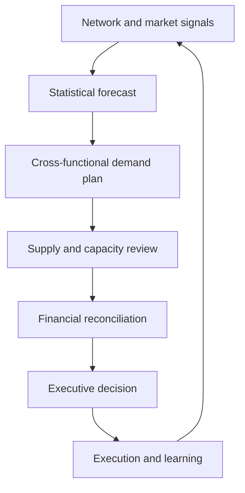

# Integrated Capstone: NorthStar Q1 Planning Decision

This capstone connects the five sections of Module 1 in one cross-functional decision. It is designed to be completed after the individual lessons or used as a workshop by a planning team.

All organizations, products, values, constraints, and events in this case are fictional and independently created for this repository.

## Learning objective

Develop a defensible quarterly demand-and-supply recommendation by combining:

- supply-network and flow analysis;
- external demand signals and product considerations;
- an agreed demand plan;
- quantitative forecast evaluation; and
- capacity, inventory, service, and financial trade-offs.

## Business situation

**NorthStar Industrial Systems** manufactures the FlowX family of connected industrial pumps. Demand has increased as customers replace older equipment and adopt remote condition monitoring. The commercial team has also secured two framework agreements that are not fully visible in historical shipments.

NorthStar must approve its first-quarter plan for the next year. The organization wants growth, but it also wants to protect service, avoid uncontrolled expediting, and maintain a finished-goods floor of 150 units.

### Supply-network facts

| Element | Current design | Planning implication |
|---|---|---|
| Electronic control kit | One qualified supplier; eight-week replenishment | Allocation changes must be visible early |
| Pump casting | Two suppliers split approximately 70/30 | Some resilience exists, but the secondary source has limited surge capacity |
| Final assembly | NorthStar plant | Normal capacity is stable; overtime can add limited output |
| External finishing | Approved regional partner | Flexible but more expensive than internal production |
| Distribution | Central warehouse serving three regions | Inventory is pooled, but regional prioritization may be required |
| Product strategy | Common platform with configurable control options | Postponement is possible until final configuration |

The electronic-kit supplier can support up to 1,360 units per month in January and February and 1,440 units in March. These limits leave little protection against supplier delay or quality loss.

## Integrated planning flow

The flow is intentionally circular: actual results and new evidence must improve the next planning cycle.

## Planning data

Use [`northstar-demand-history.csv`](../../assets/data/module-1/capstone/northstar-demand-history.csv) for the forecasting tasks.

The commercial team proposes the following demand plan for the next quarter:

| Month | Proposed demand plan |
|---|---:|
| January | 1,320 units |
| February | 1,360 units |
| March | 1,420 units |
| **Quarter** | **4,100 units** |

Operations provides these planning assumptions:

| Assumption | Value |
|---|---:|
| Opening finished-goods inventory | 220 units |
| Minimum desired ending inventory | 150 units |
| Normal internal capacity | 1,150 units/month |
| Maximum overtime capacity | 100 units/month |
| External finishing capacity | 200 units/month |
| Incremental overtime cost | $42/unit |
| Incremental external finishing cost | $75/unit |
| Contribution before exceptional planning costs | $310/unit |

## Task 1 — Diagnose the supply network

Create a one-page network assessment that answers:

1. Which material, information, and financial flows must remain synchronized?
2. Where are the most important single points of failure?
3. Which decisions should be centralized, and which can remain regional?
4. What evidence suggests NorthStar needs stronger cross-functional maturity?

Do not list risks without consequences. Connect each risk to service, cost, inventory, revenue, or decision speed.

## Task 2 — Interpret the demand pattern

Using the historical dataset:

1. Describe the level, trend, event effects, and remaining random variation.
2. Compare actual demand with the baseline forecast.
3. Explain whether the market index appears directionally useful without claiming that correlation proves causation.
4. Identify information that should be confirmed before accepting the commercial plan.

## Task 3 — Evaluate the forecast

Calculate:

1. a three-month moving-average forecast for next January using October–December actual demand;
2. forecast errors for September–December using `actual - baseline forecast`;
3. MAD for those four months;
4. MAPE for those four months; and
5. a tracking signal using cumulative error divided by MAD.

Then explain what the numbers mean. A mathematically correct answer without a planning interpretation is incomplete.

## Task 4 — Build the demand recommendation

Decide whether the proposed quarterly plan should be accepted, reduced, increased, or accepted with conditions.

Document:

- the statistical starting point;
- commercial intelligence that justifies an override;
- assumptions that need an owner and review date;
- upside and downside ranges; and
- the trigger that would cause the plan to be revised.

## Task 5 — Reconcile demand and supply

Build a monthly inventory balance using:

`Ending inventory = Beginning inventory + internal output + external output - demand`

Prepare at least two feasible responses. Possible levers include overtime, external finishing, inventory, postponement, customer prioritization, and moving flexible demand to April.

For each response, show:

- monthly output by source;
- ending inventory;
- incremental cost;
- service implications; and
- the most important execution risk.

## Task 6 — Make the executive recommendation

Prepare a decision note of no more than 250 words containing:

1. the recommended demand plan;
2. the selected supply response;
3. incremental cost and expected service effect;
4. the top three risks with owners;
5. one leading indicator and one lagging indicator; and
6. a clearly stated decision required from leadership.

## Decision checks

### 1. Statistical forecast versus approved demand plan

Must NorthStar's approved demand plan equal the statistical forecast?

Answer and rationale

### Correct answer

**No.** The forecast is the evidence-based starting point; the demand plan may include a
controlled adjustment supported by new commercial evidence.

### Why it is correct

Forecast and plan answer different questions. Any override needs a quantified effect,
source, owner, review date, and later accuracy assessment.

### Why the other answers are wrong

Automatically accepting the model ignores information outside history; silently changing
the number removes accountability and makes forecast-performance learning unreliable.

### 2. MAPE versus bias

Can the recent 4.10% MAPE alone prove that the forecast is healthy?

Answer and rationale

### Correct answer

**No.** Every recent error is positive and the tracking signal is +4.0 under the stated
error convention, indicating sustained underforecasting.

### Why it is correct

MAPE measures relative magnitude; cumulative signed error and tracking signal reveal
direction. Both perspectives are required.

### Why the other answers are wrong

Low percentage error can coexist with persistent bias, while tracking signal alone does
not describe the absolute size or customer consequence of misses.

### 3. Inventory-floor feasibility

May a response be recommended if one month falls below the approved 150-unit inventory
floor but its quarterly cost is lowest?

Answer and rationale

### Correct answer

**Not without an approved exception.** The floor is a feasibility condition before cost
ranking.

### Why it is correct

The policy represents service and uncertainty protection. A lower-cost plan that violates
it is not comparable until leadership changes the boundary with explicit risk.

### Why the other answers are wrong

A quarterly total can hide a monthly exposure; assigning the floor a low weight would
convert a mandatory condition into a preference without approval.

### 4. Flexible-demand movement

Does moving 80 March units to April eliminate the demand-supply problem?

Answer and rationale

### Correct answer

**Only if customers agree and April capacity is protected.** Otherwise the action merely
moves backlog into the next period.

### Why it is correct

The response must preserve the customer promise and reconcile the receiving period, not
only improve March arithmetic.

### Why the other answers are wrong

Treating all demand as flexible ignores customer consequence; moving volume without an
April capacity reservation hides rather than resolves the constraint.

### 5. Supplier confirmation

Should the control-kit supplier's nominal monthly capacity be treated as guaranteed
available supply?

Answer and rationale

### Correct answer

**No.** NorthStar needs dated confirmation, quality status, allocation assumptions, lead
time, and an escalation or recovery route.

### Why it is correct

Nominal capacity does not establish the quantity committed to NorthStar or the probability
of conforming, on-time supply.

### Why the other answers are wrong

Assuming full availability ignores competing demand and execution loss; adding inventory
without validating supply may create a plan that cannot be built.

## Deliverable checklist

- [ ] Network risks are linked to business consequences
- [ ] Forecast calculations are reproducible
- [ ] Forecast judgment is separated from statistical output
- [ ] Demand and supply assumptions have owners
- [ ] Inventory balances reconcile by month
- [ ] The recommendation includes cost, service, and risk
- [ ] Decision triggers are measurable

When your analysis is complete, compare it with the [solution guide](solution-guide.md). The guide presents one defensible answer, not the only possible answer.

Return to the [Module 1 overview](../README.md) or review the [glossary](../../GLOSSARY.md).
