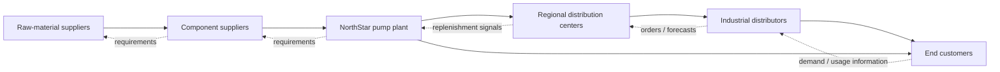

# 1. Supply Chain Fundamentals

## Concept in plain English

A supply chain is not simply a line of companies. It is a **network of organizations, people, activities, resources, and information** that works together to satisfy demand. A useful way to understand it is to follow what moves through the network: products and services, information, money, requirements, and returns.

A node or level in that network is often called an **echelon**. Depending on the business model, echelons might include raw-material suppliers, component suppliers, plants, distribution centers, retailers, service providers, and end customers.

## Supply-chain management in one sentence

**Supply chain management** (written with or without a hyphen in general usage) is the coordinated design, planning, execution, control, and ongoing improvement of the activities that connect demand with supply across the network. The goal is not merely to move goods cheaply; it is to create net value, synchronize supply and demand, build competitive capability, and measure performance across the end-to-end system.

A supply chain can also exist **inside** a company. For example, engineering, production, warehousing, sales, and finance can form an internal chain of linked processes before the product ever reaches an external customer.

Two additional ideas matter when drawing a network:

- participants at the **same echelon** can exchange inventory, information, or services with one another; and
- a real supply chain can loop back on itself rather than forming a perfectly straight line.

## Why it matters

Supply-chain decisions are interconnected. A sourcing decision can change transportation, inventory, cash flow, capacity, customer service, and risk. An end-to-end perspective therefore looks beyond one department and asks what creates the best overall value for the network.

## Original visualization - a realistic product supply chain

This diagram is intentionally simplified. Real networks can have multiple suppliers, plants, warehouses, channels, and direct-to-customer paths.

## Realistic example - NorthStar Industrial Systems

NorthStar manufactures industrial pumps used by chemical and water-treatment plants. One pump contains a motor, cast housing, seal kit, impeller, electronics, and packaging. NorthStar buys these from several suppliers, assembles the pump in Texas, ships finished units to regional distribution centers, and serves both distributors and direct industrial customers.

A customer order for 40 pumps is therefore not just a sales event. It can trigger information upstream, inventory decisions at multiple echelons, component requirements, production activity, transportation, invoicing, and eventually cash moving back through the network.

## Decision logic

When drawing a supply chain, ask:

- Who supplies the immediate organization?
- Who supplies those suppliers?
- Who receives the product or service next?
- Where is inventory held?
- What information must move in each direction?
- Where does cash move?
- What reverse flows exist?

## Common confusion

**Supply chain vs. logistics:** logistics is a major part of supply-chain management, but the supply chain is broader. It also includes demand, sourcing, planning, relationships, technology, finance, risk, product decisions, and performance management.

## Common mistake

Do not assume that every supply chain contains the same number of echelons. The network should contain the participants needed to support the business model and customer requirements.

## Practitioner perspective

In an enterprise system, these network relationships may appear as plants, storage locations, suppliers, customers, distribution centers, sourcing arrangements, transportation lanes, and planning master data. That is an implementation view of the broader supply-chain concept, not the definition itself.

## Related concepts

- [Entities and flows](02-entities-and-flows.md)
- [Vertical vs. lateral integration](04-vertical-vs-lateral-integration.md)
- [Supply chain maturity](05-supply-chain-maturity.md)
