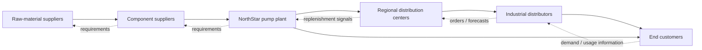

# 1. Supply Chain Fundamentals

## Learning objectives

You should be able to:

- explain the operating logic behind supply chain fundamentals;
- apply the lesson to a realistic planning or supply-chain decision; and
- identify the evidence, trade-off, and trigger needed for responsible use.

## Concept in plain English

A supply chain is not simply a line of companies. It is a **network of organizations, people, activities, resources, and information** that works together to satisfy demand. A useful way to understand it is to follow what moves through the network: products and services, information, money, requirements, and returns.

A node or level in that network is often called an **echelon**. Depending on the business model, echelons might include raw-material suppliers, component suppliers, plants, distribution centers, retailers, service providers, and end customers.

## Supply-chain management in one sentence

**Supply chain management** (written with or without a hyphen in general usage) is the coordinated design, planning, execution, control, and ongoing improvement of the activities that connect demand with supply across the network. The goal is not merely to move goods cheaply; it is to create net value, synchronize supply and demand, build competitive capability, and measure performance across the end-to-end system.

A supply chain can also exist **inside** a company. For example, engineering, production, warehousing, sales, and finance can form an internal chain of linked processes before the product ever reaches an external customer.

Two additional ideas matter when drawing a network:

- participants at the **same echelon** can exchange inventory, information, or services with one another; and
- a real supply chain can loop back on itself rather than forming a perfectly straight line.

## Original visualization - a realistic product supply chain

This diagram is intentionally simplified. Real networks can have multiple suppliers, plants, warehouses, channels, and direct-to-customer paths.

## Realistic example - NorthStar Industrial Systems

NorthStar manufactures industrial pumps used by chemical and water-treatment plants. One pump contains a motor, cast housing, seal kit, impeller, electronics, and packaging. NorthStar buys these from several suppliers, assembles the pump in Texas, ships finished units to regional distribution centers, and serves both distributors and direct industrial customers.

A customer order for 40 pumps is therefore not just a sales event. It can trigger information upstream, inventory decisions at multiple echelons, component requirements, production activity, transportation, invoicing, and eventually cash moving back through the network.

## Why it matters

Supply-chain decisions are interconnected. A sourcing decision can change transportation, inventory, cash flow, capacity, customer service, and risk. An end-to-end perspective therefore looks beyond one department and asks what creates the best overall value for the network.

## Decision logic

When drawing a supply chain, ask:

- Who supplies the immediate organization?
- Who supplies those suppliers?
- Who receives the product or service next?
- Where is inventory held?
- What information must move in each direction?
- Where does cash move?
- What reverse flows exist?

## Evidence retained through the workflow

Retain the customer promise, entity-and-flow map, baseline measures, assumptions, owners, and review date. Record the decision date and the event or threshold that requires reassessment.

## Applied decision artifact

Use a one-page **supply chain fundamentals decision record** with these fields:

- **Decision and boundary:** Map the customer promise, participating entities, three flows, decision owners, and the measure that proves the whole chain improved.
- **Required evidence:** the customer promise, entity-and-flow map, baseline measures, assumptions, owners, and review date.
- **Expected result:** A local improvement can reduce end-to-end service when material, information, and cash consequences are separated.
- **Balancing condition:** Tighter coordination improves responsiveness but adds data-sharing, governance, and dependency obligations.
- **Accountability:** name the decision owner, approval date, residual exposure owner, and measurable trigger for reassessment.

The record is complete only when another practitioner can reproduce the reasoning and identify the next action without relying on meeting memory.

## Trade-offs

Tighter coordination improves responsiveness but adds data-sharing, governance, and dependency obligations.

## Commonly confused with
**Supply chain vs. logistics:** logistics is a major part of supply-chain management, but the supply chain is broader. It also includes demand, sourcing, planning, relationships, technology, finance, risk, product decisions, and performance management.

## Common mistakes
Do not assume that every supply chain contains the same number of echelons. The network should contain the participants needed to support the business model and customer requirements.

## Original knowledge check

**Question.** NorthStar is deciding how to apply supply chain fundamentals. Which proposal is most defensible?

A. Use supply chain fundamentals as a label for the preferred option before defining the decision outcome, constraints, or owner.
B. Map the customer promise, participating entities, three flows, decision owners, and the measure that proves the whole chain improved.
C. Choose the apparent upside without evaluating this balancing condition: Tighter coordination improves responsiveness but adds data-sharing, governance, and dependency obligations.
D. Approve the choice without retaining the customer promise, entity-and-flow map, baseline measures, assumptions, owners, and review date; omit the reassessment trigger as well.

Answer and rationale

### Correct answer

**B. Map the customer promise, participating entities, three flows, decision owners, and the measure that proves the whole chain improved.**

### Why it is correct

A local improvement can reduce end-to-end service when material, information, and cash consequences are separated. The recommended action connects the operating choice to evidence, ownership, and a measurable outcome.

### Why the other answers are wrong

- **A** reverses the decision sequence. The team should first do the required work: map the customer promise, participating entities, three flows, decision owners, and the measure that proves the whole chain improved.
- **C** optimizes one visible result and omits the balancing effects: tighter coordination improves responsiveness but adds data-sharing, governance, and dependency obligations.
- **D** leaves the approval unauditable. A reviewer would be missing the customer promise, entity-and-flow map, baseline measures, assumptions, owners, and review date, as well as the trigger needed to revisit the decision when conditions change.

Those approaches ignore the governing trade-off: tighter coordination improves responsiveness but adds data-sharing, governance, and dependency obligations.

## Practitioner perspective

In an enterprise system, these network relationships may appear as plants, storage locations, suppliers, customers, distribution centers, sourcing arrangements, transportation lanes, and planning master data. That is an implementation view of the broader supply-chain concept, not the definition itself.

## Related concepts

- [Section overview](./README.md)
- [Module 2 continuation](../../02-network-design-digital-connectivity-performance/section-a-network-design-and-technology-investment/01-strategy-to-network-design.md)
- [Entities and flows](02-entities-and-flows.md)
- [Vertical vs. lateral integration](04-vertical-vs-lateral-integration.md)
- [Supply chain maturity](05-supply-chain-maturity.md)

---

[Section overview](README.md) · [Next: Entities and Flows](02-entities-and-flows.md)
