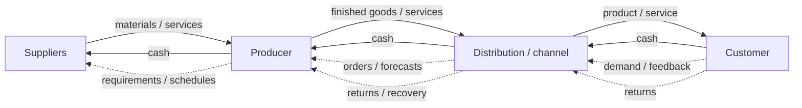

# 2. Entities and Flows

## Learning objectives

You should be able to:

- explain the operating logic behind entities and flows;
- apply the lesson to a realistic planning or supply-chain decision; and
- identify the evidence, trade-off, and trigger needed for responsible use.

## Concept in plain English

A supply chain becomes easier to understand when you separate **who participates** from **what moves** between them.

Typical entities include suppliers, consolidation or logistics nodes, producers, distribution centers, channel partners, service providers, and customers. The exact entities vary by industry.

## The major flows

### Product and service flow

Physical materials and finished goods usually move toward the customer. Services can also be supplied at many points in the network.

### Information flow

Information moves in both directions. Customers communicate demand and feedback; suppliers and producers communicate availability, status, capacity, lead time, and other planning information.

### Funds flow

Money generally moves upstream, from customers toward the organizations that created and delivered the value.

### Strategic requirements

Customer and market needs ultimately influence upstream decisions about sourcing, design, capacity, quality, service, and supply.

### Reverse flow

Returns, repairs, recycling, rework, and other recovery activities can move products or materials back through the network.

## Realistic example

A distributor tells NorthStar that a major water utility expects demand for a corrosion-resistant pump to increase next quarter. The information travels upstream before the physical product exists. NorthStar revises its demand plan, confirms special-alloy availability with its housing supplier, and reserves capacity. Months later the pumps move downstream, invoices are paid upstream, and a small number of returned units move backward for failure analysis.

## What to remember

The same supply chain can have several flows occurring at the same time and in different directions. A product may be moving toward the customer while cash, forecasts, quality data, and returned items move in other directions.

## Why it matters

Unseen handoffs create shortages, excess inventory, delayed decisions, and cash disputes even when each organization performs its own task.

## Decision logic

Trace product, information, and funds across every tier and assign an owner and required timing to each material handoff. Do not approve the decision until mandatory conditions are feasible and the residual exposure has a named owner.

## Evidence retained through the workflow

Retain the tier map, flow direction, event timestamps, ownership transfer, source system, exception rule, and accountable role. Record the decision date and the event or threshold that requires reassessment.

## Applied decision artifact

Use a one-page **entities and flows decision record** with these fields:

- **Decision and boundary:** Trace product, information, and funds across every tier and assign an owner and required timing to each material handoff.
- **Required evidence:** the tier map, flow direction, event timestamps, ownership transfer, source system, exception rule, and accountable role.
- **Expected result:** Unseen handoffs create shortages, excess inventory, delayed decisions, and cash disputes even when each organization performs its own task.
- **Balancing condition:** More visibility improves coordination, while unnecessary detail increases integration cost and can expose sensitive partner information.
- **Accountability:** name the decision owner, approval date, residual exposure owner, and measurable trigger for reassessment.

The record is complete only when another practitioner can reproduce the reasoning and identify the next action without relying on meeting memory.

## Trade-offs

More visibility improves coordination, while unnecessary detail increases integration cost and can expose sensitive partner information.

## Commonly confused with

Do not confuse a preferred decision method with a guaranteed outcome. Trace product, information, and funds across every tier and assign an owner and required timing to each material handoff. Validate the result with the tier map, flow direction, event timestamps, ownership transfer, source system, exception rule, and accountable role; the evidence, not the method's label, determines whether the choice worked.

## Common mistakes
Avoid treating the supply chain as only the physical movement of goods. Information and financial flows are part of the system and often determine how well the physical flow performs.

## Original knowledge check

**Question.** NorthStar is deciding how to apply entities and flows. Which proposal is most defensible?

A. Use entities and flows as a label for the preferred option before defining the decision outcome, constraints, or owner.
B. Trace product, information, and funds across every tier and assign an owner and required timing to each material handoff.
C. Choose the apparent upside without evaluating this balancing condition: More visibility improves coordination, while unnecessary detail increases integration cost and can expose sensitive partner information.
D. Approve the choice without retaining the tier map, flow direction, event timestamps, ownership transfer, source system, exception rule, and accountable role; omit the reassessment trigger as well.

Answer and rationale

### Correct answer

**B. Trace product, information, and funds across every tier and assign an owner and required timing to each material handoff.**

### Why it is correct

Unseen handoffs create shortages, excess inventory, delayed decisions, and cash disputes even when each organization performs its own task. The recommended action connects the operating choice to evidence, ownership, and a measurable outcome.

### Why the other answers are wrong

- **A** reverses the decision sequence. The team should first do the required work: trace product, information, and funds across every tier and assign an owner and required timing to each material handoff.
- **C** optimizes one visible result and omits the balancing effects: more visibility improves coordination, while unnecessary detail increases integration cost and can expose sensitive partner information.
- **D** leaves the approval unauditable. A reviewer would be missing the tier map, flow direction, event timestamps, ownership transfer, source system, exception rule, and accountable role, as well as the trigger needed to revisit the decision when conditions change.

Those approaches ignore the governing trade-off: more visibility improves coordination, while unnecessary detail increases integration cost and can expose sensitive partner information.

## Practitioner perspective

A review should be able to reconstruct the choice from the tier map, flow direction, event timestamps, ownership transfer, source system, exception rule, and accountable role. If those records cannot explain what changed, who decided, and when the decision will be revisited, the process is not yet controlled.

## Related concepts

- [Section overview](./README.md)
- [Module 2 continuation](../../02-network-design-digital-connectivity-performance/section-a-network-design-and-technology-investment/01-strategy-to-network-design.md)

---

[Previous: Supply Chain Fundamentals](01-supply-chain-fundamentals.md) · [Next: Funds, Value, and Balance](03-funds-value-balance.md)
