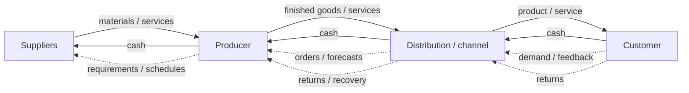

# 2. Entities and Flows

## Concept in plain English

A supply chain becomes easier to understand when you separate **who participates** from **what moves** between them.

Typical entities include suppliers, consolidation or logistics nodes, producers, distribution centers, channel partners, service providers, and customers. The exact entities vary by industry.

## The major flows

### Product and service flow

Physical materials and finished goods usually move toward the customer. Services can also be supplied at many points in the network.

### Information flow

Information moves in both directions. Customers communicate demand and feedback; suppliers and producers communicate availability, status, capacity, lead time, and other planning information.

### Funds flow

Money generally moves upstream, from customers toward the organizations that created and delivered the value.

### Strategic requirements

Customer and market needs ultimately influence upstream decisions about sourcing, design, capacity, quality, service, and supply.

### Reverse flow

Returns, repairs, recycling, rework, and other recovery activities can move products or materials back through the network.

## Realistic example

A distributor tells NorthStar that a major water utility expects demand for a corrosion-resistant pump to increase next quarter. The information travels upstream before the physical product exists. NorthStar revises its demand plan, confirms special-alloy availability with its housing supplier, and reserves capacity. Months later the pumps move downstream, invoices are paid upstream, and a small number of returned units move backward for failure analysis.

## What to remember

The same supply chain can have several flows occurring at the same time and in different directions. A product may be moving toward the customer while cash, forecasts, quality data, and returned items move in other directions.

## Common mistake

Avoid treating the supply chain as only the physical movement of goods. Information and financial flows are part of the system and often determine how well the physical flow performs.
