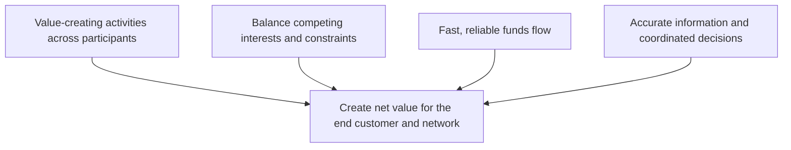

# 3. Funds, Value, and Balance

## Learning objectives

You should be able to:

- explain the operating logic behind funds, value, and balance;
- apply the lesson to a realistic planning or supply-chain decision; and
- identify the evidence, trade-off, and trigger needed for responsible use.

## Concept in plain English

A healthy supply chain must create **net value**, not just reduce one participant's cost. A decision that saves one function money but creates larger costs, delays, or risks elsewhere can make the total supply chain worse.

## Original visualization

## Why funds flow matters

Faster and more reliable payment can improve relationships, reduce financing strain, and shorten the cash-to-cash cycle. Poorly coordinated payment practices can push financial pressure onto smaller suppliers and ultimately increase supply risk.

## Stakeholders, the customer, and the coordinating firm

A **stakeholder** is any person or group whose interests can be affected by the organization or the supply chain. Customers, employees, suppliers, lenders, investors, communities, and regulators can all be stakeholders.

The end customer is especially important because customer value is what ultimately gives the supply chain a reason to exist. At the same time, a sustainable chain has to create enough value for the other critical participants to keep contributing.

Many networks also have a powerful coordinating organization, sometimes called a **channel master** or **nucleus firm**. It may be a manufacturer, retailer, brand owner, or another participant with enough influence to coordinate standards, information, and value-creating activities across the network.

## Cash-to-cash thinking

A useful way to evaluate funds flow is **cash-to-cash cycle time**: how long cash is tied up from the point the organization pays for operating inputs until cash is collected from customers. Shortening this cycle can improve working-capital efficiency, but it should not be done by simply pushing unsustainable financing pressure onto critical partners.

A simple way to think about the organization's own cash-generation picture is to watch three broad drivers together: **sales**, **after-tax operating margin**, and the **capital required** to support the business. More sales do not automatically improve cash if margins are weak or if growth consumes excessive working and fixed capital.

## Realistic example

NorthStar negotiates 120-day payment terms with a small seal supplier to improve its own working capital. The supplier must borrow at a high rate to finance production and increases its selling price by 4%. It also reduces safety stock because cash is tight. NorthStar's finance metric improves temporarily, but total cost and disruption risk increase.

The better decision is not automatically the longest payment term. Management should consider the total network impact and the importance of the supplier relationship.

## Decision questions

Before approving a local cost reduction, ask:

1. Does this create cost somewhere else in the chain?
2. Does it reduce customer value or service?
3. Does it shift unacceptable risk to a supplier or channel partner?
4. Does it improve or damage cash-to-cash performance for the overall relationship?
5. Is the change sustainable for all critical participants?

## Why it matters

Physical service can look healthy while payment terms and inventory ownership push unsustainable working-capital pressure onto a critical partner.

## Decision logic

Evaluate the physical and financial flow together, including cash-to-cash time, ownership points, payment timing, and value created for each party. Do not approve the decision until mandatory conditions are feasible and the residual exposure has a named owner.

## Evidence retained through the workflow

Retain payment terms, inventory ownership, receivable and payable timing, financing assumptions, service impact, and partner-risk trigger. Record the decision date and the event or threshold that requires reassessment.

## Applied decision artifact

Use a one-page **funds, value, and balance decision record** with these fields:

- **Decision and boundary:** Evaluate the physical and financial flow together, including cash-to-cash time, ownership points, payment timing, and value created for each party.
- **Required evidence:** payment terms, inventory ownership, receivable and payable timing, financing assumptions, service impact, and partner-risk trigger.
- **Expected result:** Physical service can look healthy while payment terms and inventory ownership push unsustainable working-capital pressure onto a critical partner.
- **Balancing condition:** Extending payment can improve the buyer's cash position but may raise supplier financing cost, price, or continuity risk.
- **Accountability:** name the decision owner, approval date, residual exposure owner, and measurable trigger for reassessment.

The record is complete only when another practitioner can reproduce the reasoning and identify the next action without relying on meeting memory.

## Trade-offs

Extending payment can improve the buyer's cash position but may raise supplier financing cost, price, or continuity risk.

## Commonly confused with
**Lowest local cost** is not the same thing as **highest supply-chain value**.

## Common mistakes
When a decision optimizes one function but harms total supply-chain performance, the broader end-to-end choice is usually better.

## Original knowledge check

**Question.** NorthStar is deciding how to apply funds, value, and balance. Which proposal is most defensible?

A. Use funds, value, and balance as a label for the preferred option before defining the decision outcome, constraints, or owner.
B. Evaluate the physical and financial flow together, including cash-to-cash time, ownership points, payment timing, and value created for each party.
C. Choose the apparent upside without evaluating this balancing condition: Extending payment can improve the buyer's cash position but may raise supplier financing cost, price, or continuity risk.
D. Approve the choice without retaining payment terms, inventory ownership, receivable and payable timing, financing assumptions, service impact, and partner-risk trigger; omit the reassessment trigger as well.

Answer and rationale

### Correct answer

**B. Evaluate the physical and financial flow together, including cash-to-cash time, ownership points, payment timing, and value created for each party.**

### Why it is correct

Physical service can look healthy while payment terms and inventory ownership push unsustainable working-capital pressure onto a critical partner. The recommended action connects the operating choice to evidence, ownership, and a measurable outcome.

### Why the other answers are wrong

- **A** reverses the decision sequence. The team should first do the required work: evaluate the physical and financial flow together, including cash-to-cash time, ownership points, payment timing, and value created for each party.
- **C** optimizes one visible result and omits the balancing effects: extending payment can improve the buyer's cash position but may raise supplier financing cost, price, or continuity risk.
- **D** leaves the approval unauditable. A reviewer would be missing payment terms, inventory ownership, receivable and payable timing, financing assumptions, service impact, and partner-risk trigger, as well as the trigger needed to revisit the decision when conditions change.

Those approaches ignore the governing trade-off: extending payment can improve the buyer's cash position but may raise supplier financing cost, price, or continuity risk.

## Practitioner perspective

A review should be able to reconstruct the choice from payment terms, inventory ownership, receivable and payable timing, financing assumptions, service impact, and partner-risk trigger. If those records cannot explain what changed, who decided, and when the decision will be revisited, the process is not yet controlled.

## Related concepts

- [Section overview](./README.md)
- [Module 2 continuation](../../02-network-design-digital-connectivity-performance/section-a-network-design-and-technology-investment/01-strategy-to-network-design.md)

---

[Previous: Entities and Flows](02-entities-and-flows.md) · [Next: Vertical vs. Lateral (Horizontal) Integration](04-vertical-vs-lateral-integration.md)
