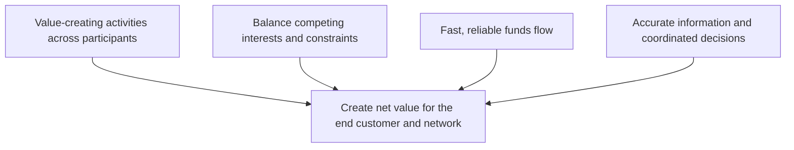

# 3. Funds, Value, and Balance

## Concept in plain English

A healthy supply chain must create **net value**, not just reduce one participant's cost. A decision that saves one function money but creates larger costs, delays, or risks elsewhere can make the total supply chain worse.

## Original visualization

## Why funds flow matters

Faster and more reliable payment can improve relationships, reduce financing strain, and shorten the cash-to-cash cycle. Poorly coordinated payment practices can push financial pressure onto smaller suppliers and ultimately increase supply risk.

## Stakeholders, the customer, and the coordinating firm

A **stakeholder** is any person or group whose interests can be affected by the organization or the supply chain. Customers, employees, suppliers, lenders, investors, communities, and regulators can all be stakeholders.

The end customer is especially important because customer value is what ultimately gives the supply chain a reason to exist. At the same time, a sustainable chain has to create enough value for the other critical participants to keep contributing.

Many networks also have a powerful coordinating organization, sometimes called a **channel master** or **nucleus firm**. It may be a manufacturer, retailer, brand owner, or another participant with enough influence to coordinate standards, information, and value-creating activities across the network.

## Cash-to-cash thinking

A useful way to evaluate funds flow is **cash-to-cash cycle time**: how long cash is tied up from the point the organization pays for operating inputs until cash is collected from customers. Shortening this cycle can improve working-capital efficiency, but it should not be done by simply pushing unsustainable financing pressure onto critical partners.

A simple way to think about the organization's own cash-generation picture is to watch three broad drivers together: **sales**, **after-tax operating margin**, and the **capital required** to support the business. More sales do not automatically improve cash if margins are weak or if growth consumes excessive working and fixed capital.

## Realistic example

NorthStar negotiates 120-day payment terms with a small seal supplier to improve its own working capital. The supplier must borrow at a high rate to finance production and increases its selling price by 4%. It also reduces safety stock because cash is tight. NorthStar's finance metric improves temporarily, but total cost and disruption risk increase.

The better decision is not automatically the longest payment term. Management should consider the total network impact and the importance of the supplier relationship.

## Decision questions

Before approving a local cost reduction, ask:

1. Does this create cost somewhere else in the chain?
2. Does it reduce customer value or service?
3. Does it shift unacceptable risk to a supplier or channel partner?
4. Does it improve or damage cash-to-cash performance for the overall relationship?
5. Is the change sustainable for all critical participants?

## Common confusion

**Lowest local cost** is not the same thing as **highest supply-chain value**.

## Common mistake

When a decision optimizes one function but harms total supply-chain performance, the broader end-to-end choice is usually better.
