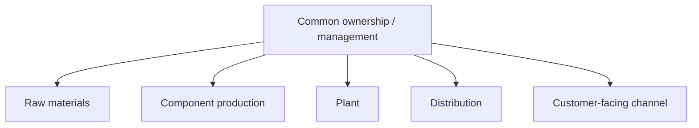
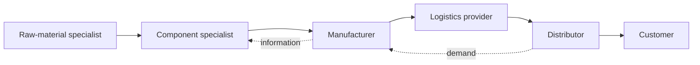

# 4. Vertical vs. Lateral (Horizontal) Integration

## Learning objectives

You should be able to:

- explain the operating logic behind vertical vs. lateral (horizontal) integration;
- apply the lesson to a realistic planning or supply-chain decision; and
- identify the evidence, trade-off, and trigger needed for responsible use.

## Vertical integration

Vertical integration brings multiple stages of the supply chain under common ownership or strong internal control.

### Typical strengths

- greater direct control;
- potentially better visibility across owned operations;
- less dependence on outside firms for the activities that are internalized.

### Typical trade-offs

- more capital and management attention are required;
- the company must maintain expertise across more activities;
- internal capacity can be less flexible than using specialized partners.

## Lateral integration

Lateral integration relies on a network of specialized organizations that coordinate to deliver the end product or service.

### Typical strengths

- access to specialized expertise;
- economies of scale and scope at partners;
- greater focus on the organization's core capabilities;
- potentially more flexibility in the network.

### Typical trade-offs

- more interorganizational coordination is required;
- visibility and control may be harder;
- dependency and relationship risk increase.

## A hybrid relationship pattern: keiretsu

A **keiretsu** is a cooperative business relationship associated with Japan in which participating companies remain separate organizations but maintain unusually close ties, which can include long-term commercial relationships and limited cross-ownership. For supply-chain learning, think of it as a relationship pattern that sits between fully independent arm's-length transactions and complete vertical ownership.

The important decision point is not to treat keiretsu as the same thing as vertical integration: the member companies remain legally and economically distinct.

## Realistic example - motor production decision

NorthStar currently builds electric motor assemblies internally. A specialist motor supplier offers to manufacture them at lower unit cost and with advanced winding technology.

The choice is not simply **make = vertical** and **buy = lateral**. NorthStar must consider whether motor technology is a core capability, what knowledge could be lost, the supplier's reliability and capacity, total landed cost, flexibility, quality, and how much control is strategically important.

## Quick comparison

| Question | Vertical integration | Lateral integration |
|---|---|---|
| Who performs more stages? | The focal organization | Specialized external partners |
| Primary advantage | Control | Focus and external expertise |
| Capital requirement | Often higher | Often lower for the focal firm |
| Coordination need | Mostly internal | Strong intercompany coordination |
| Dependency risk | More internal dependency | More partner dependency |

## Why it matters

Ownership and collaboration choices change control, investment, flexibility, knowledge access, and exposure to partners.

## Decision logic

Separate the need for control from the need for coordination, then compare ownership, contract, and collaborative options against the same requirements. Do not approve the decision until mandatory conditions are feasible and the residual exposure has a named owner.

## Evidence retained through the workflow

Retain capability requirements, control points, investment, switching cost, intellectual-property exposure, partner incentives, and exit conditions. Record the decision date and the event or threshold that requires reassessment.

## Applied decision artifact

Use a one-page **vertical vs. lateral (horizontal) integration decision record** with these fields:

- **Decision and boundary:** Separate the need for control from the need for coordination, then compare ownership, contract, and collaborative options against the same requirements.
- **Required evidence:** capability requirements, control points, investment, switching cost, intellectual-property exposure, partner incentives, and exit conditions.
- **Expected result:** Ownership and collaboration choices change control, investment, flexibility, knowledge access, and exposure to partners.
- **Balancing condition:** Vertical integration increases control and fixed commitment; lateral collaboration preserves flexibility but depends on incentives and governance.
- **Accountability:** name the decision owner, approval date, residual exposure owner, and measurable trigger for reassessment.

The record is complete only when another practitioner can reproduce the reasoning and identify the next action without relying on meeting memory.

## Trade-offs

Vertical integration increases control and fixed commitment; lateral collaboration preserves flexibility but depends on incentives and governance.

## Commonly confused with

Do not confuse a preferred decision method with a guaranteed outcome. Separate the need for control from the need for coordination, then compare ownership, contract, and collaborative options against the same requirements. Validate the result with capability requirements, control points, investment, switching cost, intellectual-property exposure, partner incentives, and exit conditions; the evidence, not the method's label, determines whether the choice worked.

## Common mistakes
Do not assume that one model is universally superior. The appropriate structure depends on strategy, competencies, economics, risk, technology, and customer requirements.

## Original knowledge check

**Question.** NorthStar is deciding how to apply vertical vs. lateral (horizontal) integration. Which proposal is most defensible?

A. Use vertical vs. lateral (horizontal) integration as a label for the preferred option before defining the decision outcome, constraints, or owner.
B. Separate the need for control from the need for coordination, then compare ownership, contract, and collaborative options against the same requirements.
C. Choose the apparent upside without evaluating this balancing condition: Vertical integration increases control and fixed commitment; lateral collaboration preserves flexibility but depends on incentives and governance.
D. Approve the choice without retaining capability requirements, control points, investment, switching cost, intellectual-property exposure, partner incentives, and exit conditions; omit the reassessment trigger as well.

Answer and rationale

### Correct answer

**B. Separate the need for control from the need for coordination, then compare ownership, contract, and collaborative options against the same requirements.**

### Why it is correct

Ownership and collaboration choices change control, investment, flexibility, knowledge access, and exposure to partners. The recommended action connects the operating choice to evidence, ownership, and a measurable outcome.

### Why the other answers are wrong

- **A** reverses the decision sequence. The team should first do the required work: separate the need for control from the need for coordination, then compare ownership, contract, and collaborative options against the same requirements.
- **C** optimizes one visible result and omits the balancing effects: vertical integration increases control and fixed commitment; lateral collaboration preserves flexibility but depends on incentives and governance.
- **D** leaves the approval unauditable. A reviewer would be missing capability requirements, control points, investment, switching cost, intellectual-property exposure, partner incentives, and exit conditions, as well as the trigger needed to revisit the decision when conditions change.

Those approaches ignore the governing trade-off: vertical integration increases control and fixed commitment; lateral collaboration preserves flexibility but depends on incentives and governance.

## Practitioner perspective

A review should be able to reconstruct the choice from capability requirements, control points, investment, switching cost, intellectual-property exposure, partner incentives, and exit conditions. If those records cannot explain what changed, who decided, and when the decision will be revisited, the process is not yet controlled.

## Related concepts

- [Section overview](./README.md)
- [Module 2 continuation](../../02-network-design-digital-connectivity-performance/section-a-network-design-and-technology-investment/01-strategy-to-network-design.md)

---

[Previous: Funds, Value, and Balance](03-funds-value-balance.md) · [Next: Supply Chain Maturity](05-supply-chain-maturity.md)
