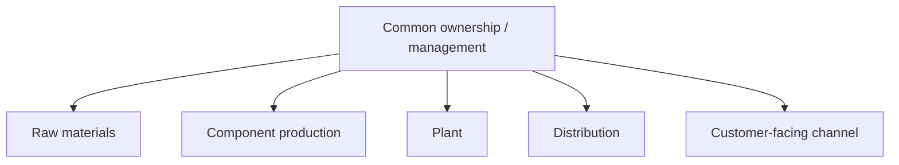
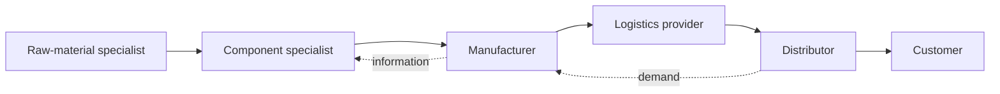

# 4. Vertical vs. Lateral (Horizontal) Integration

## Vertical integration

Vertical integration brings multiple stages of the supply chain under common ownership or strong internal control.

### Typical strengths

- greater direct control;
- potentially better visibility across owned operations;
- less dependence on outside firms for the activities that are internalized.

### Typical trade-offs

- more capital and management attention are required;
- the company must maintain expertise across more activities;
- internal capacity can be less flexible than using specialized partners.

## Lateral integration

Lateral integration relies on a network of specialized organizations that coordinate to deliver the end product or service.

### Typical strengths

- access to specialized expertise;
- economies of scale and scope at partners;
- greater focus on the organization's core capabilities;
- potentially more flexibility in the network.

### Typical trade-offs

- more interorganizational coordination is required;
- visibility and control may be harder;
- dependency and relationship risk increase.

## A hybrid relationship pattern: keiretsu

A **keiretsu** is a cooperative business relationship associated with Japan in which participating companies remain separate organizations but maintain unusually close ties, which can include long-term commercial relationships and limited cross-ownership. For supply-chain learning, think of it as a relationship pattern that sits between fully independent arm's-length transactions and complete vertical ownership.

The important decision point is not to treat keiretsu as the same thing as vertical integration: the member companies remain legally and economically distinct.

## Realistic example - motor production decision

NorthStar currently builds electric motor assemblies internally. A specialist motor supplier offers to manufacture them at lower unit cost and with advanced winding technology.

The choice is not simply **make = vertical** and **buy = lateral**. NorthStar must consider whether motor technology is a core capability, what knowledge could be lost, the supplier's reliability and capacity, total landed cost, flexibility, quality, and how much control is strategically important.

## Quick comparison

| Question | Vertical integration | Lateral integration |
|---|---|---|
| Who performs more stages? | The focal organization | Specialized external partners |
| Primary advantage | Control | Focus and external expertise |
| Capital requirement | Often higher | Often lower for the focal firm |
| Coordination need | Mostly internal | Strong intercompany coordination |
| Dependency risk | More internal dependency | More partner dependency |

## Common mistake

Do not assume that one model is universally superior. The appropriate structure depends on strategy, competencies, economics, risk, technology, and customer requirements.
