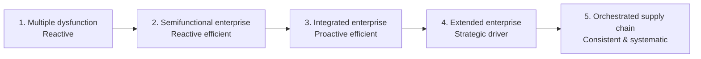
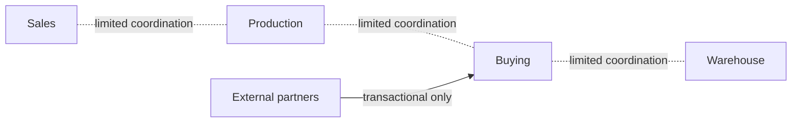
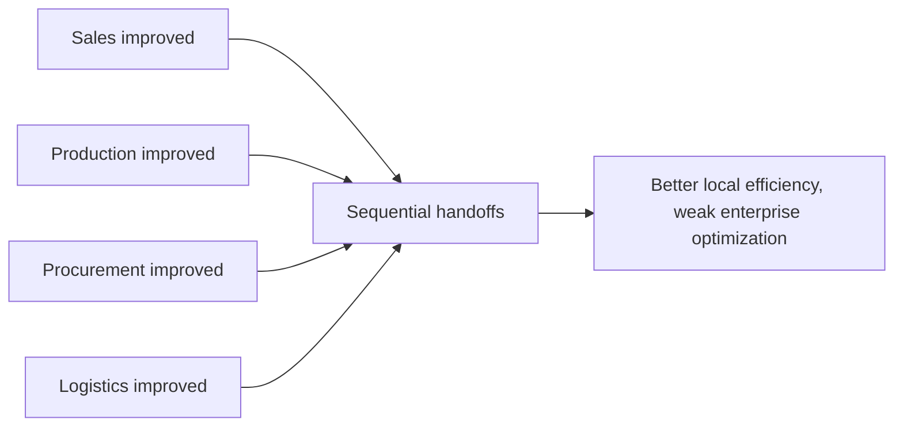
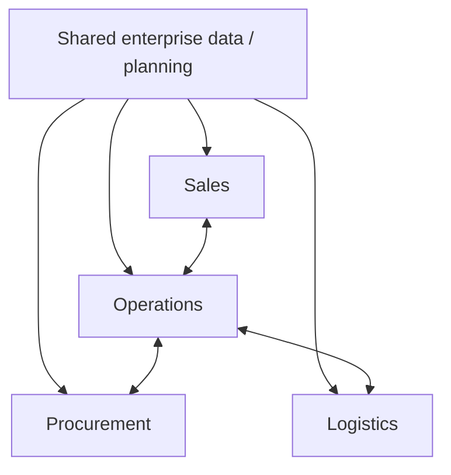
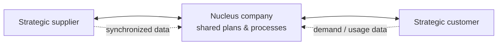
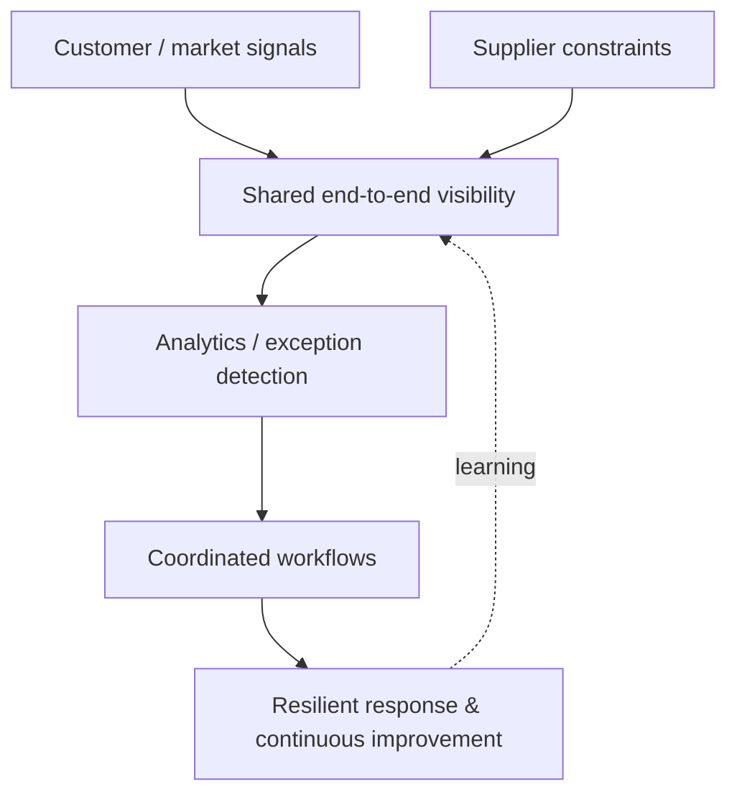

# 5. Supply Chain Maturity

## Learning objectives

You should be able to:

- explain the operating logic behind supply chain maturity;
- apply the lesson to a realistic planning or supply-chain decision; and
- identify the evidence, trade-off, and trigger needed for responsible use.

## The five-stage progression

Supply-chain evolution can be understood through five maturity stages. The important idea is not memorizing labels alone; it is understanding how **coordination, information, technology, planning, and external collaboration** mature over time.

## Stage 1 - Multiple dysfunction

Functions operate largely in silos. Information is fragmented, planning is weak, purchasing can be transactional, and the supply chain primarily reacts to demand.

### NorthStar example

Sales promises delivery without checking production. Purchasing buys based on urgent requests. Warehousing receives trucks without coordinated appointments. Forecasting is mostly judgmental. Each function can appear busy while total performance remains poor.

## Stage 2 - Semifunctional enterprise

Individual functions improve their own efficiency. Better tools and practices appear, but coordination across functions is still limited.

### NorthStar example

Purchasing introduces preferred suppliers and logistics negotiates better carrier contracts, while inventory management reduces stock. Each initiative helps locally, but decisions are not yet driven by one enterprise plan.

## Stage 3 - Integrated enterprise

The organization integrates processes and information internally. Cross-functional planning, enterprise systems, and coordinated business processes replace many functional silos.

### NorthStar example

Sales, operations, procurement, logistics, and finance use common planning data. Product-development decisions include manufacturing and supply-chain input earlier in the design process.

## Stage 4 - Extended enterprise

Integration expands outside the organization to selected suppliers and customers. Planning and information sharing become collaborative across company boundaries.

### NorthStar example

A strategic motor supplier receives forecast and capacity signals. NorthStar's largest distributor shares sell-through data. Both parties jointly resolve demand/supply mismatches.

## Stage 5 - Orchestrated supply chain

The network operates in a more systematic, data-driven, resilient, and change-ready way. Information integrity, end-to-end visibility, process automation, and shared improvement capabilities become important characteristics.

### NorthStar example

Customer usage signals update demand sensing; strategic suppliers provide near-real-time constraints; automated workflows highlight exceptions; cross-company teams manage disruptions and continuous improvement using common data.

## Process interdependencies and bottlenecks

As maturity improves, managers increasingly look at an end-to-end process instead of optimizing isolated departments. Mapping who owns each step, how one step depends on another, and where bottlenecks occur helps the organization streamline flow and remove delays that would be invisible inside a single functional silo.

## Maturity as an input to strategy

Maturity is not a trophy; it is a **gap-assessment tool**. A company should compare the capabilities its strategy requires with the capabilities the current supply chain actually has. Gaps in visibility, connectivity, process discipline, partner collaboration, data quality, resilience, or change readiness become improvement priorities.

Reassessment should continue over time because acquisitions, reorganizations, new technologies, new competitors, and major disruptions can change the maturity of the network. A business can also be at different maturity levels in different processes at the same time.

### Detailed comparison

| Stage | Typical planning / technology | Relationship pattern | Main management concern |
|---|---|---|---|
| 1 | Basic, fragmented, heavily manual | Mostly transactional | Respond somehow to demand |
| 2 | Better functional tools; local automation | External ties remain limited | Reduce cost inside each function |
| 3 | Shared enterprise systems and cross-functional planning | Internal integration is strong | Optimize the enterprise as one system |
| 4 | Shared data and synchronized processes with selected partners | Collaborative external processes | Compete as an extended network |
| 5 | Real-time data, analytics, automation, stronger security and resilience | Broad orchestration and rapid adaptation | Create sustained network advantage |

## Comparison

| Stage | Primary behavior | Integration scope | Planning character |
|---|---|---|---|
| 1 | Reactive | Siloed functions | Ad hoc |
| 2 | Reactive efficient | Functional | Local optimization |
| 3 | Proactive efficient | Enterprise | Cross-functional |
| 4 | Strategic driver | Selected external partners | Collaborative |
| 5 | Consistent/systematic | End-to-end network | Orchestrated and adaptive |

## Important nuance

Organizations do not always progress neatly. Different business units or processes can operate at different maturity levels at the same time.

## Why it matters

A strategy that assumes data, trust, or decision capabilities the organization does not possess will fail during execution.

## Decision logic

Assess maturity with operating evidence, identify the capability gap that blocks the target decision, and sequence improvement before advanced design. Do not approve the decision until mandatory conditions are feasible and the residual exposure has a named owner.

## Evidence retained through the workflow

Retain current and target maturity evidence, repeated failure patterns, capability owners, milestone criteria, and benefit measures. Record the decision date and the event or threshold that requires reassessment.

## Applied decision artifact

Use a one-page **supply chain maturity decision record** with these fields:

- **Decision and boundary:** Assess maturity with operating evidence, identify the capability gap that blocks the target decision, and sequence improvement before advanced design.
- **Required evidence:** current and target maturity evidence, repeated failure patterns, capability owners, milestone criteria, and benefit measures.
- **Expected result:** A strategy that assumes data, trust, or decision capabilities the organization does not possess will fail during execution.
- **Balancing condition:** Higher maturity enables faster coordination but requires disciplined ownership, shared measures, and sustained behavior change.
- **Accountability:** name the decision owner, approval date, residual exposure owner, and measurable trigger for reassessment.

The record is complete only when another practitioner can reproduce the reasoning and identify the next action without relying on meeting memory.

## Trade-offs

Higher maturity enables faster coordination but requires disciplined ownership, shared measures, and sustained behavior change.

## Commonly confused with

Do not confuse a preferred decision method with a guaranteed outcome. Assess maturity with operating evidence, identify the capability gap that blocks the target decision, and sequence improvement before advanced design. Validate the result with current and target maturity evidence, repeated failure patterns, capability owners, milestone criteria, and benefit measures; the evidence, not the method's label, determines whether the choice worked.

## Common mistakes
A company that has excellent ERP technology is not automatically at Stage 5. Higher maturity also requires process integration, collaboration, information quality, organizational capability, and effective use of technology.

## Original knowledge check

**Question.** NorthStar is deciding how to apply supply chain maturity. Which proposal is most defensible?

A. Use supply chain maturity as a label for the preferred option before defining the decision outcome, constraints, or owner.
B. Assess maturity with operating evidence, identify the capability gap that blocks the target decision, and sequence improvement before advanced design.
C. Choose the apparent upside without evaluating this balancing condition: Higher maturity enables faster coordination but requires disciplined ownership, shared measures, and sustained behavior change.
D. Approve the choice without retaining current and target maturity evidence, repeated failure patterns, capability owners, milestone criteria, and benefit measures; omit the reassessment trigger as well.

Answer and rationale

### Correct answer

**B. Assess maturity with operating evidence, identify the capability gap that blocks the target decision, and sequence improvement before advanced design.**

### Why it is correct

A strategy that assumes data, trust, or decision capabilities the organization does not possess will fail during execution. The recommended action connects the operating choice to evidence, ownership, and a measurable outcome.

### Why the other answers are wrong

- **A** reverses the decision sequence. The team should first do the required work: assess maturity with operating evidence, identify the capability gap that blocks the target decision, and sequence improvement before advanced design.
- **C** optimizes one visible result and omits the balancing effects: higher maturity enables faster coordination but requires disciplined ownership, shared measures, and sustained behavior change.
- **D** leaves the approval unauditable. A reviewer would be missing current and target maturity evidence, repeated failure patterns, capability owners, milestone criteria, and benefit measures, as well as the trigger needed to revisit the decision when conditions change.

Those approaches ignore the governing trade-off: higher maturity enables faster coordination but requires disciplined ownership, shared measures, and sustained behavior change.

## Practitioner perspective

A review should be able to reconstruct the choice from current and target maturity evidence, repeated failure patterns, capability owners, milestone criteria, and benefit measures. If those records cannot explain what changed, who decided, and when the decision will be revisited, the process is not yet controlled.

## Related concepts

- [Section overview](./README.md)
- [Module 2 continuation](../../02-network-design-digital-connectivity-performance/section-a-network-design-and-technology-investment/01-strategy-to-network-design.md)

---

[Previous: Vertical vs. Lateral (Horizontal) Integration](04-vertical-vs-lateral-integration.md) · [Next: Manufacturing, Service, and Specialized Supply Chains](06-supply-chain-examples.md)
