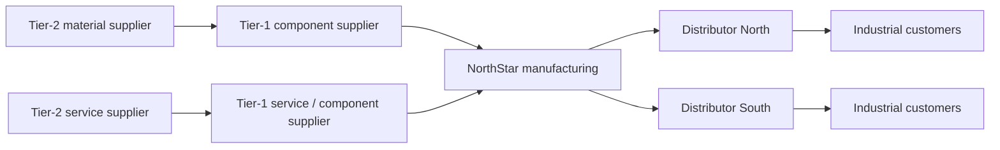
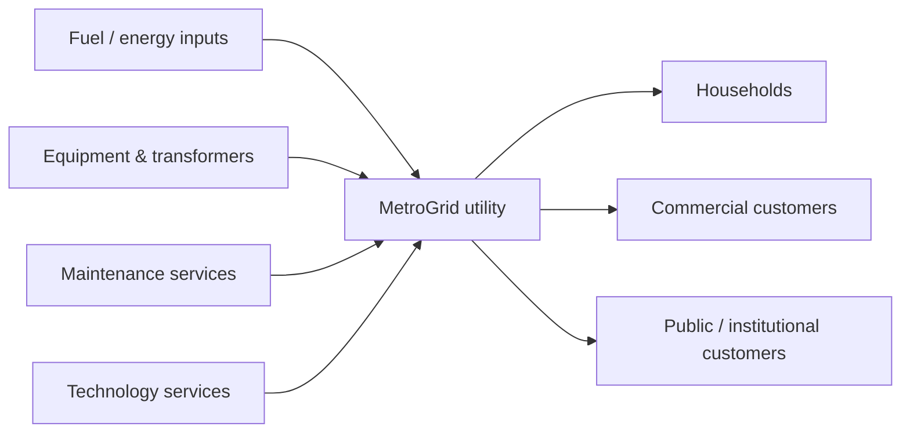

# 6. Manufacturing, Service, and Specialized Supply Chains

## Manufacturing supply chain

A manufacturing network often includes multiple supplier tiers before the focal manufacturer and several channels after it.

A Tier-1 supplier itself depends on Tier-2 suppliers. This is why risk and visibility often need to extend beyond the immediate supplier.

## Service supply chain

Services also depend on supply networks even when the customer does not receive a physical finished good.

The service provider combines physical assets, purchased services, information, labor, and infrastructure to deliver the service outcome.

### Terminology note - service industry

The **service industry** includes organizations whose main output is a service rather than a manufactured physical good. In a broad economic sense, it can include areas such as transportation, utilities, finance, retail/wholesale trade, professional services, government, and healthcare. These organizations still depend on suppliers, information, capacity, assets, people, and customer demand, so they still have supply chains.

## Specialized supply chains

Some networks have unusual objectives or constraints. Humanitarian relief, healthcare, and retail networks illustrate how the same basic entity-and-flow logic can operate under very different priorities.

### Humanitarian example

After a major hurricane, the priority may be speed and availability rather than lowest transportation cost. Infrastructure failures, uncertain demand, and the need for trusted partners change network decisions.

### Healthcare example

A hospital may focus on availability of critical supplies, contract compliance, traceability, billing accuracy, and centralization opportunities while preserving patient-care requirements.

### Retail example

An omnichannel retailer may use stores as both customer-facing locations and fulfillment nodes. This can improve response time but creates inventory, labor, and order-routing complexity.

## Decision lesson

Do not force every industry into the same physical model. Identify the customer value being delivered, the entities involved, and the flows required to deliver it.
