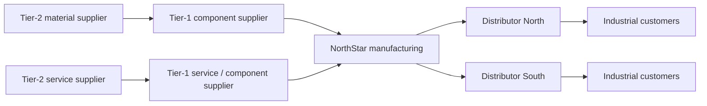
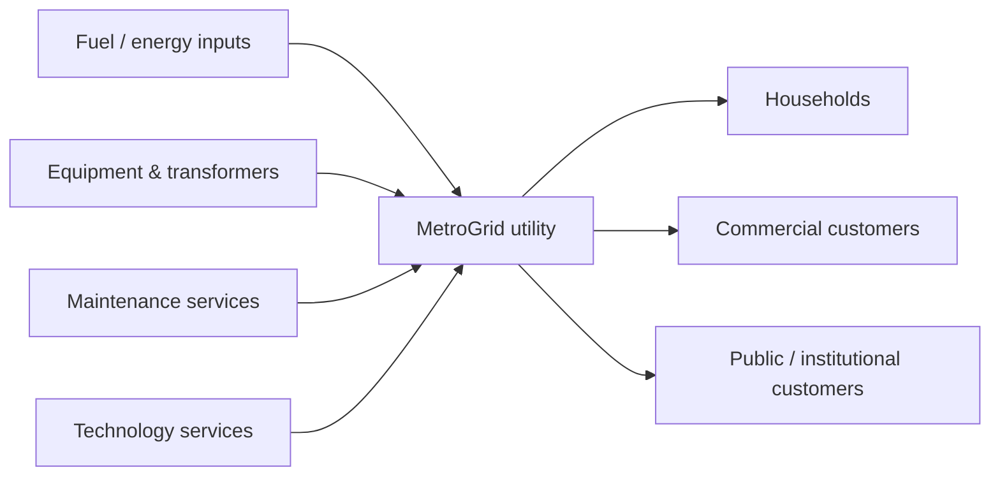

# 6. Manufacturing, Service, and Specialized Supply Chains

## Learning objectives

You should be able to:

- explain the operating logic behind manufacturing, service, and specialized supply chains;
- apply the lesson to a realistic planning or supply-chain decision; and
- identify the evidence, trade-off, and trigger needed for responsible use.

## Manufacturing supply chain

A manufacturing network often includes multiple supplier tiers before the focal manufacturer and several channels after it.

A Tier-1 supplier itself depends on Tier-2 suppliers. This is why risk and visibility often need to extend beyond the immediate supplier.

## Service supply chain

Services also depend on supply networks even when the customer does not receive a physical finished good.

The service provider combines physical assets, purchased services, information, labor, and infrastructure to deliver the service outcome.

### Terminology note - service industry

The **service industry** includes organizations whose main output is a service rather than a manufactured physical good. In a broad economic sense, it can include areas such as transportation, utilities, finance, retail/wholesale trade, professional services, government, and healthcare. These organizations still depend on suppliers, information, capacity, assets, people, and customer demand, so they still have supply chains.

## Specialized supply chains

Some networks have unusual objectives or constraints. Humanitarian relief, healthcare, and retail networks illustrate how the same basic entity-and-flow logic can operate under very different priorities.

### Humanitarian example

After a major hurricane, the priority may be speed and availability rather than lowest transportation cost. Infrastructure failures, uncertain demand, and the need for trusted partners change network decisions.

### Healthcare example

A hospital may focus on availability of critical supplies, contract compliance, traceability, billing accuracy, and centralization opportunities while preserving patient-care requirements.

### Retail example

An omnichannel retailer may use stores as both customer-facing locations and fulfillment nodes. This can improve response time but creates inventory, labor, and order-routing complexity.

## Decision lesson

Do not force every industry into the same physical model. Identify the customer value being delivered, the entities involved, and the flows required to deliver it.

## Why it matters

Manufacturing, service, humanitarian, project, and closed-loop networks require different flow, capacity, and customer-response logic.

## Decision logic

Classify the operating context before copying a supply-chain practice, then adapt inventory, capacity, information, and service controls to the actual flow. Do not approve the decision until mandatory conditions are feasible and the residual exposure has a named owner.

## Evidence retained through the workflow

Retain the service or product definition, demand pattern, capacity constraint, response time, recovery route, and customer consequence. Record the decision date and the event or threshold that requires reassessment.

## Applied decision artifact

Use a one-page **manufacturing, service, and specialized supply chains decision record** with these fields:

- **Decision and boundary:** Classify the operating context before copying a supply-chain practice, then adapt inventory, capacity, information, and service controls to the actual flow.
- **Required evidence:** the service or product definition, demand pattern, capacity constraint, response time, recovery route, and customer consequence.
- **Expected result:** Manufacturing, service, humanitarian, project, and closed-loop networks require different flow, capacity, and customer-response logic.
- **Balancing condition:** Standard practices improve consistency, but excessive standardization can ignore perishability, simultaneity, project uniqueness, or recovery requirements.
- **Accountability:** name the decision owner, approval date, residual exposure owner, and measurable trigger for reassessment.

The record is complete only when another practitioner can reproduce the reasoning and identify the next action without relying on meeting memory.

## Trade-offs

Standard practices improve consistency, but excessive standardization can ignore perishability, simultaneity, project uniqueness, or recovery requirements.

## Commonly confused with

Do not confuse a preferred decision method with a guaranteed outcome. Classify the operating context before copying a supply-chain practice, then adapt inventory, capacity, information, and service controls to the actual flow. Validate the result with the service or product definition, demand pattern, capacity constraint, response time, recovery route, and customer consequence; the evidence, not the method's label, determines whether the choice worked.

## Common mistakes

- Copying a manufacturing inventory rule into a service or project environment without testing the flow.
- Treating every network as if demand, capacity, and recovery can be managed at the same time scale.
- Selecting a fashionable practice before defining the customer outcome and operating constraint.

## Original knowledge check

**Question.** NorthStar is deciding how to apply manufacturing, service, and specialized supply chains. Which proposal is most defensible?

A. Use manufacturing, service, and specialized supply chains as a label for the preferred option before defining the decision outcome, constraints, or owner.
B. Classify the operating context before copying a supply-chain practice, then adapt inventory, capacity, information, and service controls to the actual flow.
C. Choose the apparent upside without evaluating this balancing condition: Standard practices improve consistency, but excessive standardization can ignore perishability, simultaneity, project uniqueness, or recovery requirements.
D. Approve the choice without retaining the service or product definition, demand pattern, capacity constraint, response time, recovery route, and customer consequence; omit the reassessment trigger as well.

Answer and rationale

### Correct answer

**B. Classify the operating context before copying a supply-chain practice, then adapt inventory, capacity, information, and service controls to the actual flow.**

### Why it is correct

Manufacturing, service, humanitarian, project, and closed-loop networks require different flow, capacity, and customer-response logic. The recommended action connects the operating choice to evidence, ownership, and a measurable outcome.

### Why the other answers are wrong

- **A** reverses the decision sequence. The team should first do the required work: classify the operating context before copying a supply-chain practice, then adapt inventory, capacity, information, and service controls to the actual flow.
- **C** optimizes one visible result and omits the balancing effects: standard practices improve consistency, but excessive standardization can ignore perishability, simultaneity, project uniqueness, or recovery requirements.
- **D** leaves the approval unauditable. A reviewer would be missing the service or product definition, demand pattern, capacity constraint, response time, recovery route, and customer consequence, as well as the trigger needed to revisit the decision when conditions change.

Those approaches ignore the governing trade-off: standard practices improve consistency, but excessive standardization can ignore perishability, simultaneity, project uniqueness, or recovery requirements.

## Practitioner perspective

A review should be able to reconstruct the choice from the service or product definition, demand pattern, capacity constraint, response time, recovery route, and customer consequence. If those records cannot explain what changed, who decided, and when the decision will be revisited, the process is not yet controlled.

## Related concepts

- [Section overview](./README.md)
- [Module 2 continuation](../../02-network-design-digital-connectivity-performance/section-a-network-design-and-technology-investment/01-strategy-to-network-design.md)

---

[Previous: Supply Chain Maturity](05-supply-chain-maturity.md) · [Section review](07-section-a-review.md)
