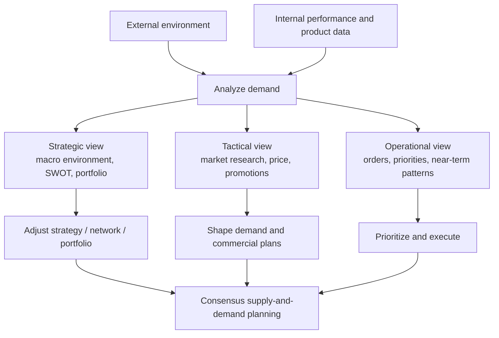

# 1. Demand Analysis and Environmental Scanning

## Learning objectives

After this topic, you should be able to:

- distinguish strategic demand analysis from shorter-horizon demand management;
- explain why an environmental scan is needed before relying on an existing plan;
- connect demand information to supply, capacity, inventory, sourcing, and logistics decisions;
- identify which parts of the external environment the organization can influence and which it can only respond to.

## Concept in plain English

Demand analysis is the discipline of asking **why demand looks the way it does before deciding what to do about it**. A forecast may tell us that next year's volume could be 120,000 units. Demand analysis asks what is behind that number: economic conditions, customer preferences, competitor moves, regulation, product maturity, price, seasonality, promotions, or simply noise.

At a strategic horizon, the organization studies its **macro environment** — large external forces such as economic, technological, natural, and regulatory conditions. These are usually not controllable by marketing. The organization instead adjusts its strategy, product portfolio, network, and risk posture.

At shorter horizons, the company has more levers. It can change price, promotions, channel activity, customer priorities, order policies, or service offers to influence or shape demand.

## Original visualization — demand analysis road map

## Why it matters

A plan can be internally consistent and still fail because the environment changed. A factory expansion based on yesterday's demand assumptions may be a bad investment after a competitor launches a substitute, regulation changes, or interest rates sharply reduce customer spending.

The supply-chain professional therefore does not treat demand as a number handed over by sales. Demand information is an input to:

- network and capacity decisions;
- sourcing and make/buy decisions;
- inventory policy;
- transportation and warehouse capacity;
- product phase-in/phase-out;
- financial planning and risk management.

## Realistic example — NorthStar's pump demand

NorthStar's annual plan assumes 12% growth in smart industrial pumps. Before adding a second assembly line, the planning team performs an environmental scan and finds:

- municipal infrastructure spending is increasing;
- a major competitor is discounting an older pump family;
- one target country is introducing stricter energy-efficiency rules;
- borrowing costs for smaller industrial customers remain high;
- NorthStar's newest model has better energy consumption but a higher purchase price.

The team should not simply accept the 12% forecast. It should separate **market growth**, **competitor pressure**, **regulatory opportunity**, and **customer affordability** and then create scenarios.

## Decision logic

Ask four questions before trusting a demand plan:

1. **What changed outside the company?**
2. **What changed in our customers, channels, or competitors?**
3. **What changed in our own product/service offer?**
4. **Which of those changes are temporary, recurring, structural, or random?**

## Common confusion

**Macro environment vs. market tactic:** a company can respond to inflation, regulation, or a recession, but it generally cannot control those forces. It can control its own pricing, promotions, channel choices, customer policies, and portfolio decisions.

## Common mistake

When a question describes a **long-term external force** that marketing cannot directly control, think strategic adaptation rather than a short-term promotional fix.

## Practitioner perspective

In enterprise planning, an environmental change may show up as a revised forecast, scenario version, product phase-out, sourcing change, capacity decision, safety-stock policy, or planning parameter. The system change is the implementation; the demand analysis is the reasoning that should come first.

## Related concepts

- [SWOT, market research, and competition](02-swot-market-research-and-competition.md)
- [Macroeconomic demand patterns](06-macroeconomic-demand-patterns.md)
- [Short- and medium-term demand patterns](08-short-medium-term-demand-patterns.md)

## Related concepts

Module 1 → Section B → Demand Analysis. Wording, scenario, and visualization are original.
