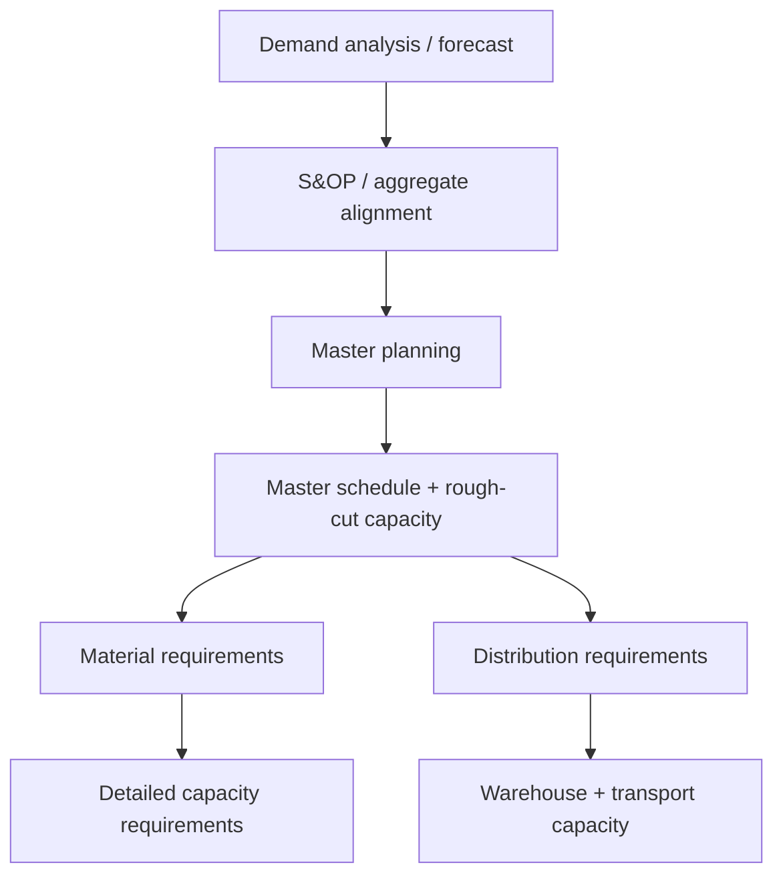

# 1B. End-to-End Procure-and-Deliver Process Overview

## Why this overview appears in demand analysis

Demand analysis is useful only when the organization can translate what it learns into people, infrastructure, plans, logistics, and execution. It therefore belongs inside a broader end-to-end view of how goods and services are procured and delivered.

## Original process map

The six blocks are connected. Better forecasting will not improve customer service if warehousing capacity, supplier contracts, skills, or execution controls cannot support the plan.

## 1. Build people capability

A mature supply chain deliberately develops the knowledge and skills required to run it. Typical actions include setting development goals, supporting independent learning and certification, coaching/mentoring, targeted training, and periodically reviewing progress.

## 2. Build or source the infrastructure

The organization first decides what capabilities it needs and which should be internal versus externally provided. Internal capabilities may require facilities, processes, systems, equipment, staffing, training, and change management. Externally provided capabilities require the right relationships, contracts, expectations, and monitoring.

This is where **make-versus-buy** and **total-cost** thinking begin to connect with supply-chain design.

## 3. Plan and schedule supply and demand

Planning turns market information into executable priorities. At different horizons this can include:

The detailed mechanics of these processes are covered later; here the key point is that demand information propagates into material, capacity, inventory, and logistics decisions.

## 4. Define logistics requirements

The organization determines what logistics must accomplish: warehouse capacity, handling needs, transportation objectives, mode choices, service expectations, and the trade-offs among transportation, inventory, warehousing, and customer service.

## 5. Build logistics capability

If logistics is internal, the organization develops processes, facilities/equipment, roles, skills, and adoption. If it is outsourced, the organization selects service providers and establishes contracts and performance expectations.

## 6. Execute, monitor, and correct

Execution includes production activity, capacity control, inventory control, delivery and transportation monitoring, oversight of third parties, expediting when required, and compliance with legal/regulatory requirements.

## Realistic example — forecast growth is not enough

NorthStar forecasts a 25% increase in demand for a new pump family. The forecast alone does not create capability. The company may also need to:

- train technicians on the new electronics;
- add test equipment;
- secure supplier capacity;
- update the master schedule and material plan;
- reserve warehouse space;
- contract additional transport capacity;
- define exception monitoring during launch.

A demand signal becomes business value only when the rest of the supply chain can respond.

## Decision perspective

When a scenario gives a good demand plan but poor execution, look beyond forecasting. The constraint may sit in skills, infrastructure, capacity, inventory, logistics, supplier relationships, or execution control.

## Related concepts

Module 1 → Section B → Processes for Procuring and Delivering Goods and Services. The structure is source-grounded; wording and visual composition are original.
