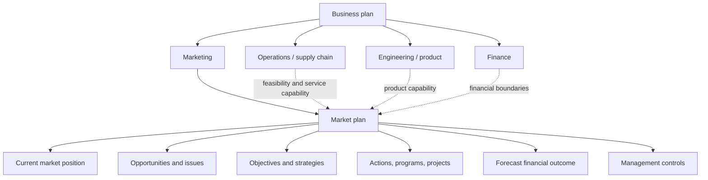
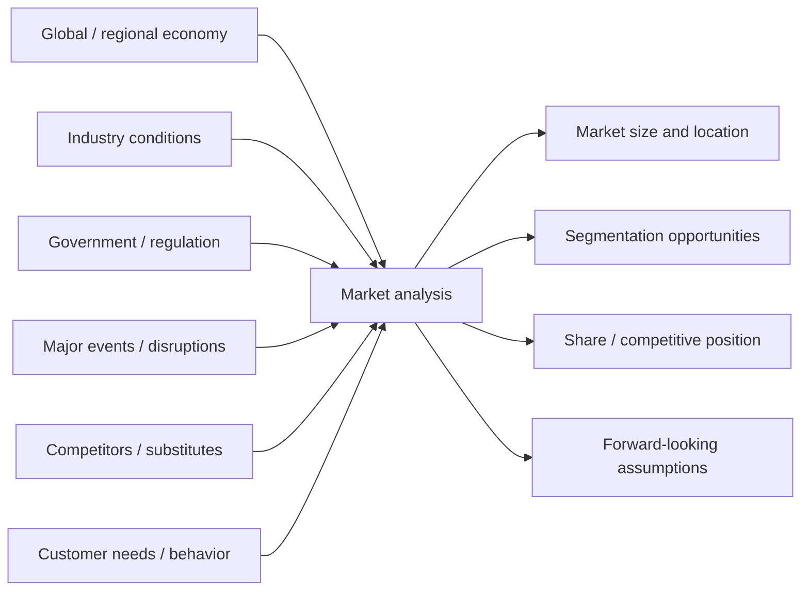
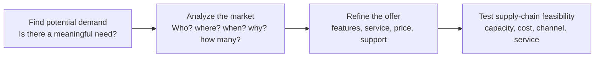
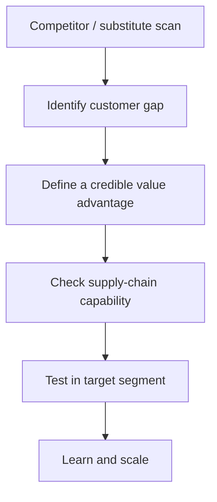

# 2. SWOT, Market Research, and Competitive Intelligence

## Concept in plain English

Strategic demand analysis needs both an **inside view** and an **outside view**. SWOT provides the frame; market research and competitive intelligence provide much of the evidence.

### SWOT in one picture

| | Positive | Negative |
|---|---|---|
| **Internal** | **Strengths** — capabilities that help us compete | **Weaknesses** — internal gaps that hold us back |
| **External** | **Opportunities** — conditions we could exploit | **Threats** — external conditions that could hurt results |

A good SWOT is evidence-based. A vague statement such as “strong brand” is less useful than “repeat-purchase rate is 18 percentage points above the category average in our largest segment.”

## Original visualization — from business plan to market plan

## Original visualization — market-analysis landscape

> **Terminology:** These notes use **market research** as a concise label for systematically gathering and analyzing market, sales, and customer information to support decisions.

## Three useful forms of market research

- **Market analysis:** how large the market is, where it is, how it behaves, and what segments exist.
- **Sales analysis:** how sales and market share are changing by product, customer, geography, or channel.
- **Consumer/customer research:** what buyers value, reject, prefer, complain about, and may be willing to pay for.

## Original process — what market research is trying to accomplish

## Handoff risk — research is not the same as a neutral forecast

Commercial teams naturally want growth, and optimistic assumptions can unintentionally enter the demand plan. If supply planners respond by creating their own conservative version, the organization ends up with competing plans instead of one shared set of assumptions. Cross-functional review is therefore important: assumptions, uncertainty, promotions, and known market events should be visible to everyone using the forecast. In collaborative supply relationships, forecast information may also need to be shared across company boundaries.

Market research should also inform the **service and reverse-flow design** of the offer: documentation, languages, support channels, return policy, repair expectations, disposal/recycling concerns, and other post-sale requirements can all change total demand and total cost.

## Realistic example — smart pump launch

NorthStar is considering a predictive-maintenance version of its pump. Interviews show that large chemical plants value remote condition monitoring, but smaller municipal customers care more about purchase price and ease of repair.

The research result should **not** automatically produce two highly customized products. The team should ask whether the additional variants create enough incremental margin to justify engineering, inventory, service, documentation, and forecasting complexity.

## Competitive scan

A useful competitor scan asks:

- What does the competitor offer?
- At what effective price and service level?
- Where is it stronger or weaker by region?
- Which customer need is still unsatisfied?
- Is the advantage based on cost, availability, quality, innovation, service, or channel access?
- How mature is the competitor's supply-chain capability?

## Common mistake

A customer survey alone does not tell you whether the market contains an unmet need. You also need to understand competing and substitute offerings.

## Common confusion

**Market share** is the portion of current market demand captured by the company or product. It is not the same as revenue growth. A company can grow revenue while losing share if the total market grows faster.

## Practitioner perspective

Market research becomes operationally valuable when it changes a decision: product design, service level, forecast, customer segment, distribution channel, sourcing model, or inventory strategy. Research that never affects a decision is merely information collection.

## Related concepts

Module 1 → Section B → SWOT Analysis, Market Research, Competition, Market Plan. Public wording and diagrams are original.
