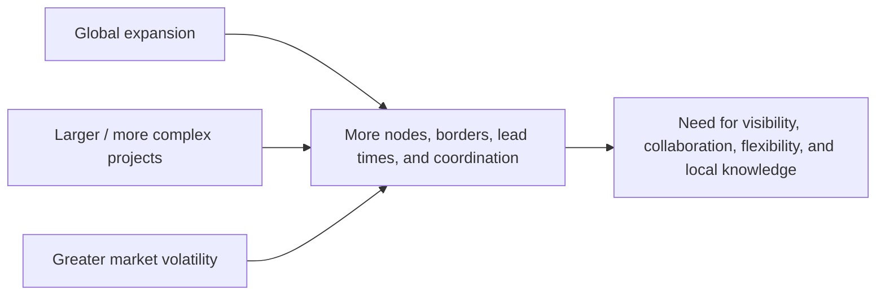

# 3. Global Perspectives and Market Volatility

## Concept in plain English

Global supply chains create opportunity and exposure at the same time. A company may gain access to new customers, suppliers, skills, and scale, but the network also becomes longer, more interdependent, and harder to coordinate.

Three forces are especially important when interpreting demand globally:

## Why local knowledge matters

A global strategy cannot assume that customers everywhere value the same thing. Differences in regulation, climate, infrastructure, payment practices, income, service expectations, and distribution channels can all change demand.

The supply chain therefore needs two capabilities at once:

- enough **standardization** to compare performance and control the network; and
- enough **local adaptation** to understand and serve regional demand.

## Realistic example — NorthStar enters Southeast Asia

NorthStar sees strong regional growth in water-treatment infrastructure and wants to sell its NS-500 pump in three countries. The product itself can remain largely standardized, but the route to market differs:

- Country A requires local regulatory approval before installation.
- Country B has customers who prefer distributor-held spare parts.
- Country C has long inland transport lead times during monsoon season.

A single global sales forecast without those local constraints could create the wrong inventory placement and service promise.

## Disruption perspective

Global interconnectedness means a disruption can affect demand **and** supply at the same time. A major event can:

- interrupt production or inbound materials;
- delay finished-goods transportation;
- change customer priorities;
- change price or availability of substitutes;
- create regional shortages or surpluses.

The correct response is rarely “make the process more rigid.” A global supply chain needs enough flexibility to absorb changes and recover.

## Common mistake

If a scenario emphasizes globalization and disruption, look for answers involving **interdependence, collaboration, visibility, local understanding, and flexibility** rather than isolation or rigid standardization.

## Related concepts

Module 1 → Section B → Global Perspectives. Example and visualization are original.
