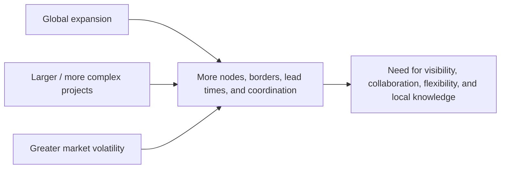

# 3. Global Perspectives and Market Volatility

## Learning objectives

You should be able to:

- explain the operating logic behind global perspectives and market volatility;
- apply the lesson to a realistic planning or supply-chain decision; and
- identify the evidence, trade-off, and trigger needed for responsible use.

## Concept in plain English

Global supply chains create opportunity and exposure at the same time. A company may gain access to new customers, suppliers, skills, and scale, but the network also becomes longer, more interdependent, and harder to coordinate.

Three forces are especially important when interpreting demand globally:

## Why local knowledge matters

A global strategy cannot assume that customers everywhere value the same thing. Differences in regulation, climate, infrastructure, payment practices, income, service expectations, and distribution channels can all change demand.

The supply chain therefore needs two capabilities at once:

- enough **standardization** to compare performance and control the network; and
- enough **local adaptation** to understand and serve regional demand.

## Realistic example — NorthStar enters Southeast Asia

NorthStar sees strong regional growth in water-treatment infrastructure and wants to sell its NS-500 pump in three countries. The product itself can remain largely standardized, but the route to market differs:

- Country A requires local regulatory approval before installation.
- Country B has customers who prefer distributor-held spare parts.
- Country C has long inland transport lead times during monsoon season.

A single global sales forecast without those local constraints could create the wrong inventory placement and service promise.

## Disruption perspective

Global interconnectedness means a disruption can affect demand **and** supply at the same time. A major event can:

- interrupt production or inbound materials;
- delay finished-goods transportation;
- change customer priorities;
- change price or availability of substitutes;
- create regional shortages or surpluses.

The correct response is rarely “make the process more rigid.” A global supply chain needs enough flexibility to absorb changes and recover.

## Why it matters

Demand signals, lead times, regulation, currency, and channel behavior vary by market and cannot safely be averaged into one global assumption.

## Decision logic

Build a common global baseline, then preserve market-specific assumptions and test scenarios for currency, policy, infrastructure, and volatility. Do not approve the decision until mandatory conditions are feasible and the residual exposure has a named owner.

## Evidence retained through the workflow

Retain market assumptions, local evidence, currency and policy scenarios, lead-time distribution, service promise, and escalation threshold. Record the decision date and the event or threshold that requires reassessment.

## Applied decision artifact

Use a one-page **global perspectives and market volatility decision record** with these fields:

- **Decision and boundary:** Build a common global baseline, then preserve market-specific assumptions and test scenarios for currency, policy, infrastructure, and volatility.
- **Required evidence:** market assumptions, local evidence, currency and policy scenarios, lead-time distribution, service promise, and escalation threshold.
- **Expected result:** Demand signals, lead times, regulation, currency, and channel behavior vary by market and cannot safely be averaged into one global assumption.
- **Balancing condition:** Global standardization improves comparability and scale, while local adaptation captures market reality at added complexity and governance cost.
- **Accountability:** name the decision owner, approval date, residual exposure owner, and measurable trigger for reassessment.

The record is complete only when another practitioner can reproduce the reasoning and identify the next action without relying on meeting memory.

## Trade-offs

Global standardization improves comparability and scale, while local adaptation captures market reality at added complexity and governance cost.

## Commonly confused with

Do not confuse a preferred decision method with a guaranteed outcome. Build a common global baseline, then preserve market-specific assumptions and test scenarios for currency, policy, infrastructure, and volatility. Validate the result with market assumptions, local evidence, currency and policy scenarios, lead-time distribution, service promise, and escalation threshold; the evidence, not the method's label, determines whether the choice worked.

## Common mistakes
If a scenario emphasizes globalization and disruption, look for answers involving **interdependence, collaboration, visibility, local understanding, and flexibility** rather than isolation or rigid standardization.

## Original knowledge check

**Question.** NorthStar is deciding how to apply global perspectives and market volatility. Which proposal is most defensible?

A. Use global perspectives and market volatility as a label for the preferred option before defining the decision outcome, constraints, or owner.
B. Build a common global baseline, then preserve market-specific assumptions and test scenarios for currency, policy, infrastructure, and volatility.
C. Choose the apparent upside without evaluating this balancing condition: Global standardization improves comparability and scale, while local adaptation captures market reality at added complexity and governance cost.
D. Approve the choice without retaining market assumptions, local evidence, currency and policy scenarios, lead-time distribution, service promise, and escalation threshold; omit the reassessment trigger as well.

Answer and rationale

### Correct answer

**B. Build a common global baseline, then preserve market-specific assumptions and test scenarios for currency, policy, infrastructure, and volatility.**

### Why it is correct

Demand signals, lead times, regulation, currency, and channel behavior vary by market and cannot safely be averaged into one global assumption. The recommended action connects the operating choice to evidence, ownership, and a measurable outcome.

### Why the other answers are wrong

- **A** reverses the decision sequence. The team should first do the required work: build a common global baseline, then preserve market-specific assumptions and test scenarios for currency, policy, infrastructure, and volatility.
- **C** optimizes one visible result and omits the balancing effects: global standardization improves comparability and scale, while local adaptation captures market reality at added complexity and governance cost.
- **D** leaves the approval unauditable. A reviewer would be missing market assumptions, local evidence, currency and policy scenarios, lead-time distribution, service promise, and escalation threshold, as well as the trigger needed to revisit the decision when conditions change.

Those approaches ignore the governing trade-off: global standardization improves comparability and scale, while local adaptation captures market reality at added complexity and governance cost.

## Practitioner perspective

A review should be able to reconstruct the choice from market assumptions, local evidence, currency and policy scenarios, lead-time distribution, service promise, and escalation threshold. If those records cannot explain what changed, who decided, and when the decision will be revisited, the process is not yet controlled.

## Related concepts

- [Section overview](./README.md)
- [Module 2 continuation](../../02-network-design-digital-connectivity-performance/section-a-network-design-and-technology-investment/02-market-segmentation-and-service-choices.md)
Module 1 → Section B → Global Perspectives. Example and visualization are original.

---

[Previous: SWOT, Market Research, and Competitive Intelligence](02-swot-market-research-and-competition.md) · [Next: Product Portfolio, Classifications, and Complexity](04-product-portfolio-and-classification.md)
