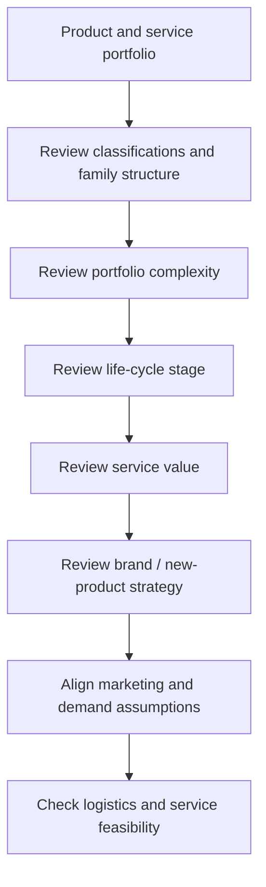
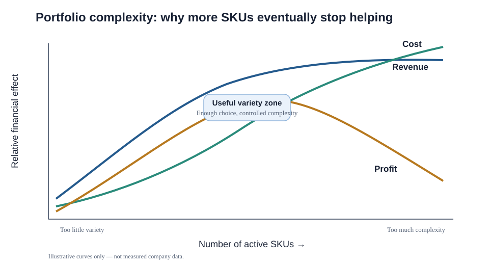

# 4. Product Portfolio, Classifications, and Complexity

## Learning objectives

You should be able to:

- explain the operating logic behind product portfolio, classifications, and complexity;
- apply the lesson to a realistic planning or supply-chain decision; and
- identify the evidence, trade-off, and trigger needed for responsible use.

## Why the portfolio belongs in demand analysis

Demand planning should not assume the current portfolio is automatically the right portfolio. Before forecasting every SKU forever, the organization should ask whether the products, services, package sizes, variants, and families still fit customer needs and the economics of the supply chain.

## Original visualization — portfolio review sequence

## First classification layer — what kind of offering is it?

- **Durable goods:** physical products expected to remain useful for an extended period.
- **Non-durable goods:** physical products consumed or deteriorated relatively quickly.
- **Services:** intangible offerings that generally cannot be inventoried in the same way as physical goods.

A portfolio review can also examine product form, durability, reliability, repurchase/replacement frequency, customization, warranty/repair/training cost, pack size, and whether the product-family hierarchy still supports profitable production and distribution.

## Product classifications and typical supply-chain emphasis

The classification matters because customers buy different products for different reasons.

| Product group | Typical supply-chain emphasis |
|---|---|
| Industrial raw materials/components | Competitive cost plus reliable, responsive supply service |
| Industrial capital equipment | Strong quality first, then cost, feature flexibility, and dependable service |
| MRO items | Cost, availability/reliability, and speed |
| Consumer convenience goods | Cost and dependable availability |
| Consumer shopping goods | Quality/brand perception, service dependability, then cost |
| Consumer specialty goods | Quality and prestige dominate |

This is a **decision aid, not an absolute ranking**. Specific customers and markets can value attributes differently.

## Portfolio complexity

Every new SKU may create revenue opportunity, but it can also create:

- lower manufacturing scale;
- more purchased parts and packaging;
- more inventory locations and safety stock;
- more forecasting error at the SKU level;
- more service, documentation, and training effort;
- more marketing messages competing with one another.

The learning point is the shape of the trade-off: revenue can flatten while cost keeps rising, causing profit to peak and then fall.

## Realistic example — too many pump variants

NorthStar sells the same pump in 24 combinations of motor voltage, casing finish, sensor package, and label language. Sales asks for eight more combinations because a few customers requested them.

Before approving the variants, the portfolio team estimates:

- expected annual incremental gross margin: **$240,000**;
- added component and packaging inventory carrying cost: **$72,000**;
- extra quality/documentation cost: **$38,000**;
- added changeover and schedule loss: **$84,000**;
- additional service/spares complexity: **$31,000**.

The apparent $240,000 opportunity falls to about **$15,000** before considering forecast error and obsolescence. The right question is not “will anyone buy it?” but “does the variant create enough total value?”

## Why it matters

Excess variants divide demand, reduce forecastability, increase changeovers, and trap inventory while apparent revenue remains attractive.

## Decision logic

When portfolio complexity grows, review:

1. Is the feature a true customer requirement or merely a preference?
2. Does it win orders or simply duplicate another option?
3. Can modular design/postponement provide variety without creating finished-goods complexity?
4. Are we optimizing profit and total cost rather than revenue alone?

## Evidence retained through the workflow

Retain SKU-family hierarchy, demand and margin history, lifecycle stage, service rule, complexity cost, owner, and retirement trigger. Record the decision date and the event or threshold that requires reassessment.

## Applied decision artifact

Use a one-page **product portfolio, classifications, and complexity decision record** with these fields:

- **Decision and boundary:** Segment offerings by demand, lifecycle, margin, strategic role, service need, and complexity cost before setting differentiated planning policies.
- **Required evidence:** SKU-family hierarchy, demand and margin history, lifecycle stage, service rule, complexity cost, owner, and retirement trigger.
- **Expected result:** Excess variants divide demand, reduce forecastability, increase changeovers, and trap inventory while apparent revenue remains attractive.
- **Balancing condition:** Broader variety may improve customer fit but increases inventory, data, sourcing, production, and service complexity.
- **Accountability:** name the decision owner, approval date, residual exposure owner, and measurable trigger for reassessment.

The record is complete only when another practitioner can reproduce the reasoning and identify the next action without relying on meeting memory.

## Trade-offs

Broader variety may improve customer fit but increases inventory, data, sourcing, production, and service complexity.

## Commonly confused with

Do not confuse a preferred decision method with a guaranteed outcome. Segment offerings by demand, lifecycle, margin, strategic role, service need, and complexity cost before setting differentiated planning policies. Validate the result with SKU-family hierarchy, demand and margin history, lifecycle stage, service rule, complexity cost, owner, and retirement trigger; the evidence, not the method's label, determines whether the choice worked.

## Common mistakes
More SKUs can increase sales while still reducing profit. Do not choose an answer simply because it maximizes revenue.

## Original knowledge check

**Question.** NorthStar is deciding how to apply product portfolio, classifications, and complexity. Which proposal is most defensible?

A. Use product portfolio, classifications, and complexity as a label for the preferred option before defining the decision outcome, constraints, or owner.
B. Segment offerings by demand, lifecycle, margin, strategic role, service need, and complexity cost before setting differentiated planning policies.
C. Choose the apparent upside without evaluating this balancing condition: Broader variety may improve customer fit but increases inventory, data, sourcing, production, and service complexity.
D. Approve the choice without retaining SKU-family hierarchy, demand and margin history, lifecycle stage, service rule, complexity cost, owner, and retirement trigger; omit the reassessment trigger as well.

Answer and rationale

### Correct answer

**B. Segment offerings by demand, lifecycle, margin, strategic role, service need, and complexity cost before setting differentiated planning policies.**

### Why it is correct

Excess variants divide demand, reduce forecastability, increase changeovers, and trap inventory while apparent revenue remains attractive. The recommended action connects the operating choice to evidence, ownership, and a measurable outcome.

### Why the other answers are wrong

- **A** reverses the decision sequence. The team should first do the required work: segment offerings by demand, lifecycle, margin, strategic role, service need, and complexity cost before setting differentiated planning policies.
- **C** optimizes one visible result and omits the balancing effects: broader variety may improve customer fit but increases inventory, data, sourcing, production, and service complexity.
- **D** leaves the approval unauditable. A reviewer would be missing SKU-family hierarchy, demand and margin history, lifecycle stage, service rule, complexity cost, owner, and retirement trigger, as well as the trigger needed to revisit the decision when conditions change.

Those approaches ignore the governing trade-off: broader variety may improve customer fit but increases inventory, data, sourcing, production, and service complexity.

## Practitioner perspective

A review should be able to reconstruct the choice from SKU-family hierarchy, demand and margin history, lifecycle stage, service rule, complexity cost, owner, and retirement trigger. If those records cannot explain what changed, who decided, and when the decision will be revisited, the process is not yet controlled.

## Related concepts

- [Section overview](./README.md)
- [Module 2 continuation](../../02-network-design-digital-connectivity-performance/section-a-network-design-and-technology-investment/02-market-segmentation-and-service-choices.md)
Module 1 → Section B → Product Assessments, Product Classification Review, Product Portfolio Complexity Management. Table, example, and graphic are independently created.

---

[Previous: Global Perspectives and Market Volatility](03-global-perspectives.md) · [Next: Product Life Cycle, Services, and New-Product Implications](05-product-life-cycle-and-services.md)
