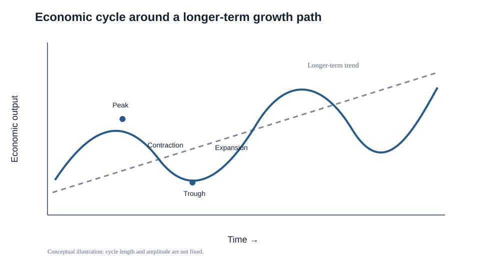

# 6. Macroeconomic Demand Patterns

## Concept in plain English

Macroeconomics looks at the **economy as a whole**. Supply-chain managers use it to form a strategic view of what may happen to industry demand, input availability, prices, investment, and capacity — not to predict one SKU directly.

Economic activity can move through expansion, peak, contraction, and trough while a longer-term growth path exists underneath. The timing and size of each cycle are not fixed.

## Why it matters to the supply chain

Macroeconomic changes can affect both demand and supply:

| Change | Possible demand-side effect | Possible supply-side effect |
|---|---|---|
| Higher interest rates | Lower big-ticket/capital spending | Higher financing cost for capacity and inventory |
| Lower interest rates | More borrowing and investment | Easier funding for projects/capacity |
| Currency depreciation | Domestic goods may become more attractive abroad | Imported inputs may become more expensive |
| Higher input prices | Customer prices may rise | Producers may reduce output if margins compress |
| Higher taxes/regulatory cost | Disposable income or investment may fall | Cost to supply may increase |
| Productivity improvement | Can support higher real output | More output from the same input base |

These are directional relationships, not guarantees. Industry structure and company-specific factors still matter.

## Real output, prices, and capacity limits

A useful macroeconomic mental model is that the economy has both **aggregate demand** and an ability to supply output. As overall prices rise, purchasing power can weaken; at the same time, higher selling prices can encourage production. Physical constraints still exist — labor, materials, equipment, and productivity limit how much output can expand in the short run.

Near very high utilization, additional demand may create more price pressure than real output. Near a trough, idle capacity and available labor may allow output to recover as demand returns.

The source also uses **full employment** to describe the point at which remaining unemployment is mainly frictional (normal job transitions) or structural (skills/location mismatch), rather than a broad shortage of jobs.

### Real GDP and weighted average price

The source uses **real GDP** together with a **weighted average price** concept to illustrate the business cycle. Real GDP represents inflation-adjusted output, while the weighted average price represents the overall price level of the mix of goods and services being considered. Around a trough, unused capacity can allow real output to increase with less price pressure; as the economy approaches capacity limits, additional demand can show up increasingly as higher prices rather than proportionally higher real output.

## Inflation and deflation

- **Inflation:** sustained upward movement in the general price level.
- **Deflation:** sustained downward movement in the general price level.

A supply-chain professional may monitor measures such as consumer prices, consumer confidence, GDP, interest rates, employment, trade, investment, and government fiscal conditions. The purpose is to identify **leading evidence** of what demand and cost conditions may look like next.

## Indicators to scan

No single indicator is enough. A strategic scan may include:

- real GDP / output;
- consumer prices;
- consumer confidence;
- employment;
- interest rates;
- exchange rates and net exports;
- government deficits/debt and fiscal conditions;
- household savings;
- foreign and domestic investment;
- industry-specific leading and lagging indicators.

A **leading indicator** may turn before the economy or industry does; a **lagging indicator** is more useful for confirming what has already happened.

A commonly used rule of thumb describes a recession as two consecutive quarters of falling real GDP, while a depression is a severe or prolonged contraction. Practitioners should use the definitions adopted by the relevant national authority when making formal assessments.

## Realistic example — planning near an economic trough

A company selling warehouse automation equipment sees low current orders, but business-confidence surveys, permit activity, and customer capital-budget inquiries have been improving for three months.

A risk-seeking company might use the weak labor market to hire scarce engineering talent before demand fully recovers. A conservative company may wait for stronger confirmation. The strategic choice depends on risk posture, but the important idea is that **leading indicators can turn before current output does**.

## Common confusion

**Macroeconomics is not a direct SKU forecast.** An expanding economy may help overall demand while a specific product still declines because it is obsolete, overpriced, or losing to a substitute.

## Common mistake

If the question describes economy-wide behavior — GDP, inflation, aggregate employment, national interest rates — think **macroeconomics**, not microeconomics.

## Related concepts

Module 1 → Section B → Macroeconomic Demand Patterns, Economic Cycles, Inflation/Deflation, Economic Metrics. Graphic and examples are original.
