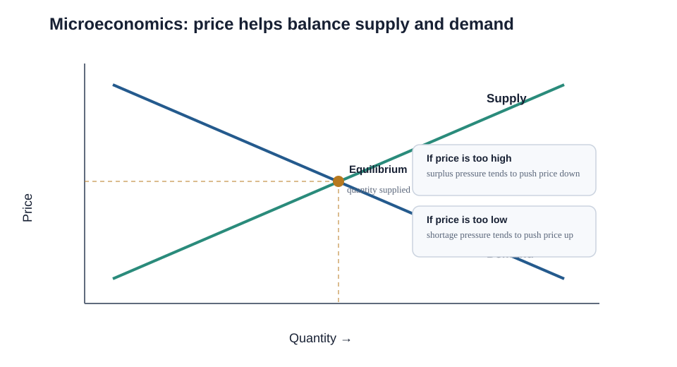
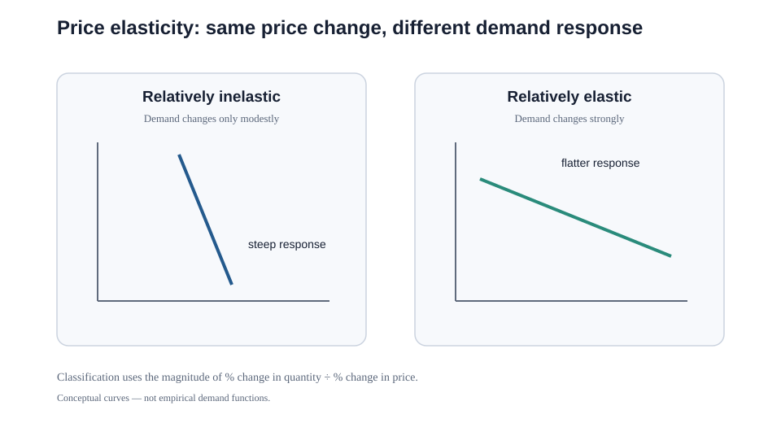

# 7. Microeconomics, Price Elasticity, and Marginal Analysis

## Learning objectives

You should be able to:

- explain the operating logic behind microeconomics, price elasticity, and marginal analysis;
- apply the lesson to a realistic planning or supply-chain decision; and
- identify the evidence, trade-off, and trigger needed for responsible use.

## Microeconomics in plain English

Microeconomics studies decisions made by individual customers and firms: how much to buy, how much to produce, what price to accept, and how resources move when incentives change.

Two basic directional rules frame many decisions:

- as **price rises**, quantity demanded tends to fall, other things equal;
- as **price rises**, quantity supplied tends to rise, other things equal.

A market tends toward a price/quantity region where the amount buyers want and the amount sellers offer are in balance.

## Supporting concepts

- **Scarcity:** not every desired resource is unlimited.
- **Opportunity cost:** choosing one option means giving up the value of another.
- **Substitution effect:** if a substitute becomes relatively more attractive, buyers may shift demand.
- **Income effect:** lower prices can allow a buyer with a fixed budget to buy more.
- **Diminishing marginal utility:** each additional unit may provide less added usefulness than the previous unit, helping explain why buyers usually require a lower price to consume more.
- **Economies of scale:** average unit cost can fall as output rises and fixed cost is spread.
- **Diminishing returns / diseconomies:** beyond some point, adding output can create new cost and complexity.

## Price elasticity of demand

A practical expression is:

`Price elasticity = (% change in quantity demanded) / (% change in price)`

Because price and quantity demanded usually move in opposite directions, the coefficient can be negative. For classification, focus on the **magnitude**:

- magnitude greater than 1 → relatively elastic;
- magnitude less than 1 → relatively inelastic;
- around 1 → roughly unit elastic.

### Useful elasticity heuristics

These are tendencies rather than universal laws:

- necessities tend to be less price-sensitive than luxuries;
- inexpensive routine items often show less response to small price movements;
- customers are usually less able to react in the short term and more able to find substitutes over a longer horizon.

### Worked example — two different products

A supplier considers a 10% price reduction.

**Product A — maintenance seal kit**

- price falls from $50 to $45: **-10%**;
- expected quantity rises from 10,000 to 10,500: **+5%**;
- elasticity magnitude ≈ **0.5** → relatively inelastic.

**Product B — optional wireless sensor upgrade**

- price falls from $200 to $180: **-10%**;
- expected quantity rises from 4,000 to 5,600: **+40%**;
- elasticity magnitude ≈ **4.0** → relatively elastic.

The same price action creates very different demand responses.

## Profit, not revenue alone

A price cut may increase revenue and still reduce profit if margin per unit collapses or logistics/service costs rise. Always consider the relevant cost structure.

## Price elasticity of supply

Supply can be relatively inelastic in the short term because capacity, tooling, labor, or materials cannot change instantly. Over a longer horizon, suppliers can add capacity, enter or exit a market, or shift to more attractive products, making supply more responsive.

## Marginal analysis

Marginal analysis asks whether **one additional action** creates more incremental benefit than incremental cost.

A useful decision rule is:

`Incremental benefit from the choice > Incremental cost of the choice`

When the benefit is measured as added revenue, a convenient calculation is:

`Marginal net benefit = Marginal revenue − Marginal cost`

### Realistic example — fill empty truck space

A truck is already committed to travel from Dallas to Houston. Its base trip cost will be incurred whether or not 2,000 kg of extra freight is accepted.

A customer offers **$0.06/kg** for the extra load. Additional fuel, handling, stop time, and wear total **$0.025/kg**.

- marginal revenue = $0.06/kg
- marginal cost = $0.025/kg
- marginal benefit = **$0.035/kg**

If the added stop does not violate service or capacity constraints, accepting the freight is economically rational. The full original trip cost is not charged again because it is already committed for this decision.

## Why it matters

Price and volume decisions can increase revenue while reducing contribution or creating capacity and service costs that destroy value.

## Decision logic

Estimate elasticity over a stated range, calculate incremental revenue and cost, and approve changes on marginal profit and operational feasibility. Do not approve the decision until mandatory conditions are feasible and the residual exposure has a named owner.

## Evidence retained through the workflow

Retain price range, baseline and response volume, elasticity method, variable and constraint cost, contribution, confidence, and guardrail. Record the decision date and the event or threshold that requires reassessment.

## Applied decision artifact

Use a one-page **microeconomics, price elasticity, and marginal analysis decision record** with these fields:

- **Decision and boundary:** Estimate elasticity over a stated range, calculate incremental revenue and cost, and approve changes on marginal profit and operational feasibility.
- **Required evidence:** price range, baseline and response volume, elasticity method, variable and constraint cost, contribution, confidence, and guardrail.
- **Expected result:** Price and volume decisions can increase revenue while reducing contribution or creating capacity and service costs that destroy value.
- **Balancing condition:** A lower price may expand volume and utilization, but it can compress margin, overload constraints, and reset customer expectations.
- **Accountability:** name the decision owner, approval date, residual exposure owner, and measurable trigger for reassessment.

The record is complete only when another practitioner can reproduce the reasoning and identify the next action without relying on meeting memory.

## Trade-offs

A lower price may expand volume and utilization, but it can compress margin, overload constraints, and reset customer expectations.

## Commonly confused with

Do not confuse a preferred decision method with a guaranteed outcome. Estimate elasticity over a stated range, calculate incremental revenue and cost, and approve changes on marginal profit and operational feasibility. Validate the result with price range, baseline and response volume, elasticity method, variable and constraint cost, contribution, confidence, and guardrail; the evidence, not the method's label, determines whether the choice worked.

## Common mistakes

- Do not classify a necessity as highly elastic merely because its price changed.
- Demand often becomes **more elastic over a longer horizon** because customers have more time to find substitutes or change behavior.
- In marginal analysis, ignore costs that will be incurred regardless of the choice; focus on incremental cost and benefit.

## Original knowledge check

**Question.** NorthStar is deciding how to apply microeconomics, price elasticity, and marginal analysis. Which proposal is most defensible?

A. Use microeconomics, price elasticity, and marginal analysis as a label for the preferred option before defining the decision outcome, constraints, or owner.
B. Estimate elasticity over a stated range, calculate incremental revenue and cost, and approve changes on marginal profit and operational feasibility.
C. Choose the apparent upside without evaluating this balancing condition: A lower price may expand volume and utilization, but it can compress margin, overload constraints, and reset customer expectations.
D. Approve the choice without retaining price range, baseline and response volume, elasticity method, variable and constraint cost, contribution, confidence, and guardrail; omit the reassessment trigger as well.

Answer and rationale

### Correct answer

**B. Estimate elasticity over a stated range, calculate incremental revenue and cost, and approve changes on marginal profit and operational feasibility.**

### Why it is correct

Price and volume decisions can increase revenue while reducing contribution or creating capacity and service costs that destroy value. The recommended action connects the operating choice to evidence, ownership, and a measurable outcome.

### Why the other answers are wrong

- **A** reverses the decision sequence. The team should first do the required work: estimate elasticity over a stated range, calculate incremental revenue and cost, and approve changes on marginal profit and operational feasibility.
- **C** optimizes one visible result and omits the balancing effects: A lower price may expand volume and utilization, but it can compress margin, overload constraints, and reset customer expectations.
- **D** leaves the approval unauditable. A reviewer would be missing price range, baseline and response volume, elasticity method, variable and constraint cost, contribution, confidence, and guardrail, as well as the trigger needed to revisit the decision when conditions change.

Those approaches ignore the governing trade-off: A lower price may expand volume and utilization, but it can compress margin, overload constraints, and reset customer expectations.

## Practitioner perspective

A review should be able to reconstruct the choice from price range, baseline and response volume, elasticity method, variable and constraint cost, contribution, confidence, and guardrail. If those records cannot explain what changed, who decided, and when the decision will be revisited, the process is not yet controlled.

## Related concepts

- [Section overview](./README.md)
- [Module 2 continuation](../../02-network-design-digital-connectivity-performance/section-a-network-design-and-technology-investment/02-market-segmentation-and-service-choices.md)
Module 1 → Section B → Microeconomics, Supply and Demand, Price Elasticity, Marginal Analysis. Equations are standard; examples, values, wording, and visuals are original.

---

[Previous: Macroeconomic Demand Patterns](06-macroeconomic-demand-patterns.md) · [Next: Short- and Medium-Term Demand Patterns](08-short-medium-term-demand-patterns.md)
