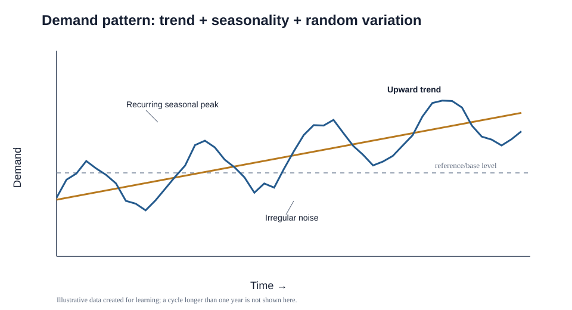

# 8. Short- and Medium-Term Demand Patterns

## The pattern-decomposition idea

Historical demand is rarely one clean signal. A useful mental model is:

**observed demand = base level + trend + seasonality + cycles/external drivers + promotions/internal drivers + random variation**

The purpose of analysis is not to force every data point into a story. It is to explain the repeatable structure well enough that forecasting can treat predictable effects differently from noise.

## Trend

A **trend** is a persistent direction over time — upward, flat, or downward. It can be linear or accelerate/decelerate.

Example: NorthStar's smart-pump family has grown about 7–10% annually for four years as customers adopt condition monitoring.

## Cycle

A **cycle** is a wave-like movement that lasts longer than a normal seasonal calendar pattern. Economic expansion and recession are classic examples. The timing is not reliably fixed to a month or quarter.

Example: demand for heavy construction equipment may rise and fall with multi-year investment cycles. External drivers can sometimes be tracked through **leading indicators** (early signal) or **lagging indicators** (confirmation after the change).

## Seasonality

**Seasonality** is a recurring calendar-linked pattern within a year. It can occur by month, week, day, or even hour.

Examples:

- cold-drink demand rises in summer;
- parcel volume rises around year-end holidays;
- restaurant demand peaks at meal times;
- a B2B company sees order spikes at fiscal-quarter end.

If seasonality is material, forecasting often separates the underlying level/trend from the seasonal effect and then reapplies the seasonal pattern.

## Promotions and other internal drivers

Discounts, advertising, special placement, and commercial campaigns can intentionally change demand. If a promotion caused a spike, treating that spike as ordinary base demand can create a bad forecast.

### Example

Normal weekly demand for a home air purifier is about **2,400 units**. A two-week retail promotion creates sales of **5,800** and **6,200 units**. If the planner simply averages those weeks into the baseline, the future forecast may be inflated unless the promotion effect is identified separately.

## Random variation

Random variation is the residual fluctuation that remains after identifiable patterns and causes have been accounted for. It is the part we cannot reliably explain or predict.

A statistical-process-control analogy can help: identifiable effects such as a promotion or seasonal event behave like **special/assignable causes**, while the many small unexplained influences resemble **common-cause variation**. The analogy is useful because it encourages the planner to remove explainable structure before labeling the remainder as noise.

After identifiable structure has been removed, the remaining residual should behave more like noise than a repeatable pattern. If the residual still shows a strong shape, the analyst may have missed an explanatory driver. The goal is not to explain every point, but also not to label a repeatable cause as random.

A useful test is:

> If trend, seasonality, promotions, events, and other known drivers have already been addressed, what remains may be random variation rather than another pattern that needs a story.

## Compare the four major patterns

| Pattern | Calendar-fixed? | Typical horizon | Predictability |
|---|---:|---|---|
| Trend | No | Long | Direction may persist but can change |
| Seasonality | Yes | Within a year | Relatively predictable if history is stable |
| Cycle | No | Multi-year / irregular | Harder to time precisely |
| Random variation | No | Any | Unpredictable by definition |

## Common mistake

Do not confuse **seasonality** with a **cycle**. A December holiday spike that repeats each year is seasonal. A multi-year construction boom and slowdown is cyclical.

## Practitioner perspective

Forecasting systems can decompose history mathematically, but human review still matters. Promotions, product transitions, stockouts, one-time projects, and data errors can all create apparent patterns that should not be extrapolated automatically.

## Related concepts

Module 1 → Section B → Short- to Medium-Term Demand Patterns, Trends, Cycles, Seasonality, Promotions, Random Variation. Graphic, table, examples, and wording are original.
