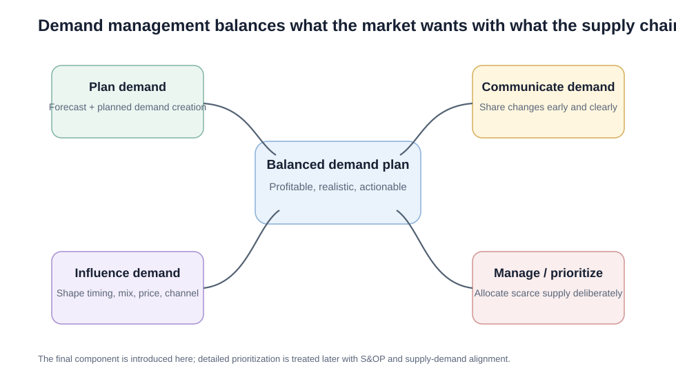
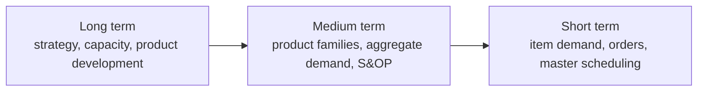
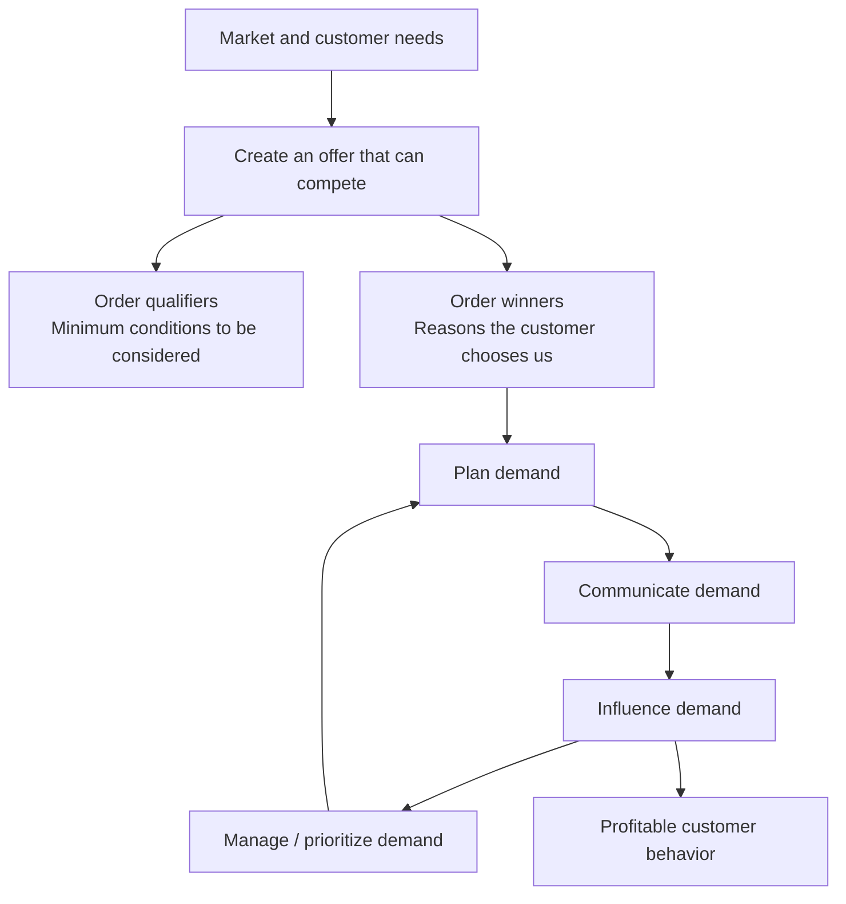
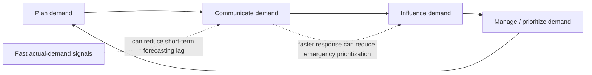

# 1. Demand Management Foundations

## Learning objectives

After this topic, you should be able to:

- explain demand management in plain English;
- distinguish planning, communicating, influencing, and prioritizing demand;
- connect demand management to long-, medium-, and short-term planning;
- distinguish an **order qualifier** from an **order winner**;
- explain why different capacity strategies emphasize different demand-management components.

## Concept in plain English

Demand management is the process of keeping **what customers are likely to want** and **what the organization can profitably supply** in balance.

It is broader than forecasting. Forecasting estimates future demand. Demand management also asks:

- What demand should we actively create?
- What changes must we tell supply-chain partners about?
- Can demand be moved to a different period or product?
- If supply is constrained, which demand should receive priority?
- Are the commercial teams actually committed to creating the demand in the plan?

The process therefore connects the market-facing side of the business with operations, logistics, finance, product management, and supply partners.

## Original visualization — four components

## Demand management across planning horizons

The level of detail increases as the decision horizon gets shorter.

A long-range executive plan may be expressed in revenue or broad product families. Near-term execution needs item-level quantities, locations, and dates.

## Demand-management road map

The purpose is not to create volume at any cost. The goal is profitable demand that the supply chain can serve.

## How the components link together

The components are iterative rather than one-time handoffs.

At short horizons, timely actual-demand information can shorten the loop. If point-of-sale or customer-consumption signals reach partners quickly, the supply chain relies less on delayed order signals and has fewer surprises to prioritize after the fact.

## Order qualifier vs. order winner

An **order qualifier** is something the company must be good enough at just to remain in the customer's consideration set.

An **order winner** is a characteristic that actually helps the customer choose that company over alternatives.

| Situation | Likely role |
|---|---|
| Meeting an industry-mandated quality level | Qualifier |
| Same-day delivery when competitors take a week | Potential winner |
| Price within the normal market range | Qualifier |
| Highly reliable field service in a critical-equipment market | Potential winner |

An order winner can become a qualifier over time as competitors copy it.

## Four capacity strategies and the demand-management emphasis

The section content links the four demand-management components to different ways of handling capacity.

| Capacity approach | Main demand-management emphasis | Practical meaning |
|---|---|---|
| High fixed capacity | Planning demand | Carry enough capability to meet peaks |
| Highly variable capacity | Communicating demand | Adjust labor/outsourcing quickly as demand changes |
| Moderately variable capacity | Influencing demand | Shape demand toward the capacity profile |
| Fixed average capacity | Managing/prioritizing demand | Ration or schedule when demand exceeds supply |

### Example

A cloud-support provider keeps a large bench of qualified engineers because lost enterprise incidents would be extremely costly. Its strategy leans heavily on **planning demand** and maintaining high capacity.

A seasonal fulfillment company instead uses temporary labor and third-party capacity. Its ability to react depends heavily on **communicating demand early**.

An airline has relatively fixed near-term seat capacity. It uses pricing, booking rules, and scheduling to **influence and prioritize demand**.

## Realistic example — NorthStar

NorthStar sells industrial pumps.

- Hospitals require 99.9% uptime support to consider NorthStar at all. That service level is an **order qualifier**.
- NorthStar's strongest differentiator is a 48-hour swap-out program for critical pumps. That is an **order winner** for some segments.
- During a supplier shortage, NorthStar promotes models using available motors rather than pushing every customer toward the constrained model. That is **influencing demand**.

## Why it matters

Uncoordinated forecasting, commercial activity, and supply response create promises that capacity, inventory, or profitability cannot support.

## Decision logic

When you see a scenario, ask:

1. Is the company trying to **estimate and commit** future demand? → planning.
2. Is it trying to **share changes or assumptions**? → communicating.
3. Is it trying to **change customer behavior**? → influencing.
4. Is it deciding **who gets limited supply**? → managing/prioritizing.

## Evidence retained through the workflow

Retain baseline forecast, commercial assumptions, constraints, approved demand actions, owners, customer effect, and outcome measures. Record the decision date and the event or threshold that requires reassessment.

## Applied decision artifact

Use a one-page **demand management foundations decision record** with these fields:

- **Decision and boundary:** Run demand management as a closed loop that senses demand, develops a consensus plan, influences feasible demand, and measures outcomes.
- **Required evidence:** baseline forecast, commercial assumptions, constraints, approved demand actions, owners, customer effect, and outcome measures.
- **Expected result:** Uncoordinated forecasting, commercial activity, and supply response create promises that capacity, inventory, or profitability cannot support.
- **Balancing condition:** Influencing demand can protect service and margin but may shift customers, channels, or revenue in unintended ways.
- **Accountability:** name the decision owner, approval date, residual exposure owner, and measurable trigger for reassessment.

The record is complete only when another practitioner can reproduce the reasoning and identify the next action without relying on meeting memory.

## Trade-offs

Influencing demand can protect service and margin but may shift customers, channels, or revenue in unintended ways.

## Commonly confused with

Do not confuse a preferred decision method with a guaranteed outcome. Run demand management as a closed loop that senses demand, develops a consensus plan, influences feasible demand, and measures outcomes. Validate the result with baseline forecast, commercial assumptions, constraints, approved demand actions, owners, customer effect, and outcome measures; the evidence, not the method's label, determines whether the choice worked.

## Common mistakes
Do not treat demand management as another name for forecasting. Forecasting is an input. Demand management is the broader balancing process.

## Original knowledge check

**Question.** NorthStar is deciding how to apply demand management foundations. Which proposal is most defensible?

A. Use demand management foundations as a label for the preferred option before defining the decision outcome, constraints, or owner.
B. Run demand management as a closed loop that senses demand, develops a consensus plan, influences feasible demand, and measures outcomes.
C. Choose the apparent upside without evaluating this balancing condition: Influencing demand can protect service and margin but may shift customers, channels, or revenue in unintended ways.
D. Approve the choice without retaining baseline forecast, commercial assumptions, constraints, approved demand actions, owners, customer effect, and outcome measures; omit the reassessment trigger as well.

Answer and rationale

### Correct answer

**B. Run demand management as a closed loop that senses demand, develops a consensus plan, influences feasible demand, and measures outcomes.**

### Why it is correct

Uncoordinated forecasting, commercial activity, and supply response create promises that capacity, inventory, or profitability cannot support. The recommended action connects the operating choice to evidence, ownership, and a measurable outcome.

### Why the other answers are wrong

- **A** reverses the decision sequence. The team should first do the required work: run demand management as a closed loop that senses demand, develops a consensus plan, influences feasible demand, and measures outcomes.
- **C** optimizes one visible result and omits the balancing effects: influencing demand can protect service and margin but may shift customers, channels, or revenue in unintended ways.
- **D** leaves the approval unauditable. A reviewer would be missing baseline forecast, commercial assumptions, constraints, approved demand actions, owners, customer effect, and outcome measures, as well as the trigger needed to revisit the decision when conditions change.

Those approaches ignore the governing trade-off: influencing demand can protect service and margin but may shift customers, channels, or revenue in unintended ways.

## Practitioner perspective

A review should be able to reconstruct the choice from baseline forecast, commercial assumptions, constraints, approved demand actions, owners, customer effect, and outcome measures. If those records cannot explain what changed, who decided, and when the decision will be revisited, the process is not yet controlled.

## Related concepts

- [Section overview](./README.md)
- [Module 2 continuation](../../02-network-design-digital-connectivity-performance/section-b-connected-supply-networks-and-master-data/03-advanced-planning-and-constraint-management.md)
- [Planning demand and the demand plan](02-planning-demand-and-demand-plan.md)
- [Influencing demand with PDCA](05-influencing-demand-and-pdca.md)
- [Demand shaping and the Four Ps](06-demand-shaping-and-four-ps.md)
Module 1 → Section C → Demand Management / Demand Management Road Map. Wording, examples, and visuals are original.

---

[Section overview](README.md) · [Next: Planning Demand and the Demand Plan](02-planning-demand-and-demand-plan.md)
