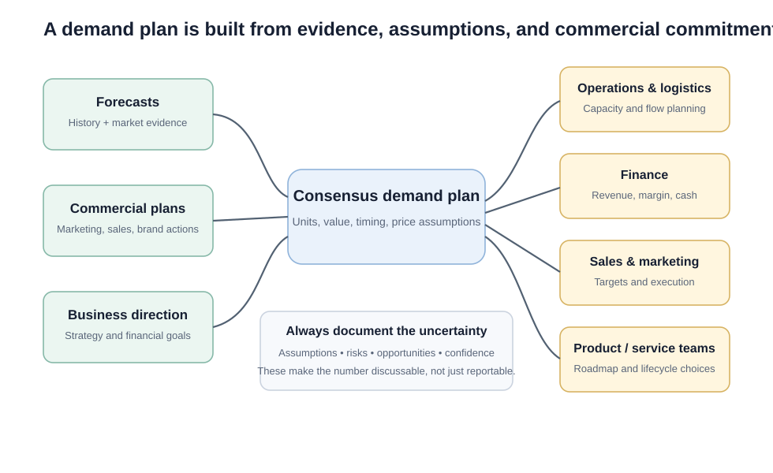

# 2. Planning Demand and the Demand Plan

## Learning objectives

You should be able to:

- distinguish a forecast from a demand plan;
- identify the major inputs to a demand plan;
- explain why assumptions and uncertainty must travel with the numbers;
- describe how different functions use the same plan;
- explain why a long enough planning horizon matters.

## Forecast vs. demand plan

A **forecast** says:

> "This is what we currently expect customers to demand."

A **demand plan** says:

> "This is the demand level the organization is planning around, including the actions the demand side intends to take."

That difference matters. A demand plan is not just a statistical output. It includes commercial judgment and commitments.

## Original visualization — demand-plan inputs and uses

The plan is influenced by:

- forecasts;
- business strategy and financial goals;
- product and brand decisions;
- marketing programs;
- sales commitments;
- planned demand-influencing or prioritization actions;
- documented assumptions and uncertainty.

## What a useful plan answers

A demand plan should be specific enough to guide supply decisions. It should help answer:

- **What** product/service family will customers want?
- **How much** is expected?
- **When** is it expected?
- **At what value or price assumptions**?
- **What commercial actions** are expected to create that demand?
- **How confident are we?**

## Why assumptions matter

Two planners can produce the same number for completely different reasons.

Suppose NorthStar expects 8,000 pumps next quarter.

Planner A assumes a government infrastructure program will start on time.

Planner B assumes private industrial demand will recover.

The same "8,000" has very different risk. If the assumption is invisible, management cannot intelligently challenge the plan.

A good demand review therefore discusses both the number **and the story behind the number**.

## Uses of the plan

Different functions need different views of the same demand.

| Function | Useful view |
|---|---|
| Operations | Units by family/item and period |
| Logistics | Units, location, timing, lane/warehouse implications |
| Finance | Revenue, margin, cash-flow implications |
| Marketing | Planned campaign response and segment mix |
| Sales | Available offer, targets, customer commitments |
| Product management | Phase-in/phase-out and feature mix |
| Executives | Business-plan fit, risk, opportunity |

The plan also acts as a control mechanism. If sales raises or lowers its estimate without a changed assumption, the demand-review process should challenge the change rather than accept it automatically.

## Planning horizon

The section content treats a horizon of **at least 18 months** as a useful best-practice reference for the demand plan.

The purpose is not that month 18 will be highly accurate. The purpose is to give the business enough visibility to:

- review each period repeatedly;
- align product and marketing plans;
- detect a future capacity need early enough to act;
- connect to the annual business-planning cycle;
- plan corrective actions when the demand trajectory does not support business goals.

## Realistic example — capital capacity decision

NorthStar's demand plan shows its large-pump family growing from 1,800 units per month to 2,450 within 14 months.

Current demonstrated capacity is 2,100 per month.

If management sees this only three months ahead, the choices are expensive: overtime, outsourcing, expediting, or lost sales.

If the gap is visible 14 months ahead, NorthStar can evaluate:

- an additional machining cell;
- supplier tooling;
- shift redesign;
- alternate sourcing;
- product redesign;
- demand shaping.

Long-horizon visibility creates options.

## Why it matters

A number without assumptions, horizon, ownership, and intended use cannot coordinate capacity, inventory, finance, or suppliers.

## Decision logic

A demand-plan number should survive four questions:

1. **Evidence:** What information supports it?
2. **Assumptions:** What has to be true?
3. **Commitment:** What will sales/marketing/product teams do to realize it?
4. **Feasibility:** Can the rest of the business prepare for it?

## Evidence retained through the workflow

Retain versioned demand plan, family hierarchy, units and currency, assumptions, events, confidence range, approvers, and consumers. Record the decision date and the event or threshold that requires reassessment.

## Applied decision artifact

Use a one-page **planning demand and the demand plan decision record** with these fields:

- **Decision and boundary:** Publish one controlled demand plan by family, period, and scenario, with documented assumptions and explicit uses at each planning horizon.
- **Required evidence:** versioned demand plan, family hierarchy, units and currency, assumptions, events, confidence range, approvers, and consumers.
- **Expected result:** A number without assumptions, horizon, ownership, and intended use cannot coordinate capacity, inventory, finance, or suppliers.
- **Balancing condition:** One consensus plan improves alignment, while retaining scenario ranges prevents false precision when uncertainty is material.
- **Accountability:** name the decision owner, approval date, residual exposure owner, and measurable trigger for reassessment.

The record is complete only when another practitioner can reproduce the reasoning and identify the next action without relying on meeting memory.

## Trade-offs

One consensus plan improves alignment, while retaining scenario ranges prevents false precision when uncertainty is material.

## Commonly confused with
**Business-plan target vs. demand plan:** the business plan may say what the company wants financially. The demand plan should remain an evidence-based consensus view. Management should not simply overwrite the demand plan to make it match an aspirational financial target.

## Common mistakes
A demand plan is not a wish list. Treat it as a request for supply that creates accountability for the demand side.

## Original knowledge check

**Question.** NorthStar is deciding how to apply planning demand and the demand plan. Which proposal is most defensible?

A. Use planning demand and the demand plan as a label for the preferred option before defining the decision outcome, constraints, or owner.
B. Publish one controlled demand plan by family, period, and scenario, with documented assumptions and explicit uses at each planning horizon.
C. Choose the apparent upside without evaluating this balancing condition: One consensus plan improves alignment, while retaining scenario ranges prevents false precision when uncertainty is material.
D. Approve the choice without retaining versioned demand plan, family hierarchy, units and currency, assumptions, events, confidence range, approvers, and consumers; omit the reassessment trigger as well.

Answer and rationale

### Correct answer

**B. Publish one controlled demand plan by family, period, and scenario, with documented assumptions and explicit uses at each planning horizon.**

### Why it is correct

A number without assumptions, horizon, ownership, and intended use cannot coordinate capacity, inventory, finance, or suppliers. The recommended action connects the operating choice to evidence, ownership, and a measurable outcome.

### Why the other answers are wrong

- **A** reverses the decision sequence. The team should first do the required work: publish one controlled demand plan by family, period, and scenario, with documented assumptions and explicit uses at each planning horizon.
- **C** optimizes one visible result and omits the balancing effects: one consensus plan improves alignment, while retaining scenario ranges prevents false precision when uncertainty is material.
- **D** leaves the approval unauditable. A reviewer would be missing versioned demand plan, family hierarchy, units and currency, assumptions, events, confidence range, approvers, and consumers, as well as the trigger needed to revisit the decision when conditions change.

Those approaches ignore the governing trade-off: one consensus plan improves alignment, while retaining scenario ranges prevents false precision when uncertainty is material.

## Practitioner perspective

A review should be able to reconstruct the choice from versioned demand plan, family hierarchy, units and currency, assumptions, events, confidence range, approvers, and consumers. If those records cannot explain what changed, who decided, and when the decision will be revisited, the process is not yet controlled.

## Related concepts

- [Section overview](./README.md)
- [Module 2 continuation](../../02-network-design-digital-connectivity-performance/section-b-connected-supply-networks-and-master-data/03-advanced-planning-and-constraint-management.md)
- [Demand manager and dashboard](04-demand-manager-and-dashboard.md)
- Forecasting — planned in Section D
- Supply and demand alignment / S&OP — planned in Section E
Module 1 → Section C → Planning Demand and Demand Plan; Demand Plan Inputs; Uses of Demand Plan; Planning Horizon and Revision Period.

---

[Previous: Demand Management Foundations](01-demand-management-foundations.md) · [Next: Communicating Demand](03-communicating-demand.md)
