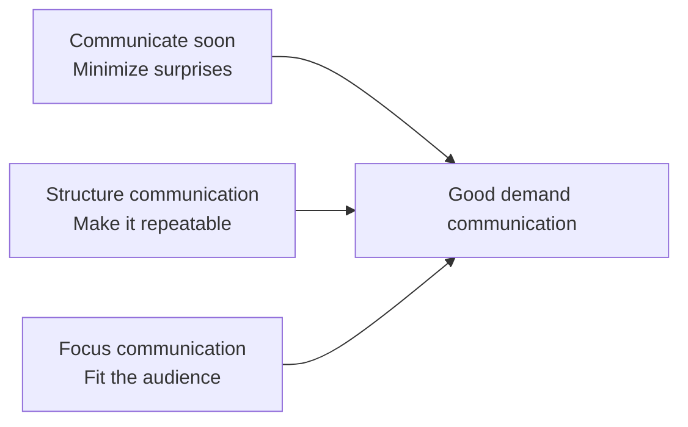
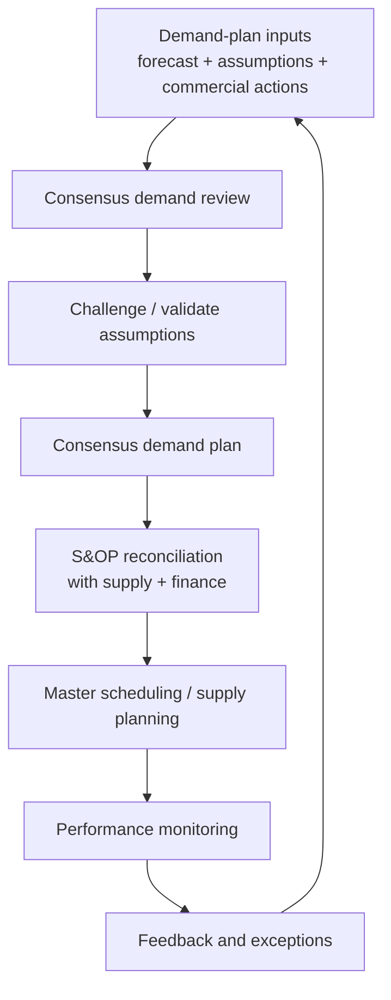

# 3. Communicating Demand

## Learning objectives

You should be able to:

- explain why demand communication reduces supply-chain surprises;
- apply the three communication principles: **soon, structured, focused**;
- describe basic order processing in a demand-management context;
- explain why transactional data alone is not enough;
- connect communication quality to the bullwhip effect.

## Concept in plain English

Even a strong demand plan fails if the people who must act on it learn about changes too late.

Communicating demand means moving relevant demand information to the right internal teams and supply-chain partners in time for them to respond.

At a basic level, this includes processing customer orders and routing the requirements to inventory or production. At a more collaborative level, it includes sharing forecasts, promotions, risks, assumptions, and actual demand signals across organizations.

## The three principles

### 1. Communicate soon

Early information is useful even when it is imperfect.

A marketing team that waits for "perfect" promotion-volume estimates can cause more damage than a team that says early:

> "Promotion is confirmed. We currently estimate +15% to +30%. We will update the range next week."

The uncertainty can be planned around. Silence cannot.

This is especially important for bad news. A weak pipeline, canceled order, competitor action, or delayed launch should be shared while the organization still has options.

### 2. Structure communications

Critical communication should not depend on someone remembering to send an email.

Recurring demand planning needs scheduled, repeatable interactions.

Systems can move transactional data, but people are still needed to explain nuance, challenge assumptions, resolve conflict, and build commitment.

### 3. Focus communications

Different audiences need different forms of the same information.

- Operations may need **units**.
- Finance may need **dollars and margin**.
- Sales may need **customer and product availability**.
- Executives may need **exceptions, risks, and scenario impact**.

Too little information creates guesswork. Too much detail hides the decision.

## Order processing

Demand communication also includes the administrative processing of a customer order so it can be fulfilled.

Depending on the supply model, the order may trigger:

- a shipment from inventory;
- a production requirement;
- an allocation decision;
- a customer confirmation;
- updates to planning systems.

## Collaborative communication

A company can share demand information beyond its own walls. The objective is to reduce latency between a real market change and the supply-chain response.

That can reduce overreaction and help dampen the **bullwhip effect**, because upstream partners are not relying only on delayed replenishment orders as a proxy for final demand.

## Realistic example — promotion uncertainty

A retailer plans a six-week promotion for NorthStar's residential water-pressure product.

Early estimate: **+20% to +45%** volume.

The marketing team should not wait until the estimate narrows to +32%.

A stronger approach is:

1. communicate the promotion date immediately;
2. share the current range and assumptions;
3. identify the most constrained components;
4. agree on a weekly estimate update;
5. monitor actual sell-through once the campaign starts;
6. update supply plans quickly.

## Common confusion

**Data transfer vs. communication:** sending a number through a system is not the same as reaching shared understanding. Demand communication includes assumptions, uncertainty, priorities, and feedback.

## Common mistake

When the main problem is "other parties did not know about a change soon enough," the best answer will often involve earlier, structured communication rather than simply more inventory.

## Related concepts

- [Demand manager and dashboard](04-demand-manager-and-dashboard.md)
- [Demand shaping and the Four Ps](06-demand-shaping-and-four-ps.md)

## Related concepts

Module 1 → Section C → Communicating Demand; Communicate Soon; Structure Communications; Focus Communications.
