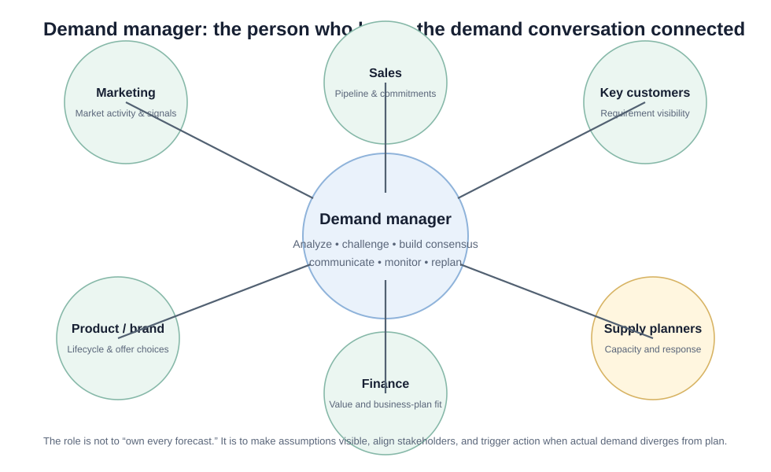
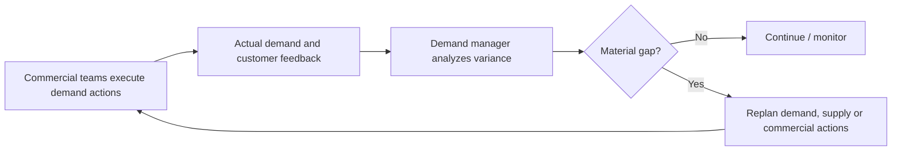
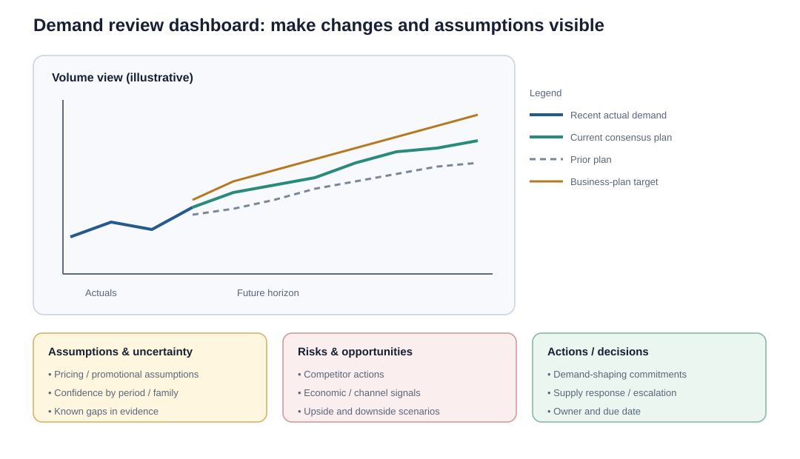

# 4. Demand Manager and Demand-Review Dashboards

## Learning objectives

You should be able to:

- describe the role of a demand manager;
- explain why the role is cross-functional;
- identify the information a demand-review dashboard should contain;
- distinguish a useful exception-oriented dashboard from an overloaded report.

## Demand manager in plain English

The demand manager is the **facilitator of the demand conversation**.

The role typically includes:

- gathering demand information by product, family, customer, or segment;
- analyzing the information and challenging inconsistencies;
- building consensus around a demand plan;
- communicating demand information among stakeholders;
- monitoring actual results;
- initiating replanning when actual demand diverges from plan.

The role needs enough authority and communication skill to respectfully challenge inputs and gain commitments.

## Original visualization — focal point

The demand manager is not a substitute for sales, marketing, supply planning, or finance. The role connects them.

## Feedback loop

## Demand-review dashboard

A dashboard should make the few important exceptions obvious.

Useful demand-review information can include:

- recent actual demand and key performance indicators;
- current plan across the future horizon;
- prior plan for comparison;
- business-plan requirement for comparison;
- assumptions;
- pricing assumptions;
- planned branding, marketing, and sales activities;
- risks, opportunities, economic trends, and competitor moves;
- uncertainties;
- open decisions and actions.

## Why show the prior plan?

Because demand plans change every cycle.

If next month's plan increased 18%, management should be able to ask:

> What new evidence changed our view?

Without the prior plan, a material change can disappear inside the latest numbers.

## Audience tailoring

A strong dashboard is not one giant report for everyone.

Examples:

- **Demand consensus meeting:** units, prior/current plan, forecast error, assumptions.
- **Finance review:** value, margin, price, cash impact.
- **Executive review:** exceptions, strategic gaps, scenarios, decision requests.
- **Supply review:** constrained families, timing, locations, mix.

## Realistic example — hidden downside risk

NorthStar's current demand plan shows 10% year-over-year growth.

The number looks healthy, but the dashboard also shows:

- one distributor represents 28% of the growth;
- the distributor's project is not yet funded;
- the prior plan showed only 4% growth;
- a competitor has launched a lower-cost model;
- sales has committed to two major events intended to create pipeline.

The dashboard turns "10% growth" into a management decision rather than a decorative number.

## Why it matters

A dashboard that displays numbers without assumptions, gaps, ownership, and required decisions becomes passive reporting.

## Decision logic

A demand dashboard should answer:

1. Where are we off plan?
2. What changed from the previous view?
3. Why did it change?
4. What assumptions are at risk?
5. What decision or action is required?

## Evidence retained through the workflow

Retain prior and current plan, variance drivers, opportunity and risk ranges, decision request, owner, due date, and outcome. Record the decision date and the event or threshold that requires reassessment.

## Applied decision artifact

Use a one-page **demand manager and demand-review dashboards decision record** with these fields:

- **Decision and boundary:** Design the demand review around changes from the prior plan, assumption movement, opportunity and risk ranges, gaps, and named decisions.
- **Required evidence:** prior and current plan, variance drivers, opportunity and risk ranges, decision request, owner, due date, and outcome.
- **Expected result:** A dashboard that displays numbers without assumptions, gaps, ownership, and required decisions becomes passive reporting.
- **Balancing condition:** A compact dashboard focuses attention, but excessive aggregation can conceal product, channel, or timing problems that need action.
- **Accountability:** name the decision owner, approval date, residual exposure owner, and measurable trigger for reassessment.

The record is complete only when another practitioner can reproduce the reasoning and identify the next action without relying on meeting memory.

## Trade-offs

A compact dashboard focuses attention, but excessive aggregation can conceal product, channel, or timing problems that need action.

## Commonly confused with
**Demand manager vs. master scheduler:** the demand manager coordinates the demand-side view and consensus. The master scheduler works on converting the approved demand/supply picture into a feasible master schedule.

## Common mistakes
If the question asks who performs analytical work on demand data, builds consensus, and communicates the demand plan across stakeholders, think **demand manager**.

## Original knowledge check

**Question.** NorthStar is deciding how to apply demand manager and demand-review dashboards. Which proposal is most defensible?

A. Use demand manager and demand-review dashboards as a label for the preferred option before defining the decision outcome, constraints, or owner.
B. Design the demand review around changes from the prior plan, assumption movement, opportunity and risk ranges, gaps, and named decisions.
C. Choose the apparent upside without evaluating this balancing condition: A compact dashboard focuses attention, but excessive aggregation can conceal product, channel, or timing problems that need action.
D. Approve the choice without retaining prior and current plan, variance drivers, opportunity and risk ranges, decision request, owner, due date, and outcome; omit the reassessment trigger as well.

Answer and rationale

### Correct answer

**B. Design the demand review around changes from the prior plan, assumption movement, opportunity and risk ranges, gaps, and named decisions.**

### Why it is correct

A dashboard that displays numbers without assumptions, gaps, ownership, and required decisions becomes passive reporting. The recommended action connects the operating choice to evidence, ownership, and a measurable outcome.

### Why the other answers are wrong

- **A** reverses the decision sequence. The team should first do the required work: design the demand review around changes from the prior plan, assumption movement, opportunity and risk ranges, gaps, and named decisions.
- **C** optimizes one visible result and omits the balancing effects: A compact dashboard focuses attention, but excessive aggregation can conceal product, channel, or timing problems that need action.
- **D** leaves the approval unauditable. A reviewer would be missing prior and current plan, variance drivers, opportunity and risk ranges, decision request, owner, due date, and outcome, as well as the trigger needed to revisit the decision when conditions change.

Those approaches ignore the governing trade-off: A compact dashboard focuses attention, but excessive aggregation can conceal product, channel, or timing problems that need action.

## Practitioner perspective

A review should be able to reconstruct the choice from prior and current plan, variance drivers, opportunity and risk ranges, decision request, owner, due date, and outcome. If those records cannot explain what changed, who decided, and when the decision will be revisited, the process is not yet controlled.

## Related concepts

- [Section overview](./README.md)
- [Module 2 continuation](../../02-network-design-digital-connectivity-performance/section-b-connected-supply-networks-and-master-data/03-advanced-planning-and-constraint-management.md)
- [Planning demand](02-planning-demand-and-demand-plan.md)
- [Communicating demand](03-communicating-demand.md)
- [Influencing demand with PDCA](05-influencing-demand-and-pdca.md)
Module 1 → Section C → Demand Manager; Focus Communications; Demand Plan Dashboard.

---

[Previous: Communicating Demand](03-communicating-demand.md) · [Next: Influencing Demand with PDCA](05-influencing-demand-and-pdca.md)
