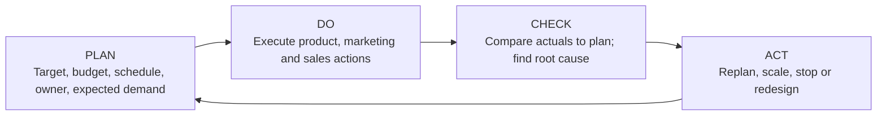

# 5. Influencing Demand with PDCA

## Learning objectives

You should be able to:

- explain why influencing demand needs a feedback loop;
- apply the plan-do-check-act cycle to a commercial initiative;
- describe demand generation;
- explain why contribution margin matters when creating demand;
- recognize substitution and timing changes as demand-influencing tools.

## Concept in plain English

Demand influencing means deliberately changing the **timing, quantity, mix, or customer behavior** around demand so the result better supports business objectives.

Examples include:

- promotions in low-demand periods;
- steering customers toward an available substitute;
- offering a discount for a later delivery date;
- encouraging larger or smaller order quantities;
- changing product positioning;
- changing price.

Good demand influencing is not "run a promotion and hope." It is planned, measured, and adjusted.

## Original process — PDCA

### Plan

Define:

- the customer/segment;
- the intended behavior change;
- budget;
- timing;
- responsibilities;
- measurable demand target;
- expected contribution to business goals.

### Do

Execute the activities:

- product/brand actions;
- campaign activity;
- sales outreach;
- customer acquisition or retention;
- launch or phase-out activity.

### Check

Compare actual performance with the plan.

Do not stop at "campaign missed target." Find the cause:

- wrong customer segment?
- weak message?
- capacity or availability problem?
- pricing?
- competitor response?
- channel problem?
- market event?

### Act

Use the evidence to change course. Increase investment in what works, reduce what does not, or redesign the activity.

## Demand generation

Demand generation converts **latent demand** into active demand.

That can require two types of education:

1. **Customers** — what problem the offer solves and why it matters.
2. **Supply-chain partners** — how to design, build, store, move, support, and sell the offer correctly.

New-product introduction is especially dependent on this because there is limited history.

## Profitability guardrail

More demand is not automatically good.

A demand-influencing action should support a positive contribution to profit.

### Example

NorthStar has excess capacity in March.

Option A: 12% discount on a low-margin pump family generates 1,000 extra units but adds only **$18 contribution per unit**.

Option B: 6% discount on a service-bundled model generates 650 extra units at **$115 contribution per unit**.

A volume-only mindset prefers A.

A contribution mindset asks which action creates the better business result and uses capacity more intelligently.

## Substitution and timing

Demand can also be shaped without creating new total demand.

Example:

- Model X is constrained.
- Model Y is technically acceptable and available.
- Customers receive a small incentive to switch to Y.

Or:

- customer accepts delivery four weeks later;
- company gives a service credit;
- constrained capacity is protected for urgent orders.

## Realistic example — healthcare diagnostic equipment

A diagnostic-device company expects a regulatory approval in October.

Instead of launching a nationwide campaign immediately, it uses PDCA:

- **Plan:** target 100 hospital evaluations in the first 60 days.
- **Do:** train clinical sales teams and launch in three regions.
- **Check:** 70% of lost opportunities are due to IT-integration concerns, not clinical value.
- **Act:** add an integration package and technical support before national expansion.

## Why it matters

Demand actions consume price, channel, inventory, and customer trust, so they must be treated as controlled experiments rather than assumptions.

## Decision logic

Define the problem and target, test one demand lever with guardrails, compare the outcome with baseline, and adopt, adapt, or stop through PDCA. Do not approve the decision until mandatory conditions are feasible and the residual exposure has a named owner.

## Evidence retained through the workflow

Retain baseline, hypothesis, target segment, action, cost, capacity check, guardrail, measured response, and learning decision. Record the decision date and the event or threshold that requires reassessment.

## Applied decision artifact

Use a one-page **influencing demand with PDCA decision record** with these fields:

- **Decision and boundary:** Define the problem and target, test one demand lever with guardrails, compare the outcome with baseline, and adopt, adapt, or stop through PDCA.
- **Required evidence:** baseline, hypothesis, target segment, action, cost, capacity check, guardrail, measured response, and learning decision.
- **Expected result:** Demand actions consume price, channel, inventory, and customer trust, so they must be treated as controlled experiments rather than assumptions.
- **Balancing condition:** A strong intervention can close a gap quickly but may erode margin, pull demand forward, or create a later service problem.
- **Accountability:** name the decision owner, approval date, residual exposure owner, and measurable trigger for reassessment.

The record is complete only when another practitioner can reproduce the reasoning and identify the next action without relying on meeting memory.

## Trade-offs

A strong intervention can close a gap quickly but may erode margin, pull demand forward, or create a later service problem.

## Commonly confused with
**Influencing demand vs. managing/prioritizing demand:** influencing tries to change customer behavior before or around the constraint. Prioritizing decides how scarce supply is allocated when demand cannot all be served.

## Common mistakes
A price incentive, substitution offer, product positioning change, or timed promotion is a classic **demand-shaping** action.

## Original knowledge check

**Question.** NorthStar is deciding how to apply influencing demand with PDCA. Which proposal is most defensible?

A. Use influencing demand with PDCA as a label for the preferred option before defining the decision outcome, constraints, or owner.
B. Define the problem and target, test one demand lever with guardrails, compare the outcome with baseline, and adopt, adapt, or stop through PDCA.
C. Choose the apparent upside without evaluating this balancing condition: A strong intervention can close a gap quickly but may erode margin, pull demand forward, or create a later service problem.
D. Approve the choice without retaining baseline, hypothesis, target segment, action, cost, capacity check, guardrail, measured response, and learning decision; omit the reassessment trigger as well.

Answer and rationale

### Correct answer

**B. Define the problem and target, test one demand lever with guardrails, compare the outcome with baseline, and adopt, adapt, or stop through PDCA.**

### Why it is correct

Demand actions consume price, channel, inventory, and customer trust, so they must be treated as controlled experiments rather than assumptions. The recommended action connects the operating choice to evidence, ownership, and a measurable outcome.

### Why the other answers are wrong

- **A** reverses the decision sequence. The team should first do the required work: define the problem and target, test one demand lever with guardrails, compare the outcome with baseline, and adopt, adapt, or stop through PDCA.
- **C** optimizes one visible result and omits the balancing effects: A strong intervention can close a gap quickly but may erode margin, pull demand forward, or create a later service problem.
- **D** leaves the approval unauditable. A reviewer would be missing baseline, hypothesis, target segment, action, cost, capacity check, guardrail, measured response, and learning decision, as well as the trigger needed to revisit the decision when conditions change.

Those approaches ignore the governing trade-off: A strong intervention can close a gap quickly but may erode margin, pull demand forward, or create a later service problem.

## Practitioner perspective

A review should be able to reconstruct the choice from baseline, hypothesis, target segment, action, cost, capacity check, guardrail, measured response, and learning decision. If those records cannot explain what changed, who decided, and when the decision will be revisited, the process is not yet controlled.

## Related concepts

- [Section overview](./README.md)
- [Module 2 continuation](../../02-network-design-digital-connectivity-performance/section-b-connected-supply-networks-and-master-data/03-advanced-planning-and-constraint-management.md)
- [Demand shaping and the Four Ps](06-demand-shaping-and-four-ps.md)
- [Product life cycle](07-product-life-cycle.md)
Module 1 → Section C → Influencing Demand; Plan-Do-Check-Action Model; Demand Influencing: Demand Generation.

---

[Previous: Demand Manager and Demand-Review Dashboards](04-demand-manager-and-dashboard.md) · [Next: Demand Shaping and the Four Ps](06-demand-shaping-and-four-ps.md)
