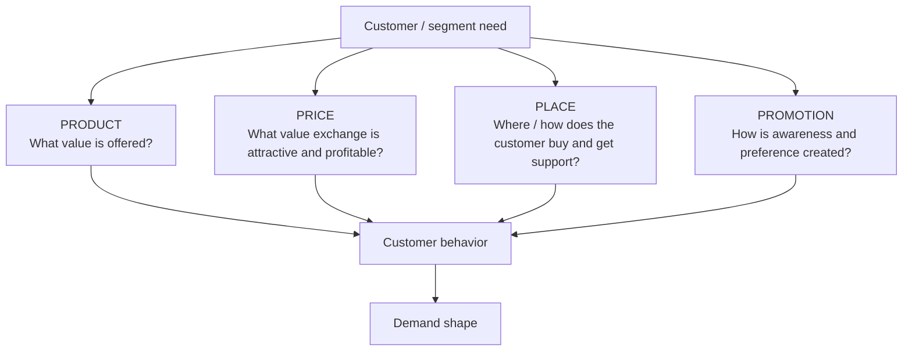

# 6. Demand Shaping and the Four Ps

## Learning objectives

You should be able to:

- explain demand shaping;
- apply product, price, placement, and promotion to a supply-chain scenario;
- connect customer focus to product and channel design;
- explain how branding and packaging can influence demand;
- recognize that the Four Ps must remain economically feasible for the supply chain.

## Demand shaping

Demand shaping uses commercial and product levers to influence purchasing behavior so demand and supply can be balanced more effectively.

## 1. Product

"Product" includes the complete product/service package.

Customer-focused design starts with the need, then determines what mix of:

- features;
- quality;
- customization;
- service;
- support;
- convenience

creates value without making the supply chain uneconomic.

### Example

NorthStar's pump can be configured with several motor, seal, monitoring, and service options.

Offering every possible combination might please individual buyers but create:

- low-volume parts;
- long lead times;
- high service complexity;
- poor forecastability.

A better design may use modular options around a common platform.

## 2. Price

Price can influence both the **level** and **timing** of demand.

Pricing decisions should consider:

- competition;
- customer-perceived value;
- brand position;
- cost-to-serve;
- segment willingness to pay;
- contribution margin.

### Example

A software provider charges less for annual prepaid contracts than month-to-month plans. The price changes customer behavior and improves demand and cash-flow predictability.

## 3. Placement

Placement is where and how the offer reaches the customer.

In a customer-focused model, it includes a **contact-channel strategy**.

Possible channels include:

- direct sales;
- distributors;
- retail stores;
- e-commerce;
- mobile apps;
- kiosks;
- call centers;
- third-party marketplaces.

A good channel should work for both customer and business.

Customer-side tests include:

- accessible;
- reliable;
- complete;
- secure and accurate;
- fast;
- flexible.

Business-side tests include:

- control and consistency;
- profitability.

### Example

A premium spare-part service can offer:

- standard distributor delivery;
- direct overnight fulfillment at a premium;
- scheduled replenishment for contracted customers.

Same product, different placement/service package, different demand behavior.

## 4. Promotion

Promotion includes more than advertising.

It can include:

- market research;
- segmentation;
- campaign strategy;
- message and media;
- brand development;
- packaging;
- promotional timing;
- feedback measurement.

### Branding

Branding identifies the offer and builds meaning around it. In a customer-driven market, brand strength is reinforced or damaged by actual product and service experience.

### Packaging

Packaging can:

- attract attention;
- communicate benefits;
- educate the customer;
- improve usability;
- support sustainability;
- enable returns or reverse logistics.

A package is part of the product/service experience, not merely a box.

## Realistic example — consumer health device

A company launches a home health monitor.

- **Product:** simplified setup and optional caregiver dashboard.
- **Price:** subscription bundle for monitoring service.
- **Place:** pharmacy, direct e-commerce, and clinician referral.
- **Promotion:** education focused on ease of use and caregiver reassurance.

If supply of one sensor is constrained, the company may temporarily emphasize the standard version rather than the premium version. The Four Ps become demand-shaping levers.

## Why it matters

Product, price, placement, and promotion decisions change both demand and the operational burden required to serve it.

## Decision logic

When a scenario mentions:

- features or service bundle → **Product**
- discounts, premiums, segment pricing → **Price**
- channel, distribution, delivery contact point → **Place**
- advertising, branding, communication, campaign → **Promotion**

## Evidence retained through the workflow

Retain target segment, lever and timing, expected lift, contribution, capacity and inventory impact, channel owner, and stop rule. Record the decision date and the event or threshold that requires reassessment.

## Applied decision artifact

Use a one-page **demand shaping and the four ps decision record** with these fields:

- **Decision and boundary:** Evaluate each proposed market lever against incremental demand, contribution, capacity, inventory, lead time, channel conflict, and customer effect.
- **Required evidence:** target segment, lever and timing, expected lift, contribution, capacity and inventory impact, channel owner, and stop rule.
- **Expected result:** Product, price, placement, and promotion decisions change both demand and the operational burden required to serve it.
- **Balancing condition:** Demand shaping can improve mix and utilization, but poorly timed actions can overload constraints or create low-quality revenue.
- **Accountability:** name the decision owner, approval date, residual exposure owner, and measurable trigger for reassessment.

The record is complete only when another practitioner can reproduce the reasoning and identify the next action without relying on meeting memory.

## Trade-offs

Demand shaping can improve mix and utilization, but poorly timed actions can overload constraints or create low-quality revenue.

## Commonly confused with
**Place is not only physical shelf location.** In modern supply chains it includes the channel through which customers purchase, receive information, and access support.

## Common mistakes
A display, retail location, e-commerce route, or customer-contact channel is usually a **placement** question even when technology is involved.

## Original knowledge check

**Question.** NorthStar is deciding how to apply demand shaping and the four ps. Which proposal is most defensible?

A. Use demand shaping and the four ps as a label for the preferred option before defining the decision outcome, constraints, or owner.
B. Evaluate each proposed market lever against incremental demand, contribution, capacity, inventory, lead time, channel conflict, and customer effect.
C. Choose the apparent upside without evaluating this balancing condition: Demand shaping can improve mix and utilization, but poorly timed actions can overload constraints or create low-quality revenue.
D. Approve the choice without retaining target segment, lever and timing, expected lift, contribution, capacity and inventory impact, channel owner, and stop rule; omit the reassessment trigger as well.

Answer and rationale

### Correct answer

**B. Evaluate each proposed market lever against incremental demand, contribution, capacity, inventory, lead time, channel conflict, and customer effect.**

### Why it is correct

Product, price, placement, and promotion decisions change both demand and the operational burden required to serve it. The recommended action connects the operating choice to evidence, ownership, and a measurable outcome.

### Why the other answers are wrong

- **A** reverses the decision sequence. The team should first do the required work: evaluate each proposed market lever against incremental demand, contribution, capacity, inventory, lead time, channel conflict, and customer effect.
- **C** optimizes one visible result and omits the balancing effects: demand shaping can improve mix and utilization, but poorly timed actions can overload constraints or create low-quality revenue.
- **D** leaves the approval unauditable. A reviewer would be missing target segment, lever and timing, expected lift, contribution, capacity and inventory impact, channel owner, and stop rule, as well as the trigger needed to revisit the decision when conditions change.

Those approaches ignore the governing trade-off: demand shaping can improve mix and utilization, but poorly timed actions can overload constraints or create low-quality revenue.

## Practitioner perspective

A review should be able to reconstruct the choice from target segment, lever and timing, expected lift, contribution, capacity and inventory impact, channel owner, and stop rule. If those records cannot explain what changed, who decided, and when the decision will be revisited, the process is not yet controlled.

## Related concepts

- [Section overview](./README.md)
- [Module 2 continuation](../../02-network-design-digital-connectivity-performance/section-b-connected-supply-networks-and-master-data/03-advanced-planning-and-constraint-management.md)
- [Influencing demand with PDCA](05-influencing-demand-and-pdca.md)
- [Product life cycle](07-product-life-cycle.md)
Module 1 → Section C → Four Ps / demand-shaping topic; product, price, placement, promotion, branding, and packaging.

---

[Previous: Influencing Demand with PDCA](05-influencing-demand-and-pdca.md) · [Next: Product Life Cycle](07-product-life-cycle.md)
