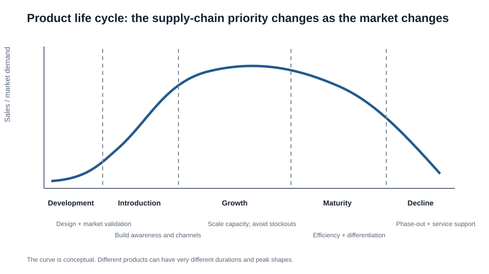

# 7. Product Life Cycle

## Learning objectives

You should be able to:

- identify the major stages of the product life cycle;
- explain how supply-chain priorities change by stage;
- connect product maturity to capacity, inventory, distribution, and fulfillment strategy;
- explain life-cycle analysis at a high level.

## Original visualization

The classic stages are:

1. Development
2. Introduction
3. Growth
4. Maturity
5. Decline

The important supply-chain lesson is not memorizing a curve. It is understanding that the **right supply-chain response changes by stage**.

## Stage-by-stage view

| Stage | Demand / market condition | Typical supply-chain priority |
|---|---|---|
| Development | No established sales history | Design feasibility, supplier capability, launch readiness |
| Introduction | Low volume, high uncertainty | Availability, learning, channel setup, responsive capacity |
| Growth | Rapidly increasing demand | Scale capacity, expand distribution, avoid stockouts |
| Maturity | Slower growth, stronger competition | Efficiency, cost, service differentiation |
| Decline | Falling demand | Reduce exposure, phase out, service installed base |

## Development

The company is still validating the market and the solution.

Supply-chain questions include:

- Can the product be sourced?
- Is it manufacturable?
- What lead times will control launch?
- Which suppliers must be involved early?
- What capacity is needed initially?

## Introduction

Demand is uncertain and volume is still relatively low.

The organization may have high costs from:

- launch activity;
- new channels;
- low utilization;
- training;
- startup inefficiency.

Flexibility is often more important than maximum cost efficiency.

## Growth

Demand can rise faster than capacity.

Key risks:

- stockouts;
- supplier shortages;
- logistics bottlenecks;
- quality problems from rapid scale;
- customers switching to competitors after poor service.

A product may increasingly support a make-to-stock approach if demand becomes predictable enough.

## Maturity

Volume may remain high, but growth slows and competitors often offer similar products.

Priorities shift toward:

- cost;
- efficiency;
- differentiation;
- service;
- inventory optimization;
- process improvement.

## Decline

Demand falls because of saturation, technology change, substitution, or shifting customer preferences.

A company may need to:

- reduce finished-goods inventory;
- move from MTS toward MTO;
- close or consolidate capacity;
- make last-time buys;
- maintain spare parts and service;
- plan product retirement.

## Realistic example — industrial controller

A new smart controller launches at only 500 units per month. Forecast error is high, so the company maintains flexible capacity.

Two years later demand reaches 8,000 units per month. The company adds tooling and regional inventory.

At maturity, growth slows to 2%, and competition pushes price down. The focus shifts to cost and aftermarket support.

During decline, a new controller replaces it. The old model moves toward make-to-order while the company protects service-part availability for existing customers.

## Life-cycle analysis

Historical patterns from similar products can help estimate the likely shape and duration of demand for a new product family.

The method is not magic. It still depends on how similar the reference products really are.

## Why it matters

Using one demand and supply policy across introduction, growth, maturity, and decline creates predictable forecast, capacity, and inventory errors.

## Decision logic

Set stage-specific forecasting, capacity, inventory, channel, and service rules and review the stage when evidence changes. Do not approve the decision until mandatory conditions are feasible and the residual exposure has a named owner.

## Evidence retained through the workflow

Retain stage indicators, demand range, adoption or installed-base data, capacity posture, inventory rule, service commitment, and exit trigger. Record the decision date and the event or threshold that requires reassessment.

## Applied decision artifact

Use a one-page **product life cycle decision record** with these fields:

- **Decision and boundary:** Set stage-specific forecasting, capacity, inventory, channel, and service rules and review the stage when evidence changes.
- **Required evidence:** stage indicators, demand range, adoption or installed-base data, capacity posture, inventory rule, service commitment, and exit trigger.
- **Expected result:** Using one demand and supply policy across introduction, growth, maturity, and decline creates predictable forecast, capacity, and inventory errors.
- **Balancing condition:** Early investment supports growth but increases downside exposure; late rationalization reduces cost but can damage service obligations.
- **Accountability:** name the decision owner, approval date, residual exposure owner, and measurable trigger for reassessment.

The record is complete only when another practitioner can reproduce the reasoning and identify the next action without relying on meeting memory.

## Trade-offs

Early investment supports growth but increases downside exposure; late rationalization reduces cost but can damage service obligations.

## Commonly confused with
**Product life cycle vs. PLM:** the product life cycle describes the stages. PLM is the broader management process and information discipline used across those stages.

## Common mistakes
During rapid **growth**, the supply-chain danger is often under-capacity and stockouts. During **decline**, the danger is often excess inventory and stranded capacity.

## Original knowledge check

**Question.** NorthStar is deciding how to apply product life cycle. Which proposal is most defensible?

A. Use product life cycle as a label for the preferred option before defining the decision outcome, constraints, or owner.
B. Set stage-specific forecasting, capacity, inventory, channel, and service rules and review the stage when evidence changes.
C. Choose the apparent upside without evaluating this balancing condition: Early investment supports growth but increases downside exposure; late rationalization reduces cost but can damage service obligations.
D. Approve the choice without retaining stage indicators, demand range, adoption or installed-base data, capacity posture, inventory rule, service commitment, and exit trigger; omit the reassessment trigger as well.

Answer and rationale

### Correct answer

**B. Set stage-specific forecasting, capacity, inventory, channel, and service rules and review the stage when evidence changes.**

### Why it is correct

Using one demand and supply policy across introduction, growth, maturity, and decline creates predictable forecast, capacity, and inventory errors. The recommended action connects the operating choice to evidence, ownership, and a measurable outcome.

### Why the other answers are wrong

- **A** reverses the decision sequence. The team should first do the required work: set stage-specific forecasting, capacity, inventory, channel, and service rules and review the stage when evidence changes.
- **C** optimizes one visible result and omits the balancing effects: early investment supports growth but increases downside exposure; late rationalization reduces cost but can damage service obligations.
- **D** leaves the approval unauditable. A reviewer would be missing stage indicators, demand range, adoption or installed-base data, capacity posture, inventory rule, service commitment, and exit trigger, as well as the trigger needed to revisit the decision when conditions change.

Those approaches ignore the governing trade-off: early investment supports growth but increases downside exposure; late rationalization reduces cost but can damage service obligations.

## Practitioner perspective

A review should be able to reconstruct the choice from stage indicators, demand range, adoption or installed-base data, capacity posture, inventory rule, service commitment, and exit trigger. If those records cannot explain what changed, who decided, and when the decision will be revisited, the process is not yet controlled.

## Related concepts

- [Section overview](./README.md)
- [Module 2 continuation](../../02-network-design-digital-connectivity-performance/section-b-connected-supply-networks-and-master-data/03-advanced-planning-and-constraint-management.md)
- [PLM and NPI](08-plm-and-new-product-introduction.md)
- [NPI frequency vs. demand uncertainty](09-npi-frequency-and-demand-uncertainty.md)
Module 1 → Section C → Product Life Cycle Stages; Life Cycle Analysis.

---

[Previous: Demand Shaping and the Four Ps](06-demand-shaping-and-four-ps.md) · [Next: Product Lifecycle Management and New-Product Introduction](08-plm-and-new-product-introduction.md)
