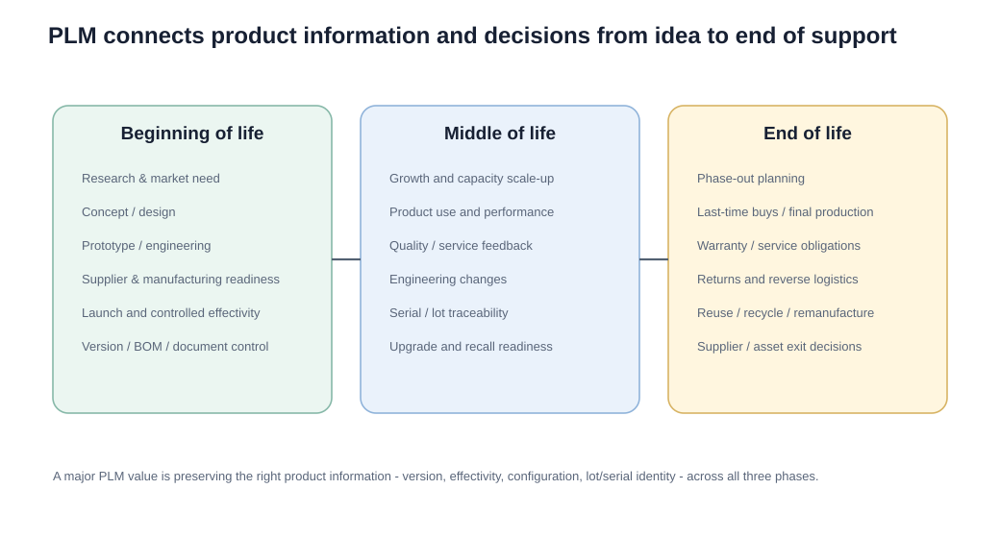

# 8. Product Lifecycle Management and New-Product Introduction

## Learning objectives

You should be able to:

- explain PLM in supply-chain terms;
- describe beginning-, middle-, and end-of-life concerns;
- connect PLM to versioning, effectivity, traceability, recalls, and reverse logistics;
- describe a practical NPI sequence;
- explain why supply-chain involvement must begin before launch.

## PLM in plain English

Product lifecycle management (PLM) is the discipline of managing the product and its information **from idea through use, support, and retirement**.

It is broader than an engineering document repository.

PLM can help manage:

- product and component versions;
- bills of material;
- effectivity dates;
- technical documents;
- serial or lot traceability;
- engineering changes;
- upgrades;
- recalls;
- end-of-life support.

## Original visualization — beginning, middle, end

### Beginning of life

Focus:

- customer need;
- research and concept;
- product design;
- prototypes;
- suppliers;
- process capability;
- launch readiness.

### Middle of life

Focus:

- scaling production and distribution;
- use and performance;
- engineering changes;
- service feedback;
- configuration control;
- traceability.

### End of life

Focus:

- phase-out;
- final production or last-time buys;
- service and warranty obligations;
- returns;
- recycling or remanufacturing;
- supplier and asset exit decisions.

## Effectivity and traceability

Imagine a medical device with three hardware revisions.

A PLM discipline should answer:

- Which BOM revision was valid on March 1?
- Which serial numbers received the revised component?
- Which customers own those serial numbers?
- Which service instruction applies?
- If a recall occurs, which units are affected?

This is why PLM has direct supply-chain value.

## New-product introduction process

A practical NPI/development-chain sequence can be expressed as:

These phases can overlap. Good NPI is cross-functional rather than a baton pass.

## Supply-chain involvement before launch

Late supply-chain involvement causes avoidable problems:

- component cannot be sourced at scale;
- supplier lead time misses market window;
- logistics cost destroys margin;
- design is difficult to manufacture;
- capacity is insufficient;
- packaging creates transport damage;
- spare-parts/service model is ignored.

## Innovative vs. functional product emphasis

An innovative product often prioritizes:

- speed;
- time to market;
- responsiveness;
- flexible capacity.

A functional product with predictable demand and low margins often prioritizes:

- cost;
- scale;
- efficiency;
- repeatability.

## Realistic example — smart industrial pump launch

NorthStar is launching the NS-900 smart pump.

During prototype review, engineering wants a custom communications module. Procurement finds that its supplier lead time is 22 weeks and minimum order quantity is 5,000 units.

The forecast for launch year is only 2,400 units with high uncertainty.

Because sourcing is involved before design freeze, NorthStar can compare:

- custom module;
- standard industrial module;
- redesign for modular interchangeability.

That decision can materially reduce launch risk.

## Why it matters

Product decisions made before launch determine supplier lead time, capacity, inventory, serviceability, compliance, and forecast risk.

## Decision logic

Use cross-functional gates that connect design maturity, demand scenarios, sourcing, capacity, quality, data, service, and launch readiness. Do not approve the decision until mandatory conditions are feasible and the residual exposure has a named owner.

## Evidence retained through the workflow

Retain requirement baseline, design maturity, demand scenarios, supplier and capacity evidence, quality gates, master data, and launch decision. Record the decision date and the event or threshold that requires reassessment.

## Applied decision artifact

Use a one-page **product lifecycle management and new-product introduction decision record** with these fields:

- **Decision and boundary:** Use cross-functional gates that connect design maturity, demand scenarios, sourcing, capacity, quality, data, service, and launch readiness.
- **Required evidence:** requirement baseline, design maturity, demand scenarios, supplier and capacity evidence, quality gates, master data, and launch decision.
- **Expected result:** Product decisions made before launch determine supplier lead time, capacity, inventory, serviceability, compliance, and forecast risk.
- **Balancing condition:** Freezing design improves execution stability, while preserving late flexibility can capture learning at the cost of timing and control complexity.
- **Accountability:** name the decision owner, approval date, residual exposure owner, and measurable trigger for reassessment.

The record is complete only when another practitioner can reproduce the reasoning and identify the next action without relying on meeting memory.

## Trade-offs

Freezing design improves execution stability, while preserving late flexibility can capture learning at the cost of timing and control complexity.

## Commonly confused with
**NPI schedule vs. product life cycle:** NPI manages the development and launch process. The product life cycle continues long after launch.

## Common mistakes

- Involving supply, quality, and service only after the product design is frozen.
- Treating one launch forecast as a committed demand quantity despite material uncertainty.
- Launching before supplier, capacity, quality, master-data, and end-of-life gates have objective evidence.

## Original knowledge check

**Question.** NorthStar is deciding how to apply product lifecycle management and new-product introduction. Which proposal is most defensible?

A. Use product lifecycle management and new-product introduction as a label for the preferred option before defining the decision outcome, constraints, or owner.
B. Use cross-functional gates that connect design maturity, demand scenarios, sourcing, capacity, quality, data, service, and launch readiness.
C. Choose the apparent upside without evaluating this balancing condition: Freezing design improves execution stability, while preserving late flexibility can capture learning at the cost of timing and control complexity.
D. Approve the choice without retaining requirement baseline, design maturity, demand scenarios, supplier and capacity evidence, quality gates, master data, and launch decision; omit the reassessment trigger as well.

Answer and rationale

### Correct answer

**B. Use cross-functional gates that connect design maturity, demand scenarios, sourcing, capacity, quality, data, service, and launch readiness.**

### Why it is correct

Product decisions made before launch determine supplier lead time, capacity, inventory, serviceability, compliance, and forecast risk. The recommended action connects the operating choice to evidence, ownership, and a measurable outcome.

### Why the other answers are wrong

- **A** reverses the decision sequence. The team should first do the required work: use cross-functional gates that connect design maturity, demand scenarios, sourcing, capacity, quality, data, service, and launch readiness.
- **C** optimizes one visible result and omits the balancing effects: freezing design improves execution stability, while preserving late flexibility can capture learning at the cost of timing and control complexity.
- **D** leaves the approval unauditable. A reviewer would be missing requirement baseline, design maturity, demand scenarios, supplier and capacity evidence, quality gates, master data, and launch decision, as well as the trigger needed to revisit the decision when conditions change.

Those approaches ignore the governing trade-off: freezing design improves execution stability, while preserving late flexibility can capture learning at the cost of timing and control complexity.

## Practitioner perspective

In an enterprise environment, PLM and ERP often intersect around:

- material master creation;
- BOMs;
- engineering change management;
- document management;
- production versions;
- effectivity;
- serialization/batch traceability.

The business principle remains the same even when system names differ: **the right product definition must be valid at the right time for the right unit or batch**.

## Related concepts

- [Section overview](./README.md)
- [Module 2 continuation](../../02-network-design-digital-connectivity-performance/section-b-connected-supply-networks-and-master-data/03-advanced-planning-and-constraint-management.md)
- [Product life cycle](07-product-life-cycle.md)
- [NPI frequency and demand uncertainty](09-npi-frequency-and-demand-uncertainty.md)
Module 1 → Section C → Product Life Cycle Management; New Product Introduction Schedules.

---

[Previous: Product Life Cycle](07-product-life-cycle.md) · [Next: NPI Frequency versus Demand Uncertainty](09-npi-frequency-and-demand-uncertainty.md)
