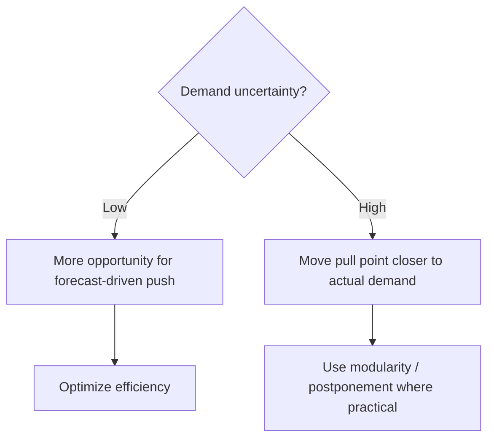

# 9. NPI Frequency versus Demand Uncertainty

## Learning objectives

You should be able to:

- explain technology clockspeed;
- connect NPI frequency to product-life-cycle length;
- connect demand uncertainty to push/pull choices;
- recognize the four product/supply-chain combinations in the matrix.

## Technology clockspeed

**Clockspeed** describes how quickly technology, products, or market expectations change.

High clockspeed usually means:

- frequent new-product introduction;
- shorter life cycles;
- greater risk of obsolescence;
- greater need for modularity and fast response.

Low clockspeed usually means:

- longer product lives;
- less frequent design change;
- more opportunity to optimize stable processes.

## Original matrix

## The four quadrants

### 1. Unstable demand + low clockspeed

Demand is uncertain, but the underlying product does not change rapidly.

Useful approaches can include:

- producing common components to forecast;
- postponing final configuration;
- centralizing inventory;
- switching to pull closer to the customer order.

### 2. Unstable demand + high clockspeed

This is the most responsiveness-intensive quadrant.

Characteristics:

- short life cycles;
- high obsolescence risk;
- uncertain mix;
- frequent redesign.

Typical responses:

- pull / make-to-order bias;
- modular design;
- short lead times;
- flexible or excess capacity;
- dynamic pricing;
- responsiveness over lowest cost.

### 3. Stable demand + low clockspeed

This fits many staple or functional products.

Typical priorities:

- make-to-stock;
- high turnover;
- cost efficiency;
- scale;
- reliable replenishment.

### 4. Stable demand + high clockspeed

This can apply to components or platforms with steady aggregate demand but frequent versions.

Modularity can allow portions of the design to remain reusable while fast-changing modules are updated.

## Push vs. pull logic

Push and pull are not necessarily all-or-nothing. A supply chain can push generic components and pull final configuration.

## Realistic examples

| Product | Demand | Clockspeed | Likely emphasis |
|---|---|---|---|
| Basic industrial fastener | Stable | Low | MTS / efficiency |
| Fashion wearable | Unstable | High | Pull / fast response |
| Commercial aircraft cabin options | Unstable mix | Low/medium | Common platform + postponed configuration |
| Standard processor module used across many devices | Stable aggregate | High | Modular reuse + efficient replenishment |

## Decision logic

If the question gives you two pieces of information, separate them:

1. **How uncertain is demand?**
2. **How quickly does the product/technology change?**

Do not use "innovative" as a shortcut without considering both.

## Common mistake

High clockspeed does **not automatically mean unstable demand**. A component can change frequently while aggregate demand stays relatively stable.

## Related concepts

- [PLM and NPI](08-plm-and-new-product-introduction.md)
- [Product life cycle](07-product-life-cycle.md)

## Related concepts

Module 1 → Section C → NPI Frequency versus Demand Uncertainty.
