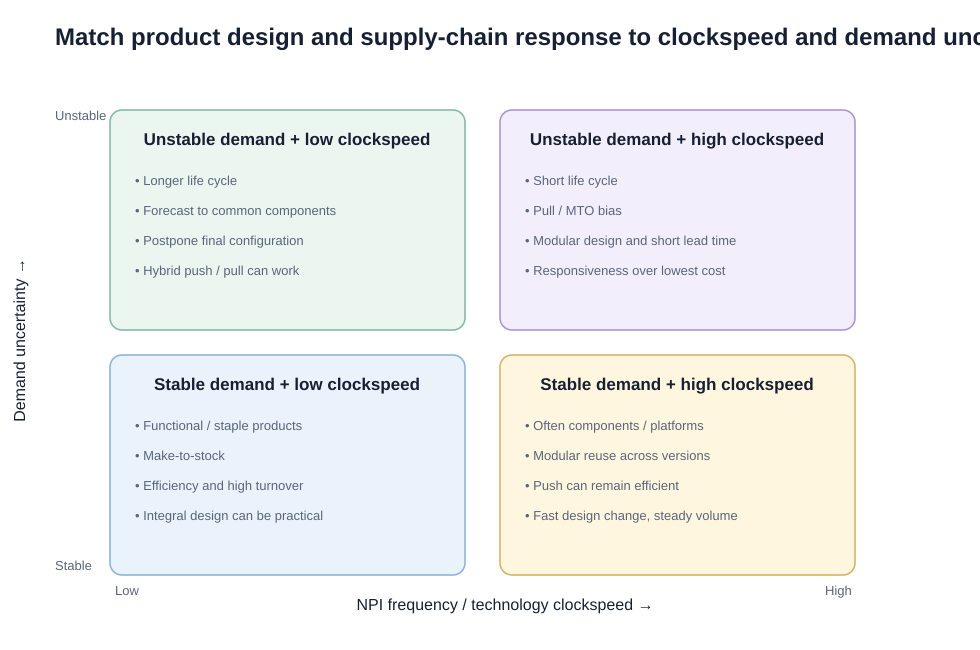
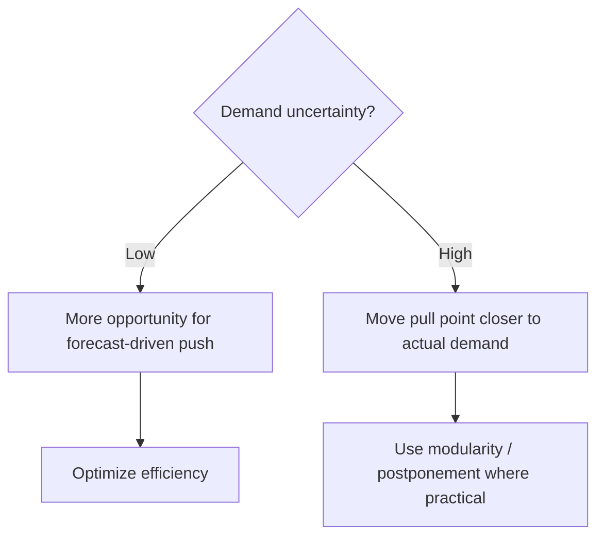

# 9. NPI Frequency versus Demand Uncertainty

## Learning objectives

You should be able to:

- explain technology clockspeed;
- connect NPI frequency to product-life-cycle length;
- connect demand uncertainty to push/pull choices;
- recognize the four product/supply-chain combinations in the matrix.

## Technology clockspeed

**Clockspeed** describes how quickly technology, products, or market expectations change.

High clockspeed usually means:

- frequent new-product introduction;
- shorter life cycles;
- greater risk of obsolescence;
- greater need for modularity and fast response.

Low clockspeed usually means:

- longer product lives;
- less frequent design change;
- more opportunity to optimize stable processes.

## Original matrix

## The four quadrants

### 1. Unstable demand + low clockspeed

Demand is uncertain, but the underlying product does not change rapidly.

Useful approaches can include:

- producing common components to forecast;
- postponing final configuration;
- centralizing inventory;
- switching to pull closer to the customer order.

### 2. Unstable demand + high clockspeed

This is the most responsiveness-intensive quadrant.

Characteristics:

- short life cycles;
- high obsolescence risk;
- uncertain mix;
- frequent redesign.

Typical responses:

- pull / make-to-order bias;
- modular design;
- short lead times;
- flexible or excess capacity;
- dynamic pricing;
- responsiveness over lowest cost.

### 3. Stable demand + low clockspeed

This fits many staple or functional products.

Typical priorities:

- make-to-stock;
- high turnover;
- cost efficiency;
- scale;
- reliable replenishment.

### 4. Stable demand + high clockspeed

This can apply to components or platforms with steady aggregate demand but frequent versions.

Modularity can allow portions of the design to remain reusable while fast-changing modules are updated.

## Push vs. pull logic

Push and pull are not necessarily all-or-nothing. A supply chain can push generic components and pull final configuration.

## Realistic examples

| Product | Demand | Clockspeed | Likely emphasis |
|---|---|---|---|
| Basic industrial fastener | Stable | Low | MTS / efficiency |
| Fashion wearable | Unstable | High | Pull / fast response |
| Commercial aircraft cabin options | Unstable mix | Low/medium | Common platform + postponed configuration |
| Standard processor module used across many devices | Stable aggregate | High | Modular reuse + efficient replenishment |

## Why it matters

High launch frequency and high demand uncertainty compound obsolescence, changeover, capacity, data, and supplier risk.

## Decision logic

If the question gives you two pieces of information, separate them:

1. **How uncertain is demand?**
2. **How quickly does the product/technology change?**

Do not use "innovative" as a shortcut without considering both.

## Evidence retained through the workflow

Retain launch calendar, demand range, common-platform percentage, differentiation point, capacity and inventory exposure, and gate owner. Record the decision date and the event or threshold that requires reassessment.

## Applied decision artifact

Use a one-page **NPI frequency versus demand uncertainty decision record** with these fields:

- **Decision and boundary:** Place the portfolio on the launch-frequency and uncertainty matrix, then choose commonality, postponement, capacity, inventory, and governance controls.
- **Required evidence:** launch calendar, demand range, common-platform percentage, differentiation point, capacity and inventory exposure, and gate owner.
- **Expected result:** High launch frequency and high demand uncertainty compound obsolescence, changeover, capacity, data, and supplier risk.
- **Balancing condition:** Frequent introductions may sustain innovation, but they fragment demand and shorten the time available to learn and stabilize operations.
- **Accountability:** name the decision owner, approval date, residual exposure owner, and measurable trigger for reassessment.

The record is complete only when another practitioner can reproduce the reasoning and identify the next action without relying on meeting memory.

## Trade-offs

Frequent introductions may sustain innovation, but they fragment demand and shorten the time available to learn and stabilize operations.

## Commonly confused with

Do not confuse a preferred decision method with a guaranteed outcome. Place the portfolio on the launch-frequency and uncertainty matrix, then choose commonality, postponement, capacity, inventory, and governance controls. Validate the result with launch calendar, demand range, common-platform percentage, differentiation point, capacity and inventory exposure, and gate owner; the evidence, not the method's label, determines whether the choice worked.

## Common mistakes
High clockspeed does **not automatically mean unstable demand**. A component can change frequently while aggregate demand stays relatively stable.

## Original knowledge check

**Question.** NorthStar is deciding how to apply NPI frequency versus demand uncertainty. Which proposal is most defensible?

A. Use NPI frequency versus demand uncertainty as a label for the preferred option before defining the decision outcome, constraints, or owner.
B. Place the portfolio on the launch-frequency and uncertainty matrix, then choose commonality, postponement, capacity, inventory, and governance controls.
C. Choose the apparent upside without evaluating this balancing condition: Frequent introductions may sustain innovation, but they fragment demand and shorten the time available to learn and stabilize operations.
D. Approve the choice without retaining launch calendar, demand range, common-platform percentage, differentiation point, capacity and inventory exposure, and gate owner; omit the reassessment trigger as well.

Answer and rationale

### Correct answer

**B. Place the portfolio on the launch-frequency and uncertainty matrix, then choose commonality, postponement, capacity, inventory, and governance controls.**

### Why it is correct

High launch frequency and high demand uncertainty compound obsolescence, changeover, capacity, data, and supplier risk. The recommended action connects the operating choice to evidence, ownership, and a measurable outcome.

### Why the other answers are wrong

- **A** reverses the decision sequence. The team should first do the required work: place the portfolio on the launch-frequency and uncertainty matrix, then choose commonality, postponement, capacity, inventory, and governance controls.
- **C** optimizes one visible result and omits the balancing effects: frequent introductions may sustain innovation, but they fragment demand and shorten the time available to learn and stabilize operations.
- **D** leaves the approval unauditable. A reviewer would be missing launch calendar, demand range, common-platform percentage, differentiation point, capacity and inventory exposure, and gate owner, as well as the trigger needed to revisit the decision when conditions change.

Those approaches ignore the governing trade-off: frequent introductions may sustain innovation, but they fragment demand and shorten the time available to learn and stabilize operations.

## Practitioner perspective

A review should be able to reconstruct the choice from launch calendar, demand range, common-platform percentage, differentiation point, capacity and inventory exposure, and gate owner. If those records cannot explain what changed, who decided, and when the decision will be revisited, the process is not yet controlled.

## Related concepts

- [Section overview](./README.md)
- [Module 2 continuation](../../02-network-design-digital-connectivity-performance/section-b-connected-supply-networks-and-master-data/03-advanced-planning-and-constraint-management.md)
- [PLM and NPI](08-plm-and-new-product-introduction.md)
- [Product life cycle](07-product-life-cycle.md)
Module 1 → Section C → NPI Frequency versus Demand Uncertainty.

---

[Previous: Product Lifecycle Management and New-Product Introduction](08-plm-and-new-product-introduction.md) · [Section review](10-section-c-review.md)
