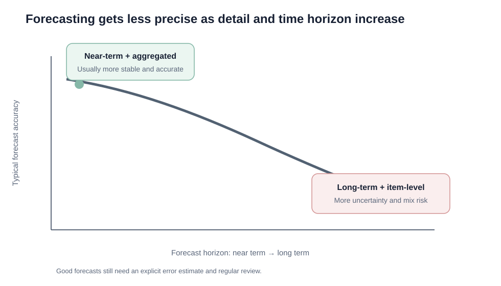
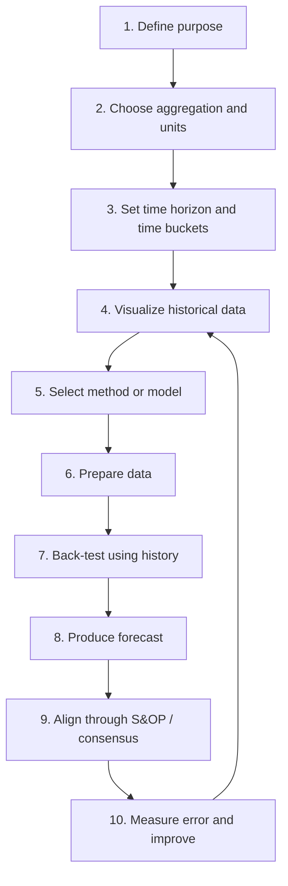

# 1. Forecasting Principles and Process

## Learning objectives

After this topic, you should be able to:

- explain why forecasting is needed even when a company builds to order;
- distinguish demand from orders;
- explain why grouped and near-term forecasts are usually more accurate;
- explain why every forecast should include an error estimate;
- follow a structured forecasting process from purpose through model review.

## Concept in plain English

A forecast is an informed estimate of future demand. It gives planners enough visibility to prepare capacity, materials, labor, warehouse space, transportation, and cash before actual demand is known.

Forecasting is necessary because most supply-chain decisions must be made **before** the final customer order arrives.

Even a make-to-order company still needs advance decisions about:

- available labor;
- supplier capacity;
- long-lead components;
- warehouse or staging space;
- transportation contracts;
- maintenance windows;
- working capital.

## Terminology checkpoint

- **Demand forecasting:** estimating how much of a specific product, component, or service customers will need in future periods.
- **Demand planning:** combining statistical forecasting with business judgment and cross-functional information to build a usable demand estimate for planning.
- **Product mix forecast:** estimating the expected proportions of individual products, options, or configurations within an aggregate family. An aggregate family forecast can be accurate while the detailed mix forecast is wrong, still creating component shortages or excess inventory.

## Five forecasting principles

### 1. Forecast demand, not just orders

Orders are an imperfect signal of true market demand. They may be distorted by:

- stockouts;
- returns;
- customers ordering early because they fear a shortage;
- distributors building inventory;
- promotions;
- order batching.

The planner should ask, **“What did customers actually want?”**, not only, **“What did they order from us?”**

### 2. Forecasts are almost always wrong

A forecast should be treated as a planning estimate, not as certainty. The practical response is to measure error, review assumptions, and design the supply chain to absorb reasonable uncertainty.

### 3. Include an estimate of error

A forecast of 10,000 units is much more useful when accompanied by information about likely error. Error tells decision makers how much buffer, flexibility, or contingency may be needed.

### 4. Aggregated forecasts are usually more accurate

Errors at the item level can offset one another when demand is pooled. A company may forecast total pump-family demand more accurately than the exact mix of every configuration.

That does **not** remove the need for a product-mix forecast. It simply means the detailed mix is usually forecast closer to the execution period.

### 5. Near-term forecasts are usually more accurate

The farther into the future we look, the more opportunity there is for customer behavior, competition, technology, prices, regulation, and the economy to change.

## Forecast horizon and aggregation

A useful planning pattern is:

| Horizon | Typical level of detail | Typical review cadence |
|---|---|---|
| Long term | Business / product family | Quarterly or annually |
| Medium term | Family / major model | Monthly |
| Short term | Item / SKU / location | Weekly or more frequently |

The key idea is **progressive detail**: use broader forecasts when uncertainty is high, then add detail as the decision point gets closer.

## Ten-step forecasting process

### Why visualization comes before model selection

A chart can reveal:

- seasonality;
- trend;
- cycles;
- structural breaks;
- one-time spikes;
- missing data.

Choosing a forecasting method before looking at the data is like choosing a tool before seeing the problem.

## Realistic example — NorthStar

NorthStar needs a 12-month demand forecast for a family of industrial pump service kits.

The planning team first decides:

- **purpose:** supplier capacity and inventory planning;
- **aggregation:** service-kit family, then later individual kit mix;
- **time bucket:** month;
- **horizon:** 12 months;
- **historical data:** three years of monthly consumption;
- **review:** monthly during S&OP.

A chart reveals repeated peaks each winter. That observation changes the model choice because forecasting the raw data directly would confuse seasonality with trend.

## Decision logic

When building a forecast, ask in this order:

1. What decision will the forecast support?
2. At what level should demand be aggregated?
3. How far ahead must the decision be made?
4. What pattern does the history show?
5. What method fits that pattern?
6. How will the model be tested?
7. What error level is acceptable?

## Common mistakes

- A sales target is **not** automatically a forecast.
- Orders are **not always equal** to demand.
- More detail does **not automatically mean** more accuracy.
- Longer horizons generally create **more uncertainty**, not more precision.

## Practitioner perspective

In enterprise planning systems, statistical forecasting should be separated from commercial overrides so the organization can measure whether human adjustments improve or reduce forecast accuracy.

## Related concepts

Module 1 → Section D → Forecasting Principles and Process. Wording, scenario, table, and visual composition are original.
