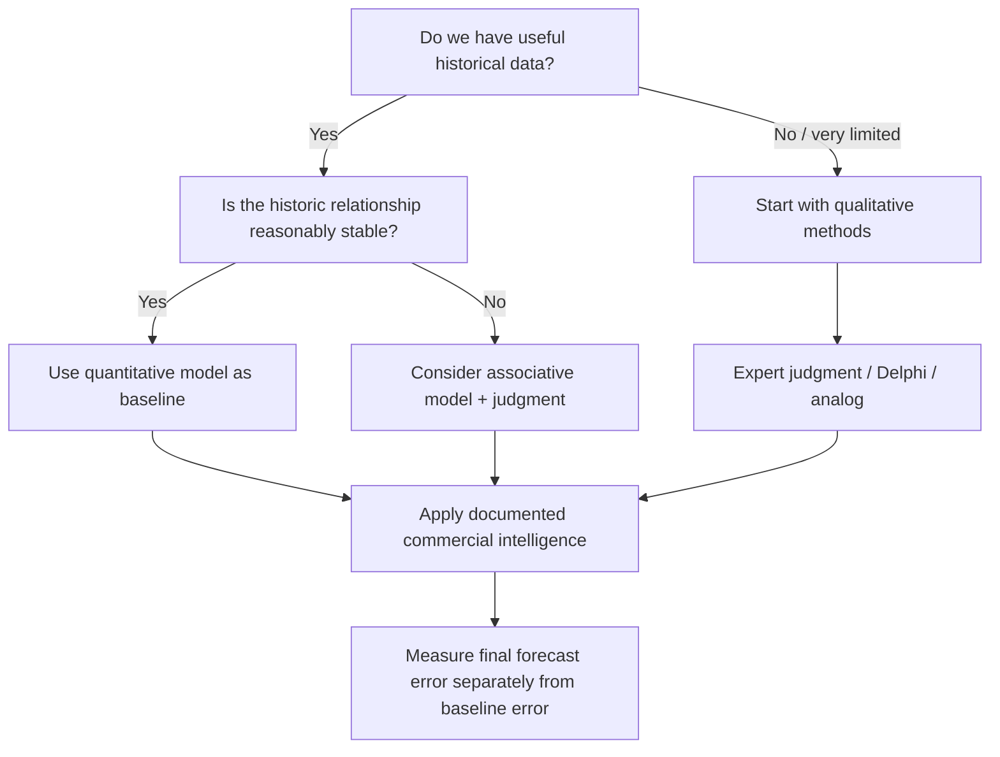
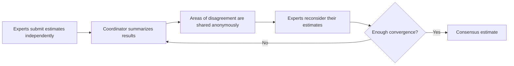

# 2. Qualitative and Combination Forecasting Methods

## Learning objectives

You should be able to:

- explain when qualitative forecasting is appropriate;
- distinguish expert judgment from the Delphi method;
- explain how optimistic / most-likely / pessimistic estimates can be combined;
- explain why a quantitative baseline plus documented judgment is often stronger than either method alone;
- recognize how human adjustments can introduce bias.

## Qualitative forecasting in plain English

Qualitative forecasting relies mainly on human knowledge rather than a mathematical pattern in historical data.

It is especially useful when:

- a product is new;
- history is too limited to support a reliable model;
- the market has changed so much that old patterns are no longer useful;
- an unusual event is expected;
- expert knowledge contains information that is not yet visible in the data.

## Method-selection view

## Expert judgment

People close to customers or markets may know things the historical data cannot yet show, for example:

- a competitor is discontinuing a product;
- a customer is opening a new plant;
- a tender is likely to be awarded;
- a regulation will change product demand;
- a distributor is planning a promotion.

The risk is **bias**. Incentives may cause someone to estimate too high or too low.

### Three-point estimate

A simple way to reduce single-number overconfidence is to request three estimates:

- pessimistic = **P**
- most likely = **M**
- optimistic = **O**

A simple average is:

`(P + M + O) / 3`

A weighted version can give more importance to the most-likely value:

`(P + 4M + O) / 6`

### Example

A new pump controller has:

- pessimistic launch demand = 3,000 units;
- most likely = 4,200;
- optimistic = 5,400.

Weighted estimate:

`(3,000 + 4×4,200 + 5,400) / 6 = 4,200 units`

The calculation does not make the judgment “scientific.” It simply forces assumptions into a transparent structure.

## Delphi method

The Delphi method seeks expert consensus through repeated rounds of anonymous input.

### Why anonymity matters

It reduces two common problems:

- **groupthink:** people follow a dominant personality instead of their own reasoning;
- **public commitment:** people resist changing an estimate because they have already defended it publicly.

The trade-off is time and effort, so Delphi is more suited to strategic or high-impact forecasting than routine SKU forecasting.

## Combination forecasting

A strong practical approach is often:

> **statistical baseline + documented judgment + error tracking**

Example:

1. A statistical model forecasts 42,000 units.
2. Sales knows a major customer will shut down one site for maintenance.
3. Marketing knows a competitor will discontinue a substitute product.
4. The demand team adjusts the forecast to 43,500.
5. Both the statistical baseline and the final adjusted forecast are measured later.

If judgment repeatedly makes the forecast worse, the adjustment process needs to change.

## Common confusion

**Qualitative** does not mean “guessing.” A good qualitative forecast uses structured expert information and explicit assumptions.

## Common mistake

When a new product has little or no historical demand, a purely time-series method is usually weak. Start with expert judgment, analogs, market research, or another appropriate qualitative approach.

## Related concepts

Module 1 → Section D → Qualitative and Combination Methods. Wording, examples, and diagrams are original.
