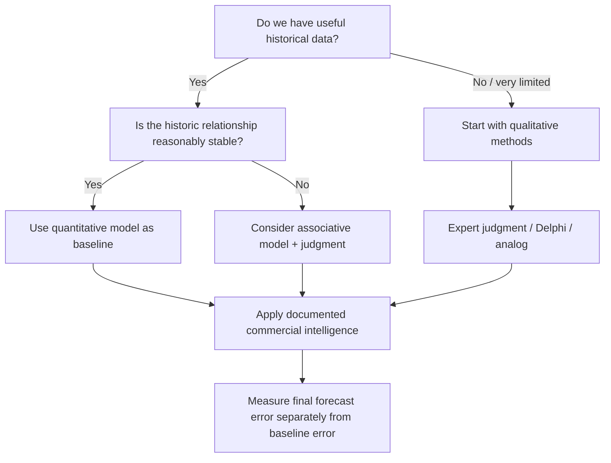
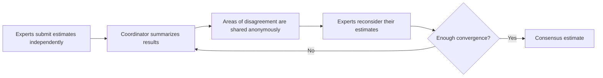

# 2. Qualitative and Combination Forecasting Methods

## Learning objectives

You should be able to:

- explain when qualitative forecasting is appropriate;
- distinguish expert judgment from the Delphi method;
- explain how optimistic / most-likely / pessimistic estimates can be combined;
- explain why a quantitative baseline plus documented judgment is often stronger than either method alone;
- recognize how human adjustments can introduce bias.

## Qualitative forecasting in plain English

Qualitative forecasting relies mainly on human knowledge rather than a mathematical pattern in historical data.

It is especially useful when:

- a product is new;
- history is too limited to support a reliable model;
- the market has changed so much that old patterns are no longer useful;
- an unusual event is expected;
- expert knowledge contains information that is not yet visible in the data.

## Method-selection view

## Expert judgment

People close to customers or markets may know things the historical data cannot yet show, for example:

- a competitor is discontinuing a product;
- a customer is opening a new plant;
- a tender is likely to be awarded;
- a regulation will change product demand;
- a distributor is planning a promotion.

The risk is **bias**. Incentives may cause someone to estimate too high or too low.

### Three-point estimate

A simple way to reduce single-number overconfidence is to request three estimates:

- pessimistic = **P**
- most likely = **M**
- optimistic = **O**

A simple average is:

`(P + M + O) / 3`

A weighted version can give more importance to the most-likely value:

`(P + 4M + O) / 6`

### Example

A new pump controller has:

- pessimistic launch demand = 3,000 units;
- most likely = 4,200;
- optimistic = 5,400.

Weighted estimate:

`(3,000 + 4×4,200 + 5,400) / 6 = 4,200 units`

The calculation does not make the judgment “scientific.” It simply forces assumptions into a transparent structure.

## Delphi method

The Delphi method seeks expert consensus through repeated rounds of anonymous input.

### Why anonymity matters

It reduces two common problems:

- **groupthink:** people follow a dominant personality instead of their own reasoning;
- **public commitment:** people resist changing an estimate because they have already defended it publicly.

The trade-off is time and effort, so Delphi is more suited to strategic or high-impact forecasting than routine SKU forecasting.

## Combination forecasting

A strong practical approach is often:

> **statistical baseline + documented judgment + error tracking**

Example:

1. A statistical model forecasts 42,000 units.
2. Sales knows a major customer will shut down one site for maintenance.
3. Marketing knows a competitor will discontinue a substitute product.
4. The demand team adjusts the forecast to 43,500.
5. Both the statistical baseline and the final adjusted forecast are measured later.

If judgment repeatedly makes the forecast worse, the adjustment process needs to change.

## Why it matters

New products, disruptions, and structural change often lack stable history, while expert judgment alone is vulnerable to bias and influence.

## Decision logic

Use a documented qualitative method, independent inputs where possible, explicit scenarios, and a controlled rule for combining judgment with data. Do not approve the decision until mandatory conditions are feasible and the residual exposure has a named owner.

## Evidence retained through the workflow

Retain expert selection, evidence supplied, independent estimates, scenario assumptions, combination weights, dissent, and later accuracy. Record the decision date and the event or threshold that requires reassessment.

## Applied decision artifact

Use a one-page **qualitative and combination forecasting methods decision record** with these fields:

- **Decision and boundary:** Use a documented qualitative method, independent inputs where possible, explicit scenarios, and a controlled rule for combining judgment with data.
- **Required evidence:** expert selection, evidence supplied, independent estimates, scenario assumptions, combination weights, dissent, and later accuracy.
- **Expected result:** New products, disruptions, and structural change often lack stable history, while expert judgment alone is vulnerable to bias and influence.
- **Balancing condition:** Judgment captures information outside the data but can introduce optimism, anchoring, hierarchy, and double counting.
- **Accountability:** name the decision owner, approval date, residual exposure owner, and measurable trigger for reassessment.

The record is complete only when another practitioner can reproduce the reasoning and identify the next action without relying on meeting memory.

## Trade-offs

Judgment captures information outside the data but can introduce optimism, anchoring, hierarchy, and double counting.

## Commonly confused with
**Qualitative** does not mean “guessing.” A good qualitative forecast uses structured expert information and explicit assumptions.

## Common mistakes
When a new product has little or no historical demand, a purely time-series method is usually weak. Start with expert judgment, analogs, market research, or another appropriate qualitative approach.

## Original knowledge check

**Question.** NorthStar is deciding how to apply qualitative and combination forecasting methods. Which proposal is most defensible?

A. Use qualitative and combination forecasting methods as a label for the preferred option before defining the decision outcome, constraints, or owner.
B. Use a documented qualitative method, independent inputs where possible, explicit scenarios, and a controlled rule for combining judgment with data.
C. Choose the apparent upside without evaluating this balancing condition: Judgment captures information outside the data but can introduce optimism, anchoring, hierarchy, and double counting.
D. Approve the choice without retaining expert selection, evidence supplied, independent estimates, scenario assumptions, combination weights, dissent, and later accuracy; omit the reassessment trigger as well.

Answer and rationale

### Correct answer

**B. Use a documented qualitative method, independent inputs where possible, explicit scenarios, and a controlled rule for combining judgment with data.**

### Why it is correct

New products, disruptions, and structural change often lack stable history, while expert judgment alone is vulnerable to bias and influence. The recommended action connects the operating choice to evidence, ownership, and a measurable outcome.

### Why the other answers are wrong

- **A** reverses the decision sequence. The team should first do the required work: use a documented qualitative method, independent inputs where possible, explicit scenarios, and a controlled rule for combining judgment with data.
- **C** optimizes one visible result and omits the balancing effects: judgment captures information outside the data but can introduce optimism, anchoring, hierarchy, and double counting.
- **D** leaves the approval unauditable. A reviewer would be missing expert selection, evidence supplied, independent estimates, scenario assumptions, combination weights, dissent, and later accuracy, as well as the trigger needed to revisit the decision when conditions change.

Those approaches ignore the governing trade-off: judgment captures information outside the data but can introduce optimism, anchoring, hierarchy, and double counting.

## Practitioner perspective

A review should be able to reconstruct the choice from expert selection, evidence supplied, independent estimates, scenario assumptions, combination weights, dissent, and later accuracy. If those records cannot explain what changed, who decided, and when the decision will be revisited, the process is not yet controlled.

## Related concepts

- [Section overview](./README.md)
- [Module 2 continuation](../../02-network-design-digital-connectivity-performance/section-c-performance-and-financial-insight/01-measurement-system-design.md)
Module 1 → Section D → Qualitative and Combination Methods. Wording, examples, and diagrams are original.

---

[Previous: Forecasting Principles and Process](01-forecasting-principles-and-process.md) · [Next: Time-Series Forecasting and Method Selection](03-time-series-forecasting-and-method-selection.md)
