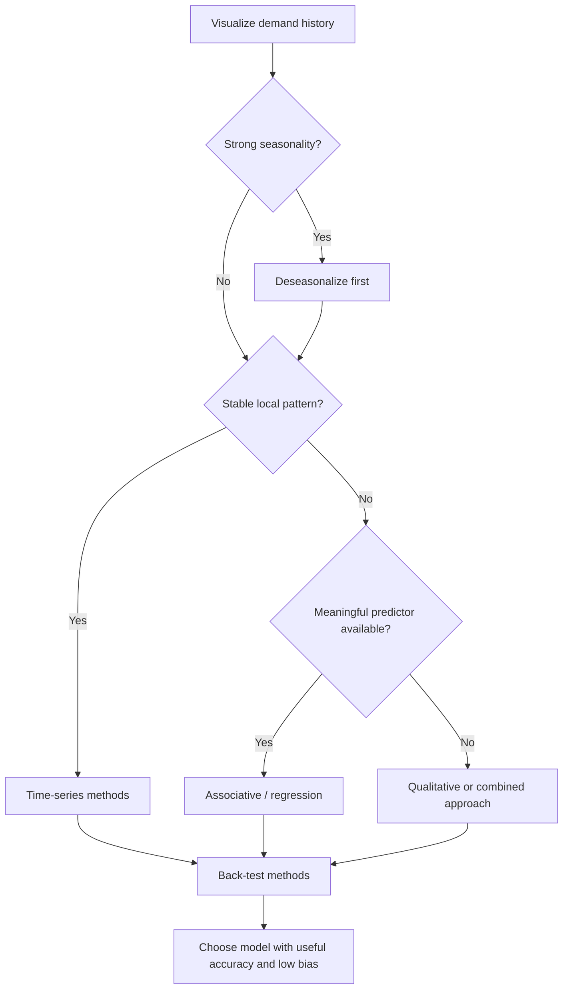

# 3. Time-Series Forecasting and Method Selection

## Learning objectives

You should be able to:

- distinguish time-series forecasting from associative forecasting;
- explain naive forecasting;
- recognize when moving averages or exponential smoothing fit the data;
- explain why time-series methods become less useful when the underlying drivers change;
- use data visualization to choose a method.

## Time-series forecasting

Time-series forecasting assumes that useful information about the future is contained in the pattern of past demand.

Typical methods include:

- naive forecast;
- simple moving average;
- weighted moving average;
- exponential smoothing.

These approaches work best when the underlying pattern is reasonably stable.

## Naive forecast

The naive rule is:

`Next period forecast = Last period actual demand`

If demand in May was 1,250 units, the June forecast is 1,250 units.

It is inexpensive and easy to explain, but a one-time spike or drop is carried directly into the next forecast.

## Time-series vs. associative forecasting

| Question | Time-series | Associative |
|---|---|---|
| Main input | Past values of the item being forecast | One or more predictors |
| Typical strength | Short / medium-term stable patterns | Longer-term or changing environments |
| Example | Forecast next month's demand from recent demand | Forecast pump demand from construction permits |
| Main assumption | Past pattern continues | Predictor has a meaningful relationship with demand |

## Model-selection logic



## Why a chart matters


The NorthStar example contains both:

- a mild upward trend;
- large recurring seasonal peaks and troughs.

A moving average applied directly during an upswing could mistake the seasonal rise for a permanent trend. The seasonal effect should therefore be removed before the base pattern is forecast.

## More periods = more smoothing, but more lag

A 6-period moving average normally reacts more slowly than a 3-period moving average.

That is a trade-off:

```text
More periods in average
        ↓
More smoothing of random noise
        ↓
Slower reaction to a genuine trend change
```

## Forecasting farther into the future

A moving average can be extended by substituting forecast values where future actuals are not yet available. But after several periods, the calculation becomes increasingly based on forecasts of forecasts. The result often flattens and becomes less informative.

## Decision rule

Use a time-series method when:

- history exists;
- the demand-generating process is reasonably stable;
- the horizon is not too long;
- no stronger causal predictor is needed.

Use an associative method when the major drivers of demand are changing and can be represented by meaningful predictors.

## Common mistake

Adding more periods to a moving average usually **reduces sensitivity to random variation**, but it also increases lag. It does not automatically improve every forecast.

## Related concepts

Module 1 → Section D → Quantitative Methods: Time-Series Forecasting. Wording and visuals are original.
