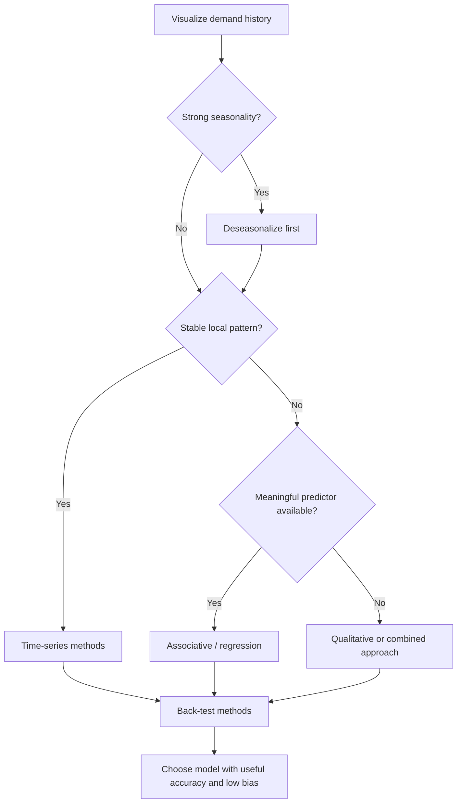

# 3. Time-Series Forecasting and Method Selection

## Learning objectives

You should be able to:

- distinguish time-series forecasting from associative forecasting;
- explain naive forecasting;
- recognize when moving averages or exponential smoothing fit the data;
- explain why time-series methods become less useful when the underlying drivers change;
- use data visualization to choose a method.

## Time-series forecasting

Time-series forecasting assumes that useful information about the future is contained in the pattern of past demand.

Typical methods include:

- naive forecast;
- simple moving average;
- weighted moving average;
- exponential smoothing.

These approaches work best when the underlying pattern is reasonably stable.

## Naive forecast

The naive rule is:

`Next period forecast = Last period actual demand`

If demand in May was 1,250 units, the June forecast is 1,250 units.

It is inexpensive and easy to explain, but a one-time spike or drop is carried directly into the next forecast.

## Time-series vs. associative forecasting

| Question | Time-series | Associative |
|---|---|---|
| Main input | Past values of the item being forecast | One or more predictors |
| Typical strength | Short / medium-term stable patterns | Longer-term or changing environments |
| Example | Forecast next month's demand from recent demand | Forecast pump demand from construction permits |
| Main assumption | Past pattern continues | Predictor has a meaningful relationship with demand |

## Model-selection logic



## Why a chart matters


The NorthStar example contains both:

- a mild upward trend;
- large recurring seasonal peaks and troughs.

A moving average applied directly during an upswing could mistake the seasonal rise for a permanent trend. The seasonal effect should therefore be removed before the base pattern is forecast.

## More periods = more smoothing, but more lag

A 6-period moving average normally reacts more slowly than a 3-period moving average.

That is a trade-off:

```text
More periods in average
        ↓
More smoothing of random noise
        ↓
Slower reaction to a genuine trend change
```

## Forecasting farther into the future

A moving average can be extended by substituting forecast values where future actuals are not yet available. But after several periods, the calculation becomes increasingly based on forecasts of forecasts. The result often flattens and becomes less informative.

## Decision rule

Use a time-series method when:

- history exists;
- the demand-generating process is reasonably stable;
- the horizon is not too long;
- no stronger causal predictor is needed.

Use an associative method when the major drivers of demand are changing and can be represented by meaningful predictors.

## Why it matters

A method can fit history well yet fail operationally when its assumptions do not match trend, seasonality, intermittency, or the decision horizon.

## Decision logic

Classify the pattern, create a holdout test, compare simple credible methods, inspect residuals and bias, and select using business-relevant error. Do not approve the decision until mandatory conditions are feasible and the residual exposure has a named owner.

## Evidence retained through the workflow

Retain training and holdout periods, pattern classification, candidate methods, parameters, error by segment, bias, and selection rationale. Record the decision date and the event or threshold that requires reassessment.

## Applied decision artifact

Use a one-page **time-series forecasting and method selection decision record** with these fields:

- **Decision and boundary:** Classify the pattern, create a holdout test, compare simple credible methods, inspect residuals and bias, and select using business-relevant error.
- **Required evidence:** training and holdout periods, pattern classification, candidate methods, parameters, error by segment, bias, and selection rationale.
- **Expected result:** A method can fit history well yet fail operationally when its assumptions do not match trend, seasonality, intermittency, or the decision horizon.
- **Balancing condition:** Responsive models adapt faster but may chase noise; stable models are easier to operate but can lag turning points.
- **Accountability:** name the decision owner, approval date, residual exposure owner, and measurable trigger for reassessment.

The record is complete only when another practitioner can reproduce the reasoning and identify the next action without relying on meeting memory.

## Trade-offs

Responsive models adapt faster but may chase noise; stable models are easier to operate but can lag turning points.

## Commonly confused with

Do not confuse a preferred decision method with a guaranteed outcome. Classify the pattern, create a holdout test, compare simple credible methods, inspect residuals and bias, and select using business-relevant error. Validate the result with training and holdout periods, pattern classification, candidate methods, parameters, error by segment, bias, and selection rationale; the evidence, not the method's label, determines whether the choice worked.

## Common mistakes
Adding more periods to a moving average usually **reduces sensitivity to random variation**, but it also increases lag. It does not automatically improve every forecast.

## Original knowledge check

**Question.** NorthStar is deciding how to apply time-series forecasting and method selection. Which proposal is most defensible?

A. Use time-series forecasting and method selection as a label for the preferred option before defining the decision outcome, constraints, or owner.
B. Classify the pattern, create a holdout test, compare simple credible methods, inspect residuals and bias, and select using business-relevant error.
C. Choose the apparent upside without evaluating this balancing condition: Responsive models adapt faster but may chase noise; stable models are easier to operate but can lag turning points.
D. Approve the choice without retaining training and holdout periods, pattern classification, candidate methods, parameters, error by segment, bias, and selection rationale; omit the reassessment trigger as well.

<details>
<summary>Answer and rationale</summary>

### Correct answer

**B. Classify the pattern, create a holdout test, compare simple credible methods, inspect residuals and bias, and select using business-relevant error.**

### Why it is correct

A method can fit history well yet fail operationally when its assumptions do not match trend, seasonality, intermittency, or the decision horizon. The recommended action connects the operating choice to evidence, ownership, and a measurable outcome.

### Why the other answers are wrong

- **A** reverses the decision sequence. The team should first do the required work: classify the pattern, create a holdout test, compare simple credible methods, inspect residuals and bias, and select using business-relevant error.
- **C** optimizes one visible result and omits the balancing effects: responsive models adapt faster but may chase noise; stable models are easier to operate but can lag turning points.
- **D** leaves the approval unauditable. A reviewer would be missing training and holdout periods, pattern classification, candidate methods, parameters, error by segment, bias, and selection rationale, as well as the trigger needed to revisit the decision when conditions change.

Those approaches ignore the governing trade-off: responsive models adapt faster but may chase noise; stable models are easier to operate but can lag turning points.

</details>

## Practitioner perspective

A review should be able to reconstruct the choice from training and holdout periods, pattern classification, candidate methods, parameters, error by segment, bias, and selection rationale. If those records cannot explain what changed, who decided, and when the decision will be revisited, the process is not yet controlled.

## Related concepts


- [Section overview](./README.md)
- [Module 2 continuation](../../02-network-design-digital-connectivity-performance/section-c-performance-and-financial-insight/01-measurement-system-design.md)
Module 1 → Section D → Quantitative Methods: Time-Series Forecasting. Wording and visuals are original.

---

[Previous: Qualitative and Combination Forecasting Methods](02-qualitative-and-combination-methods.md) · [Next: Seasonality, Deseasonalizing, and Reseasonalizing](04-seasonality-deseasonalizing-reseasonalizing.md)
