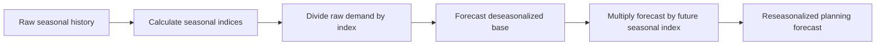

# 4. Seasonality, Deseasonalizing, and Reseasonalizing

## Learning objectives

You should be able to:

- explain why strong seasonality should be removed before forecasting the base pattern;
- calculate a seasonal index;
- deseasonalize actual demand;
- reseasonalize a forecast;
- interpret an index above or below 1.00.

## Why seasonality matters

Seasonality is a predictable repeating pattern linked to a calendar period such as month, week, day, or hour.

If winter demand is always higher than summer demand, the planner should not treat that winter increase as a permanent trend.

## Original example — NorthStar service kits

NorthStar has three years of monthly demand for dewatering-pump service kits.

Original data are available in:

[`northstar-seasonal-demand.csv`](../../assets/data/module-1/section-d/northstar-seasonal-demand.csv)

## Step 1 — monthly average

For each month, average the same month across several years.

Example for January:

`(126 + 130 + 134) / 3 = 130.0`

## Step 2 — overall average month

Average all 12 monthly averages.

For this original data set:

`Overall monthly average ≈ 104.14 units`

## Step 3 — seasonal index

`Seasonal Index = Month Average / Overall Average`

January:

`130.0 / 104.14 ≈ 1.248`

That means January demand is historically about **24.8% above an average month**.

### Interpretation

- index **> 1.00** → above-average season;
- index **< 1.00** → below-average season;
- index **≈ 1.00** → close to average.

## Step 4 — deseasonalize

`Deseasonalized Demand = Raw Demand / Seasonal Index`

If January Year 3 demand is 134 units:

`134 / 1.248 ≈ 107.4 units`

The seasonal peak has been removed, revealing a value closer to the underlying base level.

## Step 5 — forecast the base pattern

Apply the selected forecasting method to the **deseasonalized** series.

## Step 6 — reseasonalize

`Final Seasonal Forecast = Base Forecast × Seasonal Index`

Suppose the deseasonalized January forecast is 111 units:

`111 × 1.248 ≈ 138.5 units`

The planning forecast would be about **139 units** after rounding according to the company's rule.

## Complete transformation

## Common confusion

**Deseasonalized demand is not the final customer forecast.** It is an intermediate series used to estimate the underlying pattern.

## Common mistake

Do not forecast strong raw seasonality and then call the result a trend. Remove the seasonal effect, forecast the base series, and then put the seasonal effect back.

## Related concepts

Module 1 → Section D → Visualizing, Deseasonalizing, Reseasonalizing. Numerical values and visuals are original.
