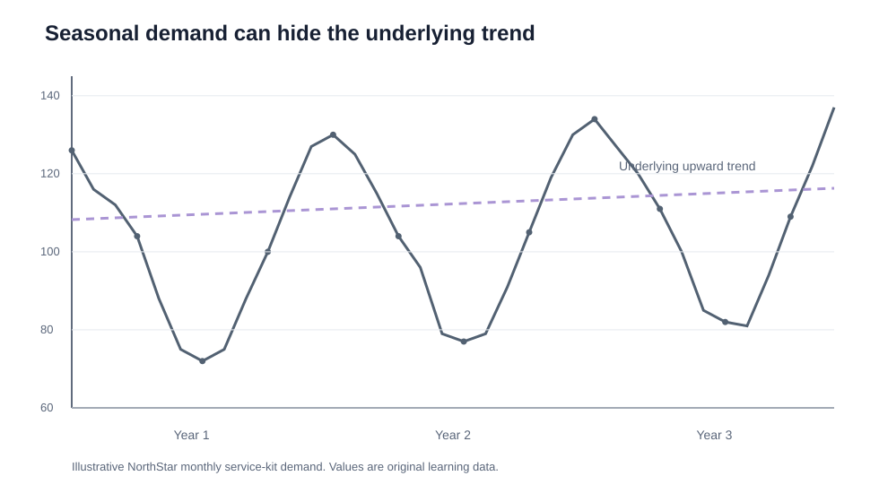
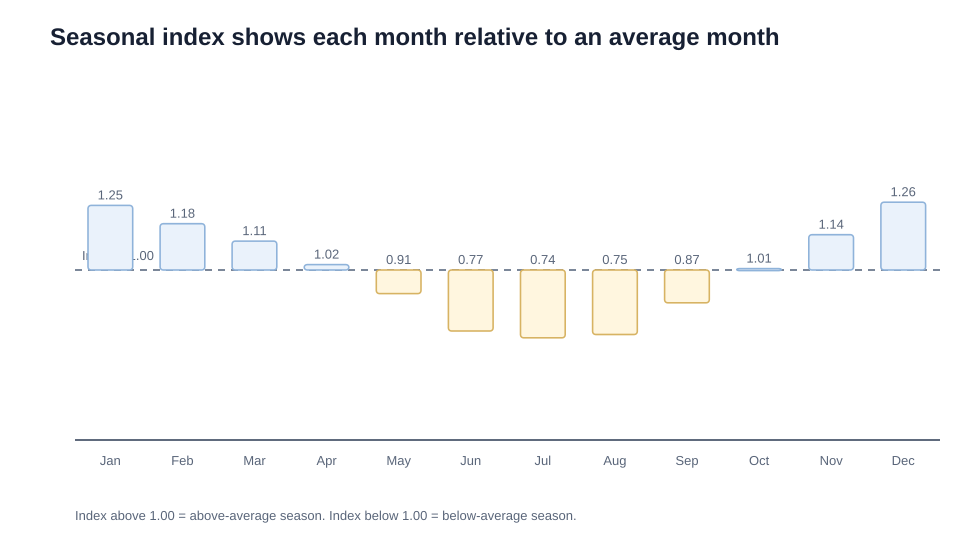
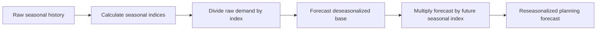

# 4. Seasonality, Deseasonalizing, and Reseasonalizing

## Learning objectives

You should be able to:

- explain why strong seasonality should be removed before forecasting the base pattern;
- calculate a seasonal index;
- deseasonalize actual demand;
- reseasonalize a forecast;
- interpret an index above or below 1.00.

## Why seasonality matters

Seasonality is a predictable repeating pattern linked to a calendar period such as month, week, day, or hour.

If winter demand is always higher than summer demand, the planner should not treat that winter increase as a permanent trend.

## Original example — NorthStar service kits

NorthStar has three years of monthly demand for dewatering-pump service kits.

Original data are available in:

[`northstar-seasonal-demand.csv`](../../assets/data/module-1/section-d/northstar-seasonal-demand.csv)

## Step 1 — monthly average

For each month, average the same month across several years.

Example for January:

`(126 + 130 + 134) / 3 = 130.0`

## Step 2 — overall average month

Average all 12 monthly averages.

For this original data set:

`Overall monthly average ≈ 104.14 units`

## Step 3 — seasonal index

`Seasonal Index = Month Average / Overall Average`

January:

`130.0 / 104.14 ≈ 1.248`

That means January demand is historically about **24.8% above an average month**.

### Interpretation

- index **> 1.00** → above-average season;
- index **< 1.00** → below-average season;
- index **≈ 1.00** → close to average.

## Step 4 — deseasonalize

`Deseasonalized Demand = Raw Demand / Seasonal Index`

If January Year 3 demand is 134 units:

`134 / 1.248 ≈ 107.4 units`

The seasonal peak has been removed, revealing a value closer to the underlying base level.

## Step 5 — forecast the base pattern

Apply the selected forecasting method to the **deseasonalized** series.

## Step 6 — reseasonalize

`Final Seasonal Forecast = Base Forecast × Seasonal Index`

Suppose the deseasonalized January forecast is 111 units:

`111 × 1.248 ≈ 138.5 units`

The planning forecast would be about **139 units** after rounding according to the company's rule.

## Complete transformation

## Why it matters

Strong recurring peaks can be mistaken for growth and cause distorted base forecasts, capacity plans, and inventory targets.

## Decision logic

Calculate normalized seasonal indices from comparable history, remove seasonality, forecast the base, and restore the future seasonal effect. Do not approve the decision until mandatory conditions are feasible and the residual exposure has a named owner.

## Evidence retained through the workflow

Retain source history, missing and event treatment, monthly averages, normalized indices, base forecast, future calendar, and refresh rule. Record the decision date and the event or threshold that requires reassessment.

## Applied decision artifact

Use a one-page **seasonality, deseasonalizing, and reseasonalizing decision record** with these fields:

- **Decision and boundary:** Calculate normalized seasonal indices from comparable history, remove seasonality, forecast the base, and restore the future seasonal effect.
- **Required evidence:** source history, missing and event treatment, monthly averages, normalized indices, base forecast, future calendar, and refresh rule.
- **Expected result:** Strong recurring peaks can be mistaken for growth and cause distorted base forecasts, capacity plans, and inventory targets.
- **Balancing condition:** Stable indices simplify planning, but structural calendar, channel, or product changes can make historical seasonality misleading.
- **Accountability:** name the decision owner, approval date, residual exposure owner, and measurable trigger for reassessment.

The record is complete only when another practitioner can reproduce the reasoning and identify the next action without relying on meeting memory.

## Trade-offs

Stable indices simplify planning, but structural calendar, channel, or product changes can make historical seasonality misleading.

## Commonly confused with
**Deseasonalized demand is not the final customer forecast.** It is an intermediate series used to estimate the underlying pattern.

## Common mistakes
Do not forecast strong raw seasonality and then call the result a trend. Remove the seasonal effect, forecast the base series, and then put the seasonal effect back.

## Original knowledge check

**Question.** NorthStar is deciding how to apply seasonality, deseasonalizing, and reseasonalizing. Which proposal is most defensible?

A. Use seasonality, deseasonalizing, and reseasonalizing as a label for the preferred option before defining the decision outcome, constraints, or owner.
B. Calculate normalized seasonal indices from comparable history, remove seasonality, forecast the base, and restore the future seasonal effect.
C. Choose the apparent upside without evaluating this balancing condition: Stable indices simplify planning, but structural calendar, channel, or product changes can make historical seasonality misleading.
D. Approve the choice without retaining source history, missing and event treatment, monthly averages, normalized indices, base forecast, future calendar, and refresh rule; omit the reassessment trigger as well.

Answer and rationale

### Correct answer

**B. Calculate normalized seasonal indices from comparable history, remove seasonality, forecast the base, and restore the future seasonal effect.**

### Why it is correct

Strong recurring peaks can be mistaken for growth and cause distorted base forecasts, capacity plans, and inventory targets. The recommended action connects the operating choice to evidence, ownership, and a measurable outcome.

### Why the other answers are wrong

- **A** reverses the decision sequence. The team should first do the required work: calculate normalized seasonal indices from comparable history, remove seasonality, forecast the base, and restore the future seasonal effect.
- **C** optimizes one visible result and omits the balancing effects: stable indices simplify planning, but structural calendar, channel, or product changes can make historical seasonality misleading.
- **D** leaves the approval unauditable. A reviewer would be missing source history, missing and event treatment, monthly averages, normalized indices, base forecast, future calendar, and refresh rule, as well as the trigger needed to revisit the decision when conditions change.

Those approaches ignore the governing trade-off: stable indices simplify planning, but structural calendar, channel, or product changes can make historical seasonality misleading.

## Practitioner perspective

A review should be able to reconstruct the choice from source history, missing and event treatment, monthly averages, normalized indices, base forecast, future calendar, and refresh rule. If those records cannot explain what changed, who decided, and when the decision will be revisited, the process is not yet controlled.

## Related concepts

- [Forecasting formula sheet](../../calculations/forecasting/formula-sheet.md)
- [Section overview](./README.md)
- [Module 2 continuation](../../02-network-design-digital-connectivity-performance/section-c-performance-and-financial-insight/01-measurement-system-design.md)
Module 1 → Section D → Visualizing, Deseasonalizing, Reseasonalizing. Numerical values and visuals are original.

---

[Previous: Time-Series Forecasting and Method Selection](03-time-series-forecasting-and-method-selection.md) · [Next: Moving Averages and Exponential Smoothing](05-moving-averages-and-exponential-smoothing.md)
