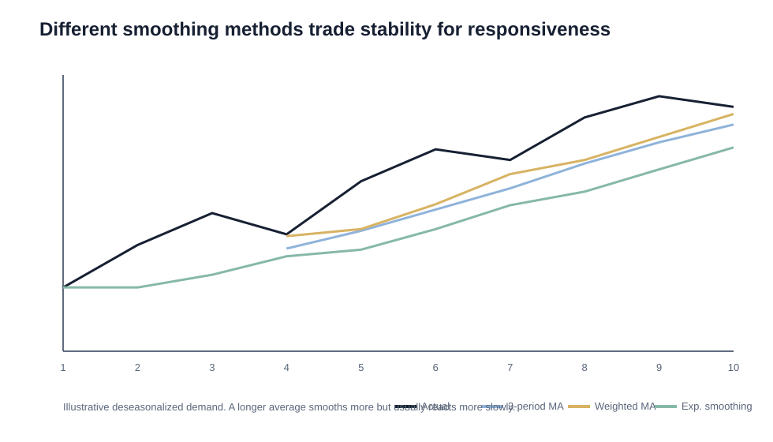

# 5. Moving Averages and Exponential Smoothing

## Learning objectives

You should be able to:

- calculate a simple moving average;
- calculate a weighted moving average;
- calculate exponential smoothing;
- explain how weights and alpha affect responsiveness;
- compare smoothing methods conceptually.

## Simple moving average

A simple moving average gives equal weight to a fixed number of recent periods.

For a 3-period moving average:

`Forecast = (A1 + A2 + A3) / 3`

Example using deseasonalized demand of 104, 108, and 111:

`(104 + 108 + 111) / 3 = 107.67`

### Trade-off

- more periods → more smoothing;
- more periods → more lag when the trend changes.

## Weighted moving average

A weighted moving average can give more importance to recent demand.

Example weights:

- oldest period = 1;
- middle period = 2;
- newest period = 3.

`Forecast = (1×104 + 2×108 + 3×111) / (1+2+3)`

`= 108.83`

The weights should be tested against historical results rather than selected only because they “feel right.”

## Exponential smoothing

Exponential smoothing uses:

- last period's actual demand;
- last period's forecast;
- smoothing constant **α**.

Formula:

`New Forecast = α(Last Actual) + (1−α)(Last Forecast)`

Example:

- α = 0.30;
- last actual = 111;
- last forecast = 106.

`0.30×111 + 0.70×106 = 107.5`

## What alpha means

| Alpha | Behavior |
|---|---|
| Low α | More weight on prior forecast; smoother; slower reaction |
| High α | More weight on recent actual; faster reaction; less smoothing |
| α = 1.0 | Becomes equivalent to a naive forecast |

A larger alpha is not automatically better. It should be selected by testing forecast error against history.

## Original comparison

Source data:

[`forecast-method-comparison.csv`](../../assets/data/module-1/section-d/forecast-method-comparison.csv)

## Why all three methods can lag

All three methods are mainly backward-looking. When demand changes structurally, each method needs actual observations before it can respond.

A forecast can therefore be mathematically consistent and still be strategically wrong.

## Quick comparison

| Method | Main strength | Main weakness |
|---|---|---|
| Naive | Very simple and cheap | Carries one-time spikes forward |
| Simple moving average | Smooths noise | Lags real trend changes |
| Weighted moving average | More responsive than equal weights | Requires judgment/testing of weights |
| Exponential smoothing | Efficient, tunable, low data storage | Still lags structural change |

## Common mistakes

- Increasing the number of moving-average periods usually increases smoothing **and** lag.
- Increasing alpha makes exponential smoothing **more responsive**, not more stable.
- Exponential smoothing does not eliminate lag.

## Related concepts

Module 1 → Section D → Simple and Weighted Moving Averages, Exponential Smoothing. Numerical examples and visuals are original.
