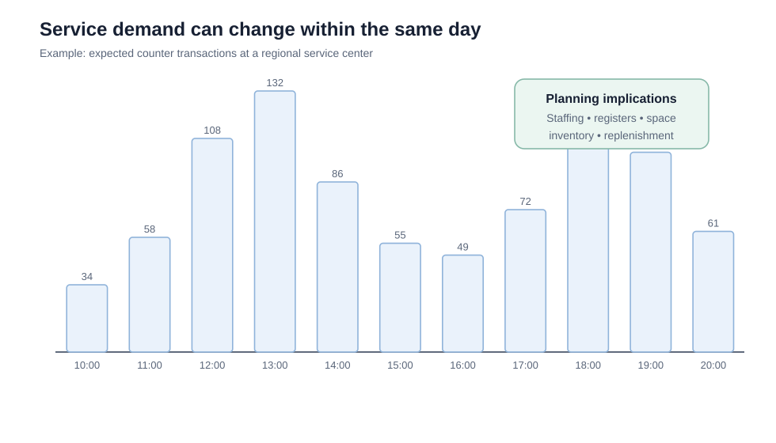

# 6. Service-Sector and Associative Forecasting

## Learning objectives

You should be able to:

- explain why service demand may require hourly or even shorter forecasting buckets;
- connect service forecasts to capacity decisions;
- distinguish time-series forecasting from associative forecasting;
- explain independent and dependent variables in a forecasting context.

## Service-sector forecasting

A factory may plan demand by week or month. A service operation may need to plan by **hour** because unused service capacity often cannot be stored for later.

Examples:

- call center agents;
- restaurant staff;
- hospital intake capacity;
- airport security lanes;
- field-service technicians;
- checkout counters.

Original data:

[`service-hourly-demand.csv`](../../assets/data/module-1/section-d/service-hourly-demand.csv)

### Planning implications

An hourly demand forecast can influence:

- shift schedules;
- break timing;
- number of service stations;
- queue capacity;
- replenishment timing;
- perishable inventory;
- temporary labor.

The forecast may also need a **service mix** forecast. A restaurant needs more than total customer count; it also needs expected demand by menu item.

## Associative forecasting

Associative forecasting predicts demand using one or more variables thought to have a meaningful relationship with demand.

Terminology:

- **independent variable (x):** predictor;
- **dependent variable (y):** value being forecast.

Examples:

| Predictor | Possible demand being forecast |
|---|---|
| Building permits | Construction materials |
| Installed machine population | Spare-parts demand |
| Airline passenger bookings | Airport catering volume |
| Weather severity index | Emergency repair demand |
| Advertising spend | Consumer-product sales |

## Intrinsic vs. extrinsic idea

Time-series forecasting is often considered **intrinsic** because it uses the item's own history.

Associative forecasting is often considered **extrinsic** because it uses information outside the demand series itself.

## When associative forecasting is useful

Use it when:

- a meaningful driver of demand can be measured;
- the historic time series alone does not explain changing demand;
- a longer-term or aggregate forecast is needed;
- the relationship is plausible and can be tested.

## Correlation is not enough

A predictor should make business sense. A variable can correlate statistically by coincidence or because both variables are affected by a third factor.

The forecasting team should be able to explain **why** the relationship is useful, not merely show a high correlation number.

## Why it matters

Services cannot inventory unused capacity, and their demand may depend more on appointments, weather, installed base, or events than past volume alone.

## Decision logic

Forecast at the time and location granularity where capacity is committed and test external predictors with a credible causal and timing relationship. Do not approve the decision until mandatory conditions are feasible and the residual exposure has a named owner.

## Evidence retained through the workflow

Retain service interval and location, capacity unit, demand history, candidate drivers, lag, model error, staffing rule, and override reason. Record the decision date and the event or threshold that requires reassessment.

## Applied decision artifact

Use a one-page **service-sector and associative forecasting decision record** with these fields:

- **Decision and boundary:** Forecast at the time and location granularity where capacity is committed and test external predictors with a credible causal and timing relationship.
- **Required evidence:** service interval and location, capacity unit, demand history, candidate drivers, lag, model error, staffing rule, and override reason.
- **Expected result:** Services cannot inventory unused capacity, and their demand may depend more on appointments, weather, installed base, or events than past volume alone.
- **Balancing condition:** Fine-grained forecasts improve staffing decisions but contain more noise and require timely local data.
- **Accountability:** name the decision owner, approval date, residual exposure owner, and measurable trigger for reassessment.

The record is complete only when another practitioner can reproduce the reasoning and identify the next action without relying on meeting memory.

## Trade-offs

Fine-grained forecasts improve staffing decisions but contain more noise and require timely local data.

## Commonly confused with

Do not confuse a preferred decision method with a guaranteed outcome. Forecast at the time and location granularity where capacity is committed and test external predictors with a credible causal and timing relationship. Validate the result with service interval and location, capacity unit, demand history, candidate drivers, lag, model error, staffing rule, and override reason; the evidence, not the method's label, determines whether the choice worked.

## Common mistakes
Forecasting kitchen-appliance demand from new-housing activity is an **associative** approach because an external predictor is being used to forecast demand.

## Original knowledge check

**Question.** NorthStar is deciding how to apply service-sector and associative forecasting. Which proposal is most defensible?

A. Use service-sector and associative forecasting as a label for the preferred option before defining the decision outcome, constraints, or owner.
B. Forecast at the time and location granularity where capacity is committed and test external predictors with a credible causal and timing relationship.
C. Choose the apparent upside without evaluating this balancing condition: Fine-grained forecasts improve staffing decisions but contain more noise and require timely local data.
D. Approve the choice without retaining service interval and location, capacity unit, demand history, candidate drivers, lag, model error, staffing rule, and override reason; omit the reassessment trigger as well.

Answer and rationale

### Correct answer

**B. Forecast at the time and location granularity where capacity is committed and test external predictors with a credible causal and timing relationship.**

### Why it is correct

Services cannot inventory unused capacity, and their demand may depend more on appointments, weather, installed base, or events than past volume alone. The recommended action connects the operating choice to evidence, ownership, and a measurable outcome.

### Why the other answers are wrong

- **A** reverses the decision sequence. The team should first do the required work: forecast at the time and location granularity where capacity is committed and test external predictors with a credible causal and timing relationship.
- **C** optimizes one visible result and omits the balancing effects: fine-grained forecasts improve staffing decisions but contain more noise and require timely local data.
- **D** leaves the approval unauditable. A reviewer would be missing service interval and location, capacity unit, demand history, candidate drivers, lag, model error, staffing rule, and override reason, as well as the trigger needed to revisit the decision when conditions change.

Those approaches ignore the governing trade-off: fine-grained forecasts improve staffing decisions but contain more noise and require timely local data.

## Practitioner perspective

A review should be able to reconstruct the choice from service interval and location, capacity unit, demand history, candidate drivers, lag, model error, staffing rule, and override reason. If those records cannot explain what changed, who decided, and when the decision will be revisited, the process is not yet controlled.

## Related concepts

- [Forecasting formula sheet](../../calculations/forecasting/formula-sheet.md)
- [Section overview](./README.md)
- [Module 2 continuation](../../02-network-design-digital-connectivity-performance/section-c-performance-and-financial-insight/01-measurement-system-design.md)
Module 1 → Section D → Service-Sector Forecasting / Quantitative Methods: Associative Forecasting. Wording, examples, and visual are original.

---

[Previous: Moving Averages and Exponential Smoothing](05-moving-averages-and-exponential-smoothing.md) · [Next: Leading Indicators, Regression, Correlation, and Causation](07-leading-indicators-regression-correlation.md)
