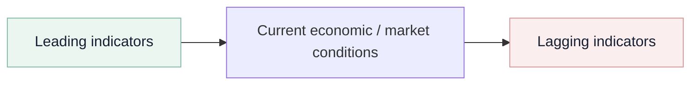

# 7. Leading Indicators, Regression, Correlation, and Causation

## Learning objectives

You should be able to:

- distinguish leading from lagging indicators;
- explain correlation versus causation;
- interpret the simple regression form `y = a + bx`;
- explain correlation coefficient `r` and coefficient of determination `r²`;
- describe multiple regression conceptually.

## Leading vs. lagging indicators

A **leading indicator** changes early enough to help anticipate what may happen next.

A **lagging indicator** confirms what has already happened.

Examples of potentially useful leading signals include:

- building permits;
- new durable-goods orders;
- new unemployment claims;
- consumer expectations;
- money-supply changes;
- the shape of the yield curve.

Examples of lagging signals include:

- unemployment rate;
- inventory-to-sales measures;
- realized company profits;
- outstanding business loans;
- average duration of unemployment.

The exact usefulness depends on the industry and decision.

## Correlation vs. causation

**Correlation:** two variables move together in a measurable way.

**Causation:** a change in one variable directly produces a change in the other.

Forecasting can use a correlated predictor even when strict causation is not proven, but the relationship should be plausible, stable enough, and useful.

## Simple regression

Simple linear regression has the form:

`y = a + bx`

where:

- `y` = forecasted dependent variable;
- `x` = predictor;
- `a` = intercept;
- `b` = slope.

Original data:

[`associative-regression-example.csv`](../../assets/data/module-1/section-d/associative-regression-example.csv)

For the original data set shown, the fitted relationship is approximately:

`Pump quote requests = 11.72 + 0.475 × Commercial-permit index`

The correlation coefficient is approximately:

`r ≈ 0.93`

and:

`r² ≈ 0.87`

That means the linear model explains a large share of variation in this **illustrative** data set. It does not prove that permits cause every change in pump demand.

## Interpreting r

- `+1.0` → perfect positive linear correlation;
- `0` → no linear correlation;
- `−1.0` → perfect negative linear correlation.

## Interpreting r²

`r²` represents the proportion of variation in the dependent variable explained by the regression model in the sample.

It should not be confused with “percent accuracy.”

## Multiple regression

Multiple regression extends the idea by using several predictors, for example:

`Pump demand = a + b1(Building permits) + b2(Marketing spend) + b3(Installed base)`

More predictors are not automatically better. Irrelevant or redundant variables can make a model harder to understand and maintain.

## Predictor-quality checklist

A good predictor should be:

- measurable;
- objective;
- economically reasonable to collect;
- relevant to the business process;
- understandable to decision makers;
- available early enough to be useful.

## Why it matters

A correlated predictor can create false confidence when timing, causality, data leakage, or structural stability is not tested.

## Decision logic

Define the causal hypothesis and lag before fitting regression, validate out of sample, inspect residuals, and monitor coefficient stability. Do not approve the decision until mandatory conditions are feasible and the residual exposure has a named owner.

## Evidence retained through the workflow

Retain predictor definition and vintage, lag, regression coefficients, correlation, holdout error, residual review, and stability trigger. Record the decision date and the event or threshold that requires reassessment.

## Applied decision artifact

Use a one-page **leading indicators, regression, correlation, and causation decision record** with these fields:

- **Decision and boundary:** Define the causal hypothesis and lag before fitting regression, validate out of sample, inspect residuals, and monitor coefficient stability.
- **Required evidence:** predictor definition and vintage, lag, regression coefficients, correlation, holdout error, residual review, and stability trigger.
- **Expected result:** A correlated predictor can create false confidence when timing, causality, data leakage, or structural stability is not tested.
- **Balancing condition:** Leading indicators provide earlier warning but may be revised, become unavailable, or stop representing the target relationship.
- **Accountability:** name the decision owner, approval date, residual exposure owner, and measurable trigger for reassessment.

The record is complete only when another practitioner can reproduce the reasoning and identify the next action without relying on meeting memory.

## Trade-offs

Leading indicators provide earlier warning but may be revised, become unavailable, or stop representing the target relationship.

## Commonly confused with

Do not confuse a preferred decision method with a guaranteed outcome. Define the causal hypothesis and lag before fitting regression, validate out of sample, inspect residuals, and monitor coefficient stability. Validate the result with predictor definition and vintage, lag, regression coefficients, correlation, holdout error, residual review, and stability trigger; the evidence, not the method's label, determines whether the choice worked.

## Common mistakes
A strong correlation does **not** prove causation. It supports further analysis and possible predictive use.

## Original knowledge check

**Question.** NorthStar is deciding how to apply leading indicators, regression, correlation, and causation. Which proposal is most defensible?

A. Use leading indicators, regression, correlation, and causation as a label for the preferred option before defining the decision outcome, constraints, or owner.
B. Define the causal hypothesis and lag before fitting regression, validate out of sample, inspect residuals, and monitor coefficient stability.
C. Choose the apparent upside without evaluating this balancing condition: Leading indicators provide earlier warning but may be revised, become unavailable, or stop representing the target relationship.
D. Approve the choice without retaining predictor definition and vintage, lag, regression coefficients, correlation, holdout error, residual review, and stability trigger; omit the reassessment trigger as well.

Answer and rationale

### Correct answer

**B. Define the causal hypothesis and lag before fitting regression, validate out of sample, inspect residuals, and monitor coefficient stability.**

### Why it is correct

A correlated predictor can create false confidence when timing, causality, data leakage, or structural stability is not tested. The recommended action connects the operating choice to evidence, ownership, and a measurable outcome.

### Why the other answers are wrong

- **A** reverses the decision sequence. The team should first do the required work: define the causal hypothesis and lag before fitting regression, validate out of sample, inspect residuals, and monitor coefficient stability.
- **C** optimizes one visible result and omits the balancing effects: leading indicators provide earlier warning but may be revised, become unavailable, or stop representing the target relationship.
- **D** leaves the approval unauditable. A reviewer would be missing predictor definition and vintage, lag, regression coefficients, correlation, holdout error, residual review, and stability trigger, as well as the trigger needed to revisit the decision when conditions change.

Those approaches ignore the governing trade-off: leading indicators provide earlier warning but may be revised, become unavailable, or stop representing the target relationship.

## Practitioner perspective

A review should be able to reconstruct the choice from predictor definition and vintage, lag, regression coefficients, correlation, holdout error, residual review, and stability trigger. If those records cannot explain what changed, who decided, and when the decision will be revisited, the process is not yet controlled.

## Related concepts

- [Forecasting formula sheet](../../calculations/forecasting/formula-sheet.md)
- [Section overview](./README.md)
- [Module 2 continuation](../../02-network-design-digital-connectivity-performance/section-c-performance-and-financial-insight/01-measurement-system-design.md)
Module 1 → Section D → Leading and Lagging Indicators / Simple Regression / Multiple Regression. Data, equation example, wording, and visual are original.

---

[Previous: Service-Sector and Associative Forecasting](06-service-sector-and-associative-forecasting.md) · [Next: Forecast Error, Accuracy, Bias, and Random Variation](08-forecast-error-bias-random-variation.md)
