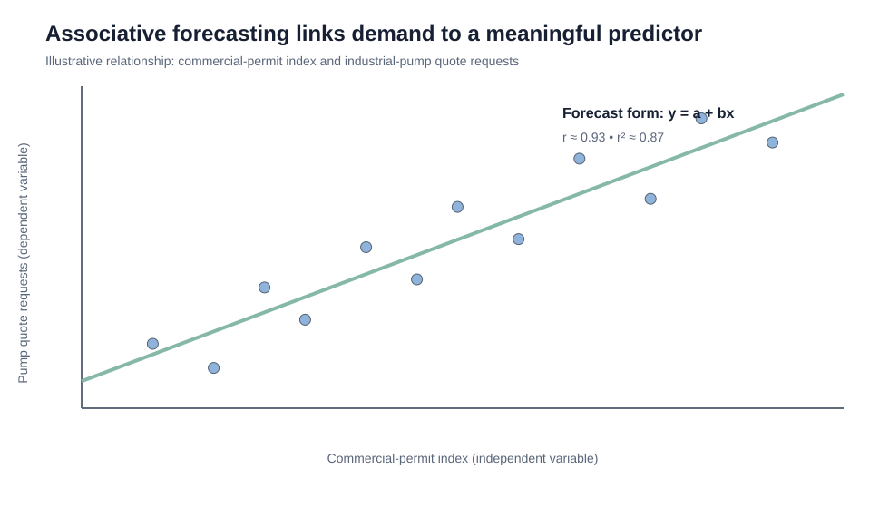

# 7. Leading Indicators, Regression, Correlation, and Causation

## Learning objectives

You should be able to:

- distinguish leading from lagging indicators;
- explain correlation versus causation;
- interpret the simple regression form `y = a + bx`;
- explain correlation coefficient `r` and coefficient of determination `r²`;
- describe multiple regression conceptually.

## Leading vs. lagging indicators

A **leading indicator** changes early enough to help anticipate what may happen next.

A **lagging indicator** confirms what has already happened.

Examples of potentially useful leading signals include:

- building permits;
- new durable-goods orders;
- new unemployment claims;
- consumer expectations;
- money-supply changes;
- the shape of the yield curve.

Examples of lagging signals include:

- unemployment rate;
- inventory-to-sales measures;
- realized company profits;
- outstanding business loans;
- average duration of unemployment.

The exact usefulness depends on the industry and decision.

## Correlation vs. causation

**Correlation:** two variables move together in a measurable way.

**Causation:** a change in one variable directly produces a change in the other.

Forecasting can use a correlated predictor even when strict causation is not proven, but the relationship should be plausible, stable enough, and useful.

## Simple regression

Simple linear regression has the form:

`y = a + bx`

where:

- `y` = forecasted dependent variable;
- `x` = predictor;
- `a` = intercept;
- `b` = slope.

Original data:

[`associative-regression-example.csv`](../../assets/data/module-1/section-d/associative-regression-example.csv)

For the original data set shown, the fitted relationship is approximately:

`Pump quote requests = 11.72 + 0.475 × Commercial-permit index`

The correlation coefficient is approximately:

`r ≈ 0.93`

and:

`r² ≈ 0.87`

That means the linear model explains a large share of variation in this **illustrative** data set. It does not prove that permits cause every change in pump demand.

## Interpreting r

- `+1.0` → perfect positive linear correlation;
- `0` → no linear correlation;
- `−1.0` → perfect negative linear correlation.

## Interpreting r²

`r²` represents the proportion of variation in the dependent variable explained by the regression model in the sample.

It should not be confused with “percent accuracy.”

## Multiple regression

Multiple regression extends the idea by using several predictors, for example:

`Pump demand = a + b1(Building permits) + b2(Marketing spend) + b3(Installed base)`

More predictors are not automatically better. Irrelevant or redundant variables can make a model harder to understand and maintain.

## Predictor-quality checklist

A good predictor should be:

- measurable;
- objective;
- economically reasonable to collect;
- relevant to the business process;
- understandable to decision makers;
- available early enough to be useful.

## Common mistake

A strong correlation does **not** prove causation. It supports further analysis and possible predictive use.

## Related concepts

Module 1 → Section D → Leading and Lagging Indicators / Simple Regression / Multiple Regression. Data, equation example, wording, and visual are original.
