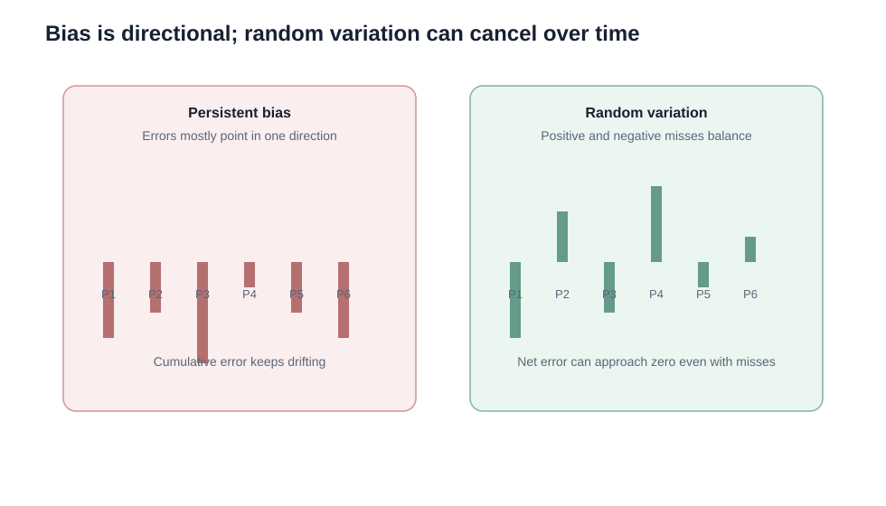

# 8. Forecast Error, Accuracy, Bias, and Random Variation

## Learning objectives

You should be able to:

- calculate forecast error;
- calculate absolute percentage error and forecast accuracy;
- distinguish bias from random variation;
- explain why monetary impact can matter more than unit error alone.

## Forecast error

Use a consistent sign convention. In this repository:

`Forecast Error = Actual Demand − Forecast Demand`

Example:

- actual = 98;
- forecast = 100.

`Error = 98 − 100 = −2`

A negative error means the forecast was higher than actual demand.

The **absolute error** is:

`|Actual − Forecast|`

so the absolute error is 2 units.

## Percentage error

Absolute percentage error (APE):

`APE = |Actual − Forecast| / Actual × 100%`

For actual demand of 98 and forecast of 100:

`APE = 2 / 98 × 100% ≈ 2.04%`

A simple forecast-accuracy expression is:

`Forecast Accuracy = 100% − APE`

so accuracy for that period is about **97.96%**.

## Unit error vs. business impact

A 100-unit miss on a $2 consumable is not financially equivalent to a 100-unit miss on a $20,000 component.

Forecast governance should therefore consider:

- error in units;
- error as a percentage;
- financial exposure;
- customer-service consequence;
- operational consequence.

## Bias vs. random variation

### Bias

Bias exists when errors consistently lean in the same direction.

Examples:

- persistent over-forecasting;
- persistent under-forecasting;
- sales overrides that are consistently optimistic;
- seasonal peaks occurring earlier than the model expects.

### Random variation

Random variation produces positive and negative errors that can largely cancel over time.

Zero cumulative error does **not** mean the forecast is perfect. Large positive and negative misses could still be operationally painful.

## Original eight-period example

Original data:

[`forecast-error-example.csv`](../../assets/data/module-1/section-d/forecast-error-example.csv)

Errors are:

`−2, +3, −3, +3, +3, −2, +4, −1`

Cumulative algebraic error:

`+5 units`

The positive total suggests some net under-forecasting over the review window, although it is not extreme by itself.

## Practical diagnostic questions

If error increases, ask:

1. Is the problem directional bias or random noise?
2. Has seasonality shifted?
3. Did a promotion or one-time order distort demand?
4. Did a commercial override introduce bias?
5. Has the product life cycle changed?
6. Is the forecasting method still appropriate?

## Common mistake

MAD uses absolute errors, so positive and negative signs disappear. Bias and tracking signal use signed error because direction matters.

## Related concepts

Module 1 → Section D → Forecast Error and Accuracy / Bias and Random Variation. Numerical example and visual are original.
