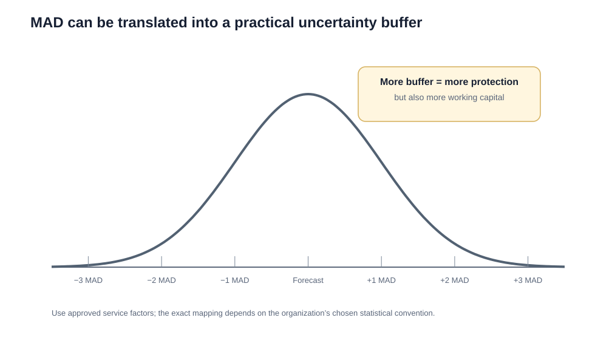
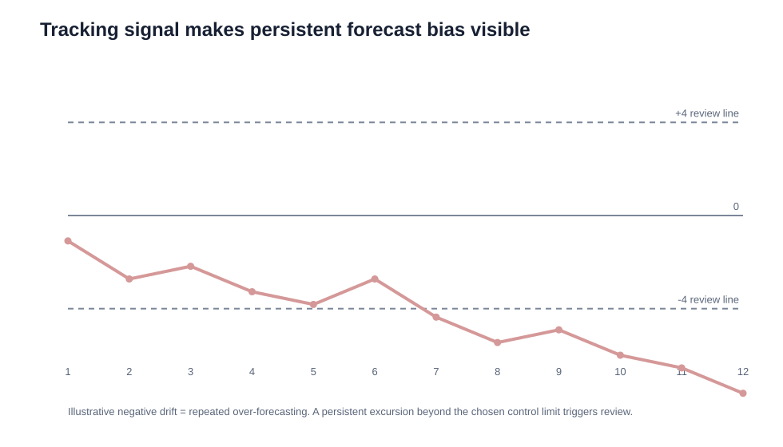
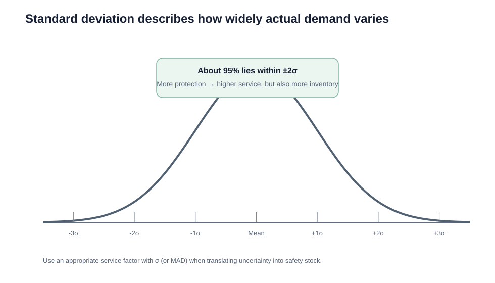
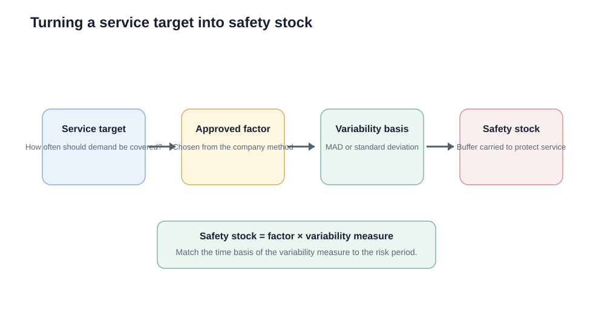

# 9. MAD, Tracking Signal, Standard Deviation, and Safety Stock

## Learning objectives

You should be able to:

- calculate mean absolute deviation (MAD);
- calculate and interpret a tracking signal;
- distinguish MAD from standard deviation;
- explain how uncertainty measures can support safety-stock decisions;
- explain the service-level versus inventory trade-off.

## Mean absolute deviation (MAD)

MAD measures the average magnitude of forecast error without regard to direction.

Formula:

`MAD = Σ|Actual − Forecast| / n`

Using the original eight-period data set:

Absolute errors:

`2, 3, 3, 3, 3, 2, 4, 1`

Total absolute error:

`21`

`MAD = 21 / 8 = 2.625 units`

Interpretation: across the eight periods, the forecast missed actual demand by about **2.63 units on average**.



The curve is a learning aid: the organization must use its approved relationship between MAD, service level, and buffer rather than assuming every data set follows an ideal distribution.

## Tracking signal

Tracking signal looks for persistent directional bias.

`Tracking Signal = Cumulative Algebraic Forecast Error / MAD`

For the same example:

- cumulative signed error = `+5`;
- MAD = `2.625`.

`Tracking Signal = 5 / 2.625 ≈ +1.90`

A positive signal indicates net under-forecasting under this sign convention.



Many organizations use control limits such as **±4** as a practical review trigger. The exact threshold is a management rule, not a universal law.

## Standard deviation

Standard deviation describes dispersion around the mean.

For a sample:

`σ(sample) = √[ Σ(x − x̄)² / (n−1) ]`

Unlike MAD, standard deviation squares deviations before averaging them and then takes a square root.



For normally distributed data, approximately:

- 68% lies within ±1 standard deviation;
- 95% lies within ±2;
- 99.7% lies within ±3.

## MAD vs. standard deviation

| Measure | What it summarizes | Main use here |
|---|---|---|
| MAD | Average absolute forecast miss | Forecast error magnitude, safety-stock basis |
| Standard deviation | Dispersion around a mean | Demand variability, safety-stock basis |

A common rough relationship under normal assumptions is:

`Standard deviation ≈ 1.25 × MAD`

Use the organization's approved method rather than mixing bases casually.

## Safety factor and safety stock



Conceptually:

`Safety Stock = Uncertainty Measure × Service Factor`

where the uncertainty measure could be MAD or standard deviation, depending on the method.

### Example

Suppose:

- standard deviation during the relevant planning interval = 18 units;
- selected service factor = 2.05.

`Safety Stock = 18 × 2.05 = 36.9`

The planner would hold about **37 units**, subject to rounding and the company's policy.

## Important caution — time basis

If the forecast error is measured monthly but replenishment lead time is two weeks, the error measure may need time-basis adjustment before it is used for safety stock.

Do not multiply a service factor by an error measure from an incompatible interval.

## Service level trade-off

Higher service protection generally means:

```text
Higher service target
      ↓
Larger safety factor
      ↓
More safety stock
      ↓
Lower stockout risk but higher inventory cost
```

## Common mistakes

- Tracking signal uses **signed cumulative error**, not absolute error.
- MAD measures magnitude, not direction.
- Standard deviation and MAD are not identical.
- Higher customer service normally requires more inventory protection, all else equal.

## Related concepts

Module 1 → Section D → MAD / Tracking Signal / Standard Deviation / Safety Factor. Numerical values and visuals are original.
