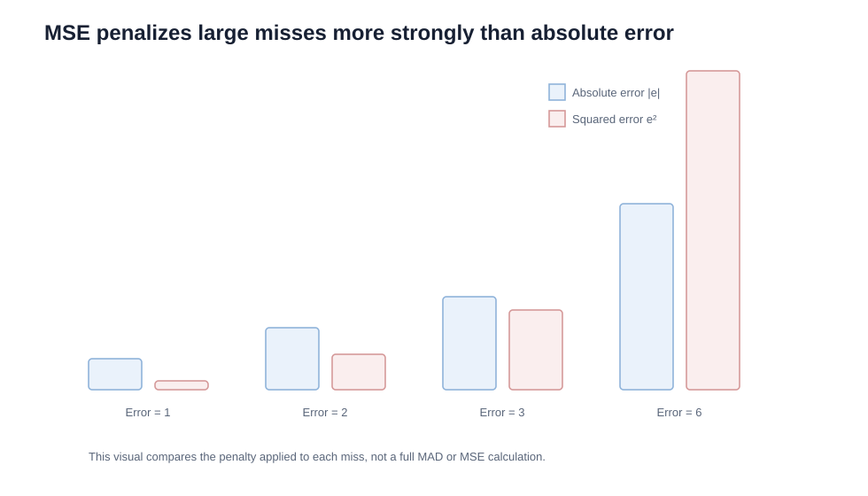

# 10. MSE, MAPE, and Choosing an Error Measure

## Learning objectives

You should be able to:

- calculate mean squared error (MSE);
- calculate mean absolute percentage error (MAPE);
- explain why MSE emphasizes large misses;
- explain why percentage error supports comparison across products of different scale;
- select an error metric that matches the management question.

## Mean squared error (MSE)

Reproduce the measures from [`forecast-error-example.csv`](../../assets/data/module-1/section-d/forecast-error-example.csv), using the actual and forecast columns rather than rounded summary values.

MSE squares each forecast error before averaging.

`MSE = Σ(Actual − Forecast)² / n`

Using the original eight-period example:

Squared errors:

`4, 9, 9, 9, 9, 4, 16, 1`

Total = `61`

`MSE = 61 / 8 = 7.625`

### Why squaring matters

A miss of 6 units contributes:

- 6 to an absolute-error total;
- 36 to a squared-error total.

MSE therefore reacts strongly to large misses.

## Mean absolute percentage error (MAPE)

MAPE expresses the average absolute error relative to actual demand.

`MAPE = [Σ(|Actual − Forecast| / Actual) / n] × 100%`

For the original eight-period example:

`MAPE ≈ 2.40%`

This makes error easy to compare between products with very different demand volumes.

## Strengths and limits

| Metric | Strength | Limitation |
|---|---|---|
| MAD | Easy to understand in units | Hard to compare across very different volume scales |
| MSE | Strong penalty for large misses | Result is in squared units and less intuitive |
| MAPE | Scale-free percentage | Becomes problematic when actual demand is zero or very small |
| Tracking signal | Detects directional bias | Not a general magnitude measure |
| Standard deviation | Useful variability measure | Not the same as forecast error unless method is defined accordingly |

## Which measure should management use?

Use the metric that matches the decision.

### Question: “How many units are we typically wrong by?”

Use **MAD**.

### Question: “Are we systematically high or low?”

Use **tracking signal / cumulative signed error**.

### Question: “Are large misses especially unacceptable?”

MSE may be useful.

### Question: “Which product family has worse relative error?”

MAPE may help because it is percentage-based.

### Question: “How variable is demand around its mean?”

Use **standard deviation**.

## Worked comparison

Original eight-period example:

| Metric | Result |
|---|---:|
| MAD | 2.625 units |
| MSE | 7.625 squared units |
| MAPE | 2.40% |
| Cumulative signed error | +5 units |
| Tracking signal | +1.90 |

The metrics answer different questions. There is no single “best” error measure for every use.

## Why it matters

Metric choice changes which errors receive attention and can reward a model that performs poorly on the decisions that matter.

## Decision logic

Select error measures by decision purpose, volume scale, zero-demand behavior, and penalty for large misses, then review more than one perspective. Do not approve the decision until mandatory conditions are feasible and the residual exposure has a named owner.

## Evidence retained through the workflow

Retain actual and forecast vintage, metric definitions, exclusions, segment weights, error distribution, bias, and model-selection decision. Record the decision date and the event or threshold that requires reassessment.

## Applied decision artifact

Use a one-page **MSE, MAPE, and choosing an error measure decision record** with these fields:

- **Decision and boundary:** Select error measures by decision purpose, volume scale, zero-demand behavior, and penalty for large misses, then review more than one perspective.
- **Required evidence:** actual and forecast vintage, metric definitions, exclusions, segment weights, error distribution, bias, and model-selection decision.
- **Expected result:** Metric choice changes which errors receive attention and can reward a model that performs poorly on the decisions that matter.
- **Balancing condition:** MSE emphasizes large misses but is scale-dependent; MAPE enables percentage comparison but becomes unstable near zero demand.
- **Accountability:** name the decision owner, approval date, residual exposure owner, and measurable trigger for reassessment.

The record is complete only when another practitioner can reproduce the reasoning and identify the next action without relying on meeting memory.

## Trade-offs

MSE emphasizes large misses but is scale-dependent; MAPE enables percentage comparison but becomes unstable near zero demand.

## Commonly confused with

Do not confuse a preferred decision method with a guaranteed outcome. Select error measures by decision purpose, volume scale, zero-demand behavior, and penalty for large misses, then review more than one perspective. Validate the result with actual and forecast vintage, metric definitions, exclusions, segment weights, error distribution, bias, and model-selection decision; the evidence, not the method's label, determines whether the choice worked.

## Common mistakes

- MSE magnifies larger errors because of squaring.
- MAPE is a percentage, not a unit quantity.
- A low cumulative signed error can hide large random positive and negative misses.

## Original knowledge check

**Question.** NorthStar is deciding how to apply MSE, MAPE, and choosing an error measure. Which proposal is most defensible?

A. Use MSE, MAPE, and choosing an error measure as a label for the preferred option before defining the decision outcome, constraints, or owner.
B. Select error measures by decision purpose, volume scale, zero-demand behavior, and penalty for large misses, then review more than one perspective.
C. Choose the apparent upside without evaluating this balancing condition: MSE emphasizes large misses but is scale-dependent; MAPE enables percentage comparison but becomes unstable near zero demand.
D. Approve the choice without retaining actual and forecast vintage, metric definitions, exclusions, segment weights, error distribution, bias, and model-selection decision; omit the reassessment trigger as well.

Answer and rationale

### Correct answer

**B. Select error measures by decision purpose, volume scale, zero-demand behavior, and penalty for large misses, then review more than one perspective.**

### Why it is correct

Metric choice changes which errors receive attention and can reward a model that performs poorly on the decisions that matter. The recommended action connects the operating choice to evidence, ownership, and a measurable outcome.

### Why the other answers are wrong

- **A** reverses the decision sequence. The team should first do the required work: select error measures by decision purpose, volume scale, zero-demand behavior, and penalty for large misses, then review more than one perspective.
- **C** optimizes one visible result and omits the balancing effects: MSE emphasizes large misses but is scale-dependent; MAPE enables percentage comparison but becomes unstable near zero demand.
- **D** leaves the approval unauditable. A reviewer would be missing actual and forecast vintage, metric definitions, exclusions, segment weights, error distribution, bias, and model-selection decision, as well as the trigger needed to revisit the decision when conditions change.

Those approaches ignore the governing trade-off: MSE emphasizes large misses but is scale-dependent; MAPE enables percentage comparison but becomes unstable near zero demand.

## Practitioner perspective

A review should be able to reconstruct the choice from actual and forecast vintage, metric definitions, exclusions, segment weights, error distribution, bias, and model-selection decision. If those records cannot explain what changed, who decided, and when the decision will be revisited, the process is not yet controlled.

## Related concepts

- [Forecasting formula sheet](../../calculations/forecasting/formula-sheet.md)
- [Section overview](./README.md)
- [Module 2 continuation](../../02-network-design-digital-connectivity-performance/section-c-performance-and-financial-insight/01-measurement-system-design.md)
Module 1 → Section D → Mean Squared Error / Mean Absolute Percentage Error / Error Measurement. Numerical example and visual are original.

---

[Previous: MAD, Tracking Signal, Standard Deviation, and Safety Stock](09-mad-tracking-signal-standard-deviation.md) · [Section review](11-section-d-review.md)
