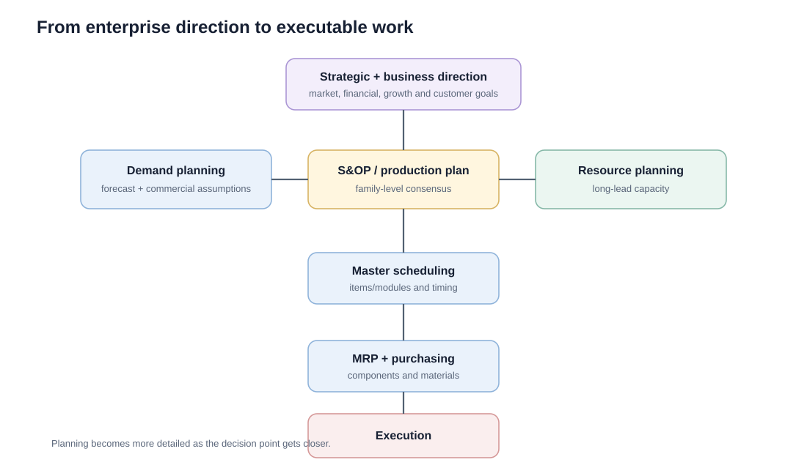
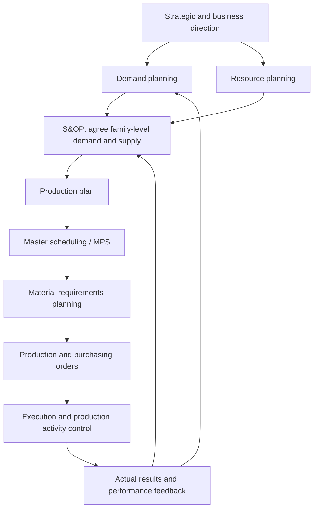

# 1. Operations Planning and Control

## Learning objectives

After this topic, you should be able to:

- explain where S&OP sits within the larger planning system;
- distinguish demand planning, production planning, master scheduling, MRP, and execution;
- explain why planning becomes more detailed as the time horizon gets shorter;
- describe the role of master planning.

## Concept in plain English

A company cannot jump directly from a five-year strategy to tomorrow's shop-floor schedule. It needs a chain of connected planning decisions.

At the top, leadership decides **where the business is going**. In the middle, S&OP decides **how much the business should sell and supply by product family**. Closer to execution, master scheduling and material planning decide **which items, in what quantities, and when**.

## The planning cascade

The important pattern is **progressive detail**:

| Planning layer | Main question | Typical level |
|---|---|---|
| Strategy / business plan | Where are we trying to go? | Enterprise / product family |
| S&OP / production plan | How much should we sell and supply? | Product family |
| Master scheduling | Which end items or modules, and when? | Item / module |
| MRP | What materials are required and when? | Components / raw materials |
| Execution | What work should happen now? | Order / operation |

## Master planning

### Capacity checks follow the same hierarchy

Priority planning and capacity planning should stay synchronized:

| Priority / output plan | Matching capacity view |
|---|---|
| S&OP / production plan | Resource planning |
| Master production schedule | Rough-cut capacity planning (RCCP) |
| Material requirements plan | Capacity requirements planning (CRP) |
| Execution / shop-floor work | Capacity control |

Distribution requirements planning (DRP) can also feed replenishment needs from distribution locations back toward central supply and the production-planning system.

Master planning is the umbrella that connects demand management, production planning, resource planning, and master scheduling. It prevents each function from optimizing its own plan while damaging the enterprise plan.

A useful mental model is:

> **Demand says what the market needs. Supply says what is feasible. Finance says what is economically acceptable. Planning connects the three.**

## Realistic example — NorthStar

NorthStar expects its industrial-pump family to grow from about **9,000 units per quarter to 11,500** over the next 18 months.

Leadership does not immediately schedule individual pump orders. Instead:

1. the demand team updates the family forecast;
2. S&OP compares family demand with available manufacturing and supplier capacity;
3. resource planning identifies a possible need for a second automated test stand;
4. the agreed production plan flows to master scheduling;
5. the MPS then schedules specific pump models and modules;
6. MRP calculates motors, seals, castings, electronics, and purchased materials.

## Why it matters

Strategy, aggregate plans, master schedules, and execution fail when each horizon uses different assumptions or lacks a feedback path.

## Decision logic

If the question concerns **aggregate product-family volume**, think S&OP / production planning.

If it concerns **long-lead capacity**, think resource planning.

If it concerns **specific end items or modules**, think master scheduling.

If it concerns **component quantities and timing**, think MRP.

## Evidence retained through the workflow

Retain planning hierarchy, horizon and bucket, approved inputs, constraints, decision rights, schedule version, and variance feedback. Record the decision date and the event or threshold that requires reassessment.

## Applied decision artifact

Use a one-page **operations planning and control decision record** with these fields:

- **Decision and boundary:** Connect every planning level through defined inputs, outputs, time fences, owners, and variance escalation from execution back to planning.
- **Required evidence:** planning hierarchy, horizon and bucket, approved inputs, constraints, decision rights, schedule version, and variance feedback.
- **Expected result:** Strategy, aggregate plans, master schedules, and execution fail when each horizon uses different assumptions or lacks a feedback path.
- **Balancing condition:** Central coordination improves alignment, while excessive control can slow local response to short-lived operating conditions.
- **Accountability:** name the decision owner, approval date, residual exposure owner, and measurable trigger for reassessment.

The record is complete only when another practitioner can reproduce the reasoning and identify the next action without relying on meeting memory.

## Trade-offs

Central coordination improves alignment, while excessive control can slow local response to short-lived operating conditions.

## Commonly confused with
**S&OP is not the master production schedule.** S&OP works at an aggregate family level. The MPS is a more detailed item- or module-level schedule used later in the planning hierarchy.

## Common mistakes

- Do not treat S&OP as a weekly SKU scheduling meeting.
- Do not send a detailed component plan directly from the business plan.
- Do not confuse resource planning with short-term capacity control.

## Original knowledge check

**Question.** NorthStar is deciding how to apply operations planning and control. Which proposal is most defensible?

A. Use operations planning and control as a label for the preferred option before defining the decision outcome, constraints, or owner.
B. Connect every planning level through defined inputs, outputs, time fences, owners, and variance escalation from execution back to planning.
C. Choose the apparent upside without evaluating this balancing condition: Central coordination improves alignment, while excessive control can slow local response to short-lived operating conditions.
D. Approve the choice without retaining planning hierarchy, horizon and bucket, approved inputs, constraints, decision rights, schedule version, and variance feedback; omit the reassessment trigger as well.

Answer and rationale

### Correct answer

**B. Connect every planning level through defined inputs, outputs, time fences, owners, and variance escalation from execution back to planning.**

### Why it is correct

Strategy, aggregate plans, master schedules, and execution fail when each horizon uses different assumptions or lacks a feedback path. The recommended action connects the operating choice to evidence, ownership, and a measurable outcome.

### Why the other answers are wrong

- **A** reverses the decision sequence. The team should first do the required work: connect every planning level through defined inputs, outputs, time fences, owners, and variance escalation from execution back to planning.
- **C** optimizes one visible result and omits the balancing effects: central coordination improves alignment, while excessive control can slow local response to short-lived operating conditions.
- **D** leaves the approval unauditable. A reviewer would be missing planning hierarchy, horizon and bucket, approved inputs, constraints, decision rights, schedule version, and variance feedback, as well as the trigger needed to revisit the decision when conditions change.

Those approaches ignore the governing trade-off: central coordination improves alignment, while excessive control can slow local response to short-lived operating conditions.

## Practitioner perspective

In ERP environments, these planning layers may be implemented by different applications or planning objects, but the business logic remains hierarchical: aggregate decisions should constrain and guide detailed planning.

## Related concepts

- [Section overview](./README.md)
- [Module 2 continuation](../../02-network-design-digital-connectivity-performance/section-a-network-design-and-technology-investment/03-network-configuration-and-flow-design.md)
Module 1 → Section E → Supply and Demand Alignment Road Map / Operations Planning and Control. Wording and visual composition are original.

---

[Section overview](README.md) · [Next: Strategic, Business, Master, and Resource Planning](02-strategic-business-master-resource-planning.md)
