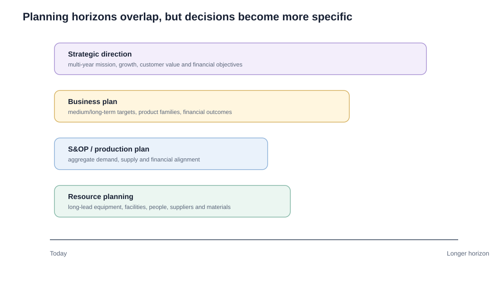

# 2. Strategic, Business, Master, and Resource Planning

## Learning objectives

You should be able to:

- separate strategic planning from business planning;
- explain why the business plan is a reference point for S&OP;
- explain the role of master planning;
- explain when resource planning is needed and why its horizon can be long.

## Four connected planning views

### Strategic plan

The strategic plan establishes the long-range direction of the organization. It addresses mission, growth, competitive direction, customer value, financial expectations, and the resources needed to support the strategy.

### Business plan

The business plan translates strategic direction into more concrete medium- to long-term expectations. It normally includes financial targets and product-family expectations and becomes a reference point against which S&OP can test whether current plans are still moving the business toward its goals.

### Master planning

Master planning connects the business plan with the operating system. It brings together the near- to medium-term S&OP plan and the longer-term resource view.

### Resource planning

For practical planning, resource planning commonly looks roughly **15 to 18 months ahead**, but it can extend much farther when facilities or major equipment have long acquisition, construction, installation, or qualification lead times.

Resource planning asks whether the organization will have enough **long-lead capacity**. It can include facilities, critical equipment, specialist labor, supplier capability, or very long-lead materials.

The key issue is not simply the calendar horizon. It is the **lead time needed to obtain and make the resource productive**.

## Realistic example — a capacity decision

NorthStar's current final-test area can support **42,000 pumps per year**. The 18-month family demand plan suggests an annualized requirement of **47,500** units by next year.

Possible responses include:

- add a second shift;
- improve cycle time;
- outsource overflow testing;
- purchase another automated test stand;
- expand the test area.

A new test stand requires:

- 4 months for approval and procurement;
- 5 months for manufacture and delivery;
- 1 month for installation;
- 2 months for validation and ramp-up.

That is a **12-month resource lead time**. Waiting until the detailed MPS shows overload would be too late.

## Business plan vs. S&OP

| Business plan | S&OP |
|---|---|
| Sets broader business and financial direction | Converts direction into an executable aggregate plan |
| Longer-term | Near- to intermediate-term |
| Often expressed financially and by family | Uses units and money by family |
| Updated less frequently | Commonly reviewed monthly |
| Provides reference targets | Reconciles latest demand, supply, and finance |

## Why it matters

A feasible short-term schedule cannot compensate for a long-term capacity gap or a business plan that was never translated into operational units.

## Decision logic

When a question asks **"Can we get the machine, facility, people, or supplier capacity in time?"**, think resource planning.

When it asks **"Are our current family-level plans still consistent with business goals?"**, think S&OP against the business plan.

## Evidence retained through the workflow

Retain volume and financial reconciliation, family hierarchy, resource rates, capacity limits, investment lead time, scenario, and approval gate. Record the decision date and the event or threshold that requires reassessment.

## Applied decision artifact

Use a one-page **strategic, business, master, and resource planning decision record** with these fields:

- **Decision and boundary:** Reconcile strategic direction, financial plan, family demand, resource requirements, and the master schedule using consistent units and horizons.
- **Required evidence:** volume and financial reconciliation, family hierarchy, resource rates, capacity limits, investment lead time, scenario, and approval gate.
- **Expected result:** A feasible short-term schedule cannot compensate for a long-term capacity gap or a business plan that was never translated into operational units.
- **Balancing condition:** Early resource commitment protects growth but can strand capital if demand changes; delayed commitment preserves cash but narrows response options.
- **Accountability:** name the decision owner, approval date, residual exposure owner, and measurable trigger for reassessment.

The record is complete only when another practitioner can reproduce the reasoning and identify the next action without relying on meeting memory.

## Trade-offs

Early resource commitment protects growth but can strand capital if demand changes; delayed commitment preserves cash but narrows response options.

## Commonly confused with

Do not confuse a preferred decision method with a guaranteed outcome. Reconcile strategic direction, financial plan, family demand, resource requirements, and the master schedule using consistent units and horizons. Validate the result with volume and financial reconciliation, family hierarchy, resource rates, capacity limits, investment lead time, scenario, and approval gate; the evidence, not the method's label, determines whether the choice worked.

## Common mistakes

- Resource planning is not the same as RCCP. RCCP is later and more detailed.
- Long-range plans should not disappear into a file; S&OP uses current performance to test progress against them.
- Capacity decisions involving major capital can require executive approval even when the need is identified through planning.

## Original knowledge check

**Question.** NorthStar is deciding how to apply strategic, business, master, and resource planning. Which proposal is most defensible?

A. Use strategic, business, master, and resource planning as a label for the preferred option before defining the decision outcome, constraints, or owner.
B. Reconcile strategic direction, financial plan, family demand, resource requirements, and the master schedule using consistent units and horizons.
C. Choose the apparent upside without evaluating this balancing condition: Early resource commitment protects growth but can strand capital if demand changes; delayed commitment preserves cash but narrows response options.
D. Approve the choice without retaining volume and financial reconciliation, family hierarchy, resource rates, capacity limits, investment lead time, scenario, and approval gate; omit the reassessment trigger as well.

Answer and rationale

### Correct answer

**B. Reconcile strategic direction, financial plan, family demand, resource requirements, and the master schedule using consistent units and horizons.**

### Why it is correct

A feasible short-term schedule cannot compensate for a long-term capacity gap or a business plan that was never translated into operational units. The recommended action connects the operating choice to evidence, ownership, and a measurable outcome.

### Why the other answers are wrong

- **A** reverses the decision sequence. The team should first do the required work: reconcile strategic direction, financial plan, family demand, resource requirements, and the master schedule using consistent units and horizons.
- **C** optimizes one visible result and omits the balancing effects: early resource commitment protects growth but can strand capital if demand changes; delayed commitment preserves cash but narrows response options.
- **D** leaves the approval unauditable. A reviewer would be missing volume and financial reconciliation, family hierarchy, resource rates, capacity limits, investment lead time, scenario, and approval gate, as well as the trigger needed to revisit the decision when conditions change.

Those approaches ignore the governing trade-off: early resource commitment protects growth but can strand capital if demand changes; delayed commitment preserves cash but narrows response options.

## Practitioner perspective

A review should be able to reconstruct the choice from volume and financial reconciliation, family hierarchy, resource rates, capacity limits, investment lead time, scenario, and approval gate. If those records cannot explain what changed, who decided, and when the decision will be revisited, the process is not yet controlled.

## Related concepts

- [Section overview](./README.md)
- [Module 2 continuation](../../02-network-design-digital-connectivity-performance/section-a-network-design-and-technology-investment/03-network-configuration-and-flow-design.md)
Module 1 → Section E → Strategic and Business Planning; Master Planning; Resource Planning. Scenario and visual are original.

---

[Previous: Operations Planning and Control](01-operations-planning-and-control.md) · [Next: S&OP Foundations and the Monthly Process](03-sop-foundations-and-monthly-process.md)
