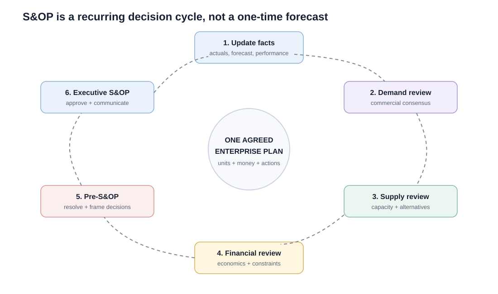

# 3. S&OP Foundations and the Monthly Process

## Learning objectives

You should be able to:

- explain the purpose of S&OP;
- explain why S&OP uses aggregate product-family planning;
- identify the recurring S&OP phases and meetings;
- explain why S&OP is both a process and a plan.

## Concept in plain English

Sales and operations planning is the recurring management process used to produce **one agreed view of demand, supply, and financial consequences**.

Without S&OP, sales may commit to one number, operations may build to another, finance may budget a third, and product management may be planning a launch that none of those numbers includes.

S&OP forces these views into the same conversation.

## A practical monthly cycle

Different organizations may combine or rename meetings. The learning point is the flow of decisions:

1. refresh the facts;
2. understand product and demand changes;
3. agree the demand view;
4. test supply capability;
5. translate alternatives into financial impact;
6. reconcile unresolved issues;
7. make executive decisions;
8. communicate and execute the plan.

## Why product-family level matters

A common S&OP horizon is about **12 to 18 months or more**—long enough to see resource implications, but still close enough to guide tactical decisions. The exact horizon should cover the longest decisions that S&OP must influence.

S&OP is intentionally aggregate. Executives need to decide the volume and resource direction of major families, not debate thousands of SKUs.

Detailed exceptions can be escalated when they materially affect the family plan.

## Replanning is normal

The plan is not frozen for a year. Each monthly cycle compares:

- previous assumptions;
- actual performance;
- new opportunities and risks;
- changed demand;
- changed capacity;
- changed financial expectations.

Replanning is therefore a feature of S&OP, not evidence that planning failed.

## Realistic example — one number problem

Before NorthStar introduces disciplined S&OP:

- Sales expects 13,200 pumps next quarter.
- Marketing assumes 14,000 because of a campaign.
- Operations is staffed for 12,300.
- Finance budgeted 12,800.

Each number may be defensible in isolation, but the company cannot execute four plans at once.

The S&OP cycle forces the organization to agree on one planning number and document what must happen to achieve it.

## Common confusion

**Consensus does not mean every function gets its preferred number.** It means all functions understand the assumptions, trade-offs, and final decision and agree to execute against the approved plan.

## Common mistakes

- S&OP is generally a recurring monthly management process, not a once-a-year budgeting exercise.
- The executive meeting is the culmination of prior analysis, not the place where raw data analysis begins.
- S&OP links strategy with execution; it does not replace detailed planning systems.

## Related concepts

Module 1 → Section E → S&OP Process and Meetings. Process treatment and example are original.
