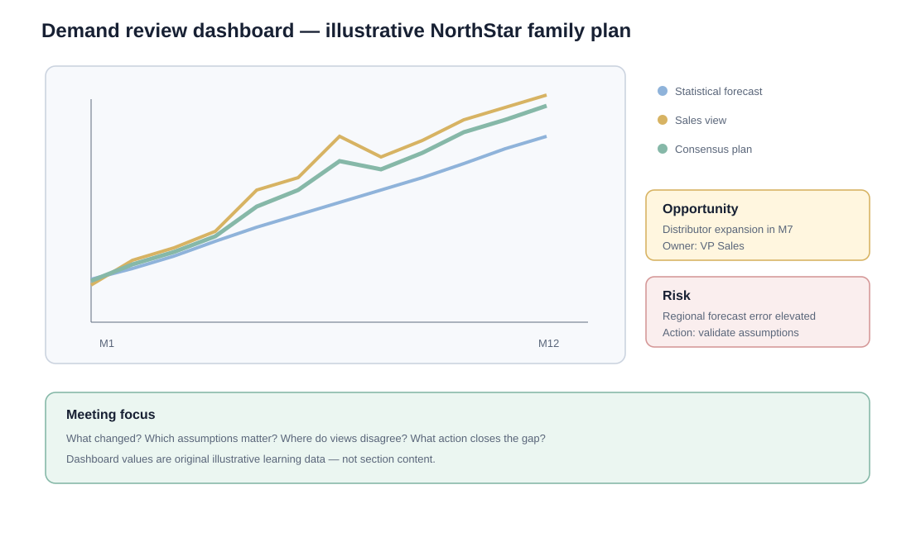

# 4. Demand Review and the Demand-Plan Dashboard

## Learning objectives

You should be able to:

- explain the purpose of the demand review;
- identify who should own and facilitate the meeting;
- explain why family-level dashboards are used;
- interpret assumptions, risks, opportunities, and exceptions in a demand plan.

## What the demand review does

The demand review turns multiple commercial views into **one consensus demand plan**.

The meeting should not be a line-by-line forecasting workshop. Detailed analysis should happen beforehand. The meeting focuses on significant changes, disagreements, assumptions, exceptions, and actions needed to close gaps to the business plan.

## Typical inputs

- statistical forecast and recent error;
- customer and market intelligence;
- new-product timing;
- promotions and pricing actions;
- sales pipeline information;
- product-family actuals;
- assumptions and known events;
- risks and opportunities.

The example dashboard uses original NorthStar learning data available in [`assets/data/module-1/section-e/demand-review-example.csv`](../../assets/data/module-1/section-e/demand-review-example.csv).

## Example dashboard logic

Suppose the approved family plan is around 4,000 pumps per month. Marketing expects a digital campaign in Month 5 to lift demand. Sales sees a major distributor expansion in Month 7, while the demand manager notes that forecast error has been high in one region.

The meeting should ask:

1. What changed since last month?
2. Which assumptions are still valid?
3. Which differences are large enough to matter?
4. What revenue or service gap exists relative to the business plan?
5. Which demand actions should be taken?
6. Which issues must be passed to supply review?

## Demand manager vs. meeting owner

Demand forecasting is primarily a **sales/marketing-side responsibility** in this framework. The demand manager can integrate data and facilitate consensus, but commercial leadership owns the market-facing assumptions.

A demand manager can prepare the integrated view, identify disagreements, maintain assumptions, and facilitate the process. Accountability for the commercial plan, however, belongs with senior demand-side leadership.

That distinction helps prevent the meeting from becoming "the forecaster's meeting" instead of a commercial management process.

## Units and money

A demand plan should be understandable both operationally and financially.

- Operations and logistics need quantities.
- Sales and marketing need volume and revenue implications.
- Finance needs monetary impact.

The same approved assumptions should drive all views.

## Why it matters

A demand review that debates one forecast number without drivers, ranges, and prior commitments cannot produce an accountable plan.

## Decision logic

Review actuals versus prior plan, identify assumption changes, quantify upside and downside, and escalate only decisions that need cross-functional authority. Do not approve the decision until mandatory conditions are feasible and the residual exposure has a named owner.

## Evidence retained through the workflow

Retain prior and proposed plan, forecast error and bias, assumption changes, event effects, opportunity and risk, owner, and decision request. Record the decision date and the event or threshold that requires reassessment.

## Applied decision artifact

Use a one-page **demand review and the demand-plan dashboard decision record** with these fields:

- **Decision and boundary:** Review actuals versus prior plan, identify assumption changes, quantify upside and downside, and escalate only decisions that need cross-functional authority.
- **Required evidence:** prior and proposed plan, forecast error and bias, assumption changes, event effects, opportunity and risk, owner, and decision request.
- **Expected result:** A demand review that debates one forecast number without drivers, ranges, and prior commitments cannot produce an accountable plan.
- **Balancing condition:** A stable baseline supports accountability, while legitimate new evidence must still be incorporated without turning every meeting into replanning from zero.
- **Accountability:** name the decision owner, approval date, residual exposure owner, and measurable trigger for reassessment.

The record is complete only when another practitioner can reproduce the reasoning and identify the next action without relying on meeting memory.

## Trade-offs

A stable baseline supports accountability, while legitimate new evidence must still be incorporated without turning every meeting into replanning from zero.

## Commonly confused with

Do not confuse a preferred decision method with a guaranteed outcome. Review actuals versus prior plan, identify assumption changes, quantify upside and downside, and escalate only decisions that need cross-functional authority. Validate the result with prior and proposed plan, forecast error and bias, assumption changes, event effects, opportunity and risk, owner, and decision request; the evidence, not the method's label, determines whether the choice worked.

## Common mistakes

- Demand review should not allow each function to keep its own official number.
- Review by product family is the normal aggregate level; detailed subfamilies should be exception-driven.
- A dashboard is a decision aid, not a substitute for documented assumptions.

## Original knowledge check

**Question.** NorthStar is deciding how to apply demand review and the demand-plan dashboard. Which proposal is most defensible?

A. Use demand review and the demand-plan dashboard as a label for the preferred option before defining the decision outcome, constraints, or owner.
B. Review actuals versus prior plan, identify assumption changes, quantify upside and downside, and escalate only decisions that need cross-functional authority.
C. Choose the apparent upside without evaluating this balancing condition: A stable baseline supports accountability, while legitimate new evidence must still be incorporated without turning every meeting into replanning from zero.
D. Approve the choice without retaining prior and proposed plan, forecast error and bias, assumption changes, event effects, opportunity and risk, owner, and decision request; omit the reassessment trigger as well.

Answer and rationale

### Correct answer

**B. Review actuals versus prior plan, identify assumption changes, quantify upside and downside, and escalate only decisions that need cross-functional authority.**

### Why it is correct

A demand review that debates one forecast number without drivers, ranges, and prior commitments cannot produce an accountable plan. The recommended action connects the operating choice to evidence, ownership, and a measurable outcome.

### Why the other answers are wrong

- **A** reverses the decision sequence. The team should first do the required work: review actuals versus prior plan, identify assumption changes, quantify upside and downside, and escalate only decisions that need cross-functional authority.
- **C** optimizes one visible result and omits the balancing effects: A stable baseline supports accountability, while legitimate new evidence must still be incorporated without turning every meeting into replanning from zero.
- **D** leaves the approval unauditable. A reviewer would be missing prior and proposed plan, forecast error and bias, assumption changes, event effects, opportunity and risk, owner, and decision request, as well as the trigger needed to revisit the decision when conditions change.

Those approaches ignore the governing trade-off: A stable baseline supports accountability, while legitimate new evidence must still be incorporated without turning every meeting into replanning from zero.

## Practitioner perspective

A review should be able to reconstruct the choice from prior and proposed plan, forecast error and bias, assumption changes, event effects, opportunity and risk, owner, and decision request. If those records cannot explain what changed, who decided, and when the decision will be revisited, the process is not yet controlled.

## Related concepts

- [Section overview](./README.md)
- [Module 2 continuation](../../02-network-design-digital-connectivity-performance/section-a-network-design-and-technology-investment/03-network-configuration-and-flow-design.md)
Module 1 → Section E → Evaluating Demand Levels / Demand Plan Dashboard. Dashboard layout, data, and example are original.

---

[Previous: S&OP Foundations and the Monthly Process](03-sop-foundations-and-monthly-process.md) · [Next: Supply Review and the Production Plan](05-supply-review-and-production-plan.md)
