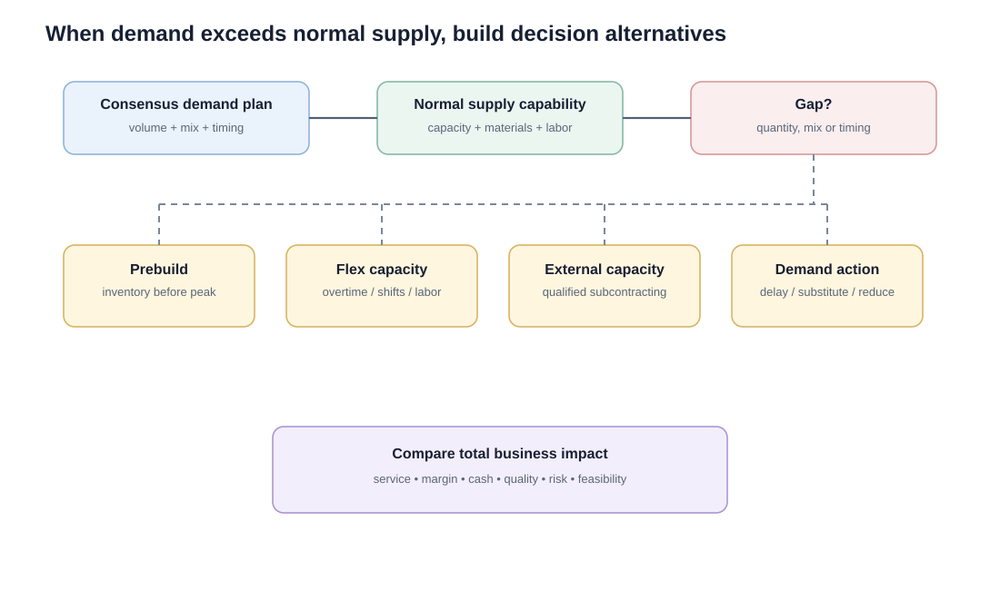

# 5. Supply Review and the Production Plan

## Learning objectives

You should be able to:

- explain what the supply review tests;
- explain how a production plan is created from the consensus demand plan;
- identify common responses to a demand-capacity gap;
- distinguish aggregate production planning from detailed scheduling.

## The supply review question

The demand team asks, **"What do we expect the market to need?"**

The supply team asks, **"Can we profitably support that need with the resources available?"**

The supply review checks feasibility across product families and identifies constraints, costs, and alternatives.

## When supply can meet demand

If capacity, materials, labor, suppliers, and logistics can support the demand plan, the aggregate production plan can align closely to the demand plan.

## When supply cannot meet demand

The supply team should not simply reject the demand plan. It should develop alternatives, such as:

- build inventory before a peak;
- use overtime or an additional shift;
- hire temporary or permanent labor;
- use qualified subcontract capacity;
- lease or add equipment;
- change product mix;
- delay some demand;
- stimulate substitute products;
- reduce the demand plan only when better alternatives do not work.

## Realistic example — family capacity gap

NorthStar's next-quarter demand plan calls for **13,200 pumps**. Normal quarterly capacity is **12,100**.

Supply develops three alternatives:

| Alternative | Incremental units | Incremental cost | Main risk |
|---|---:|---:|---|
| Overtime | 600 | $132,000 | fatigue / quality |
| Qualified subcontract test capacity | 400 | $108,000 | coordination / supplier quality |
| Prebuild before peak | 300 | $42,000 carrying cost | inventory / mix risk |

Together they can cover the 1,100-unit gap. Finance will still need to confirm whether the economics and cash impact are acceptable.

## Production plan outputs

Operations plans should use **physical measures that make sense for the operation**—for example units, liters, tons, labor-hours, or another capacity-relevant measure. Monetary views belong alongside the plan for finance, but money alone does not describe operational load.

For short-life products or rapidly changing demand, S&OP still needs an **agile operating response**. Monthly alignment cannot compensate for an operation that is structurally unable to change mix or capacity fast enough.

At the S&OP level, the production plan can include:

- output rate by product family;
- planned inventory;
- planned backlog;
- labor and equipment requirements;
- major material or supplier capacity requirements;
- known constraints and assumptions.

It is not yet a detailed work-center schedule.

## Common confusion

A **production plan** is an aggregate S&OP output. A **master production schedule** later converts that direction into more detailed item- or module-level quantities and timing.

## Common mistakes

- Capacity constraints should generate alternatives, not automatic rejection of demand.
- The demand plan should not be reduced first simply because supply is constrained.
- Production planning at S&OP is by product family, not individual work center or component.

## Related concepts

Module 1 → Section E → Evaluating Supply Capability / Operations Contributions. Numbers and scenario are original.
